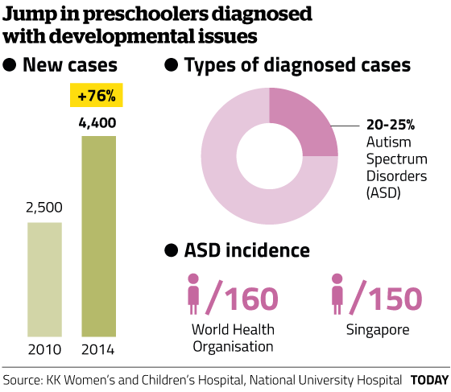

---
jupyter:
  jupytext:
    formats: ipynb,Rmd
    text_representation:
      extension: .Rmd
      format_name: rmarkdown
      format_version: '1.2'
      jupytext_version: 1.3.0
  kernelspec:
    display_name: R
    language: R
    name: ir
---

<div class="alert alert-block alert-info" style="margin-top: 20px">
    <a href="">
         
    </a>
    <h1>
        One-Stop Analytics: Exploratory Data Analysis (EDA) & Statistics
    </h1>
</div>


# Case Study of Autism Spectrum Disorder (ASD) with R

---


## <span style="color:blue">[ United States ]</span> 

## Centers for Disease Control and Prevention (CDC) - Autism Spectrum Disorder (ASD)

Autism spectrum disorder (ASD) is a developmental disability that can cause significant social, communication and behavioral challenges. CDC is committed to continuing to provide essential data on ASD, search for factors that put children at risk for ASD and possible causes, and develop resources that help identify children with ASD as early as possible.

https://www.cdc.gov/ncbddd/autism/data/index.html


## <span style="color:blue">[ Singapore ]</span> 

## TODAY Online - More preschoolers diagnosed with developmental issues

Doctors cited better awareness among parents and preschool teachers, leading to early referrals for diagnosis.

https://www.gov.sg/news/content/today-online-more-preschoolers-diagnosed-with-developmental-issues




 

https://www.pathlight.org.sg/


<div class="alert alert-block alert-info" style="margin-top: 20px">
    <a href="">
         
    </a>
</div>


# Workshop Objective: 

## Use R to analyze Autism Spectrum Disorder (ASD) data from CDC USA. 

https://www.cdc.gov/ncbddd/autism/data/index.html

* ## R Fundamentals

* ## Data Summarization 

* ## Data Visualisation (Base Graphic)

* ## Data Visualisation (Enhanced)

* ## Sampling & Normality

* ## Confidence Interval (CI)

* ## Workshop Submission

* ## Appendices


<div class="alert alert-block alert-info" style="margin-top: 20px">
    <a href="">
         
    </a>
</div>


## <span style="color:blue">R Fundamentals</span>


**R packaged used:**

* if(!require(naniar)){install.packages("naniar")}
* if(!require(dplyr)){install.packages("dplyr")}
* if(!require(ggplot2)){install.packages("ggplot2")}
* if(!require(plotly)){install.packages("plotly")}
* if(!require(ggthemes)){install.packages("ggthemes")}
* if(!require(usmap)){install.packages("usmap")}
* if(!require(cowplot)){install.packages("cowplot")}


<div class="alert alert-block alert-info" style="margin-top: 20px">
    <h3>
    R Fundamentals - Get & Set working directory
    </h3>
</div>


**Obtain current R <span style="color:blue">working directory</span>**

```{r}
getwd()
```

**Set new R working directory**

```{r}
# setwd("/media/sf_vm_shared_folder/git/DDC/DDC-ASD/model_R")
# setwd('~/Desktop/admin-desktop/vm_shared_folder/git/DDC-ASD/model_R')
getwd()
```

**Read in CSV data, storing as R <span style="color:blue">dataframe</span>**

```{r}
# Dataset: US. National Level Children ASD Prevalence
ASD_National <- read.csv("../dataset/ADV_ASD_National.csv", stringsAsFactors = FALSE)
```

```{r}
# Dataset: US. State Level Children ASD Prevalence
ASD_State    <- read.csv("../dataset/ADV_ASD_State.csv", stringsAsFactors = FALSE)
```

**Obtain number of rows and number of columns/features/variables**

```{r}
dim(ASD_National)
```

```{r}
dim(ASD_State)
```

**Obtain overview (data structure/types)**

```{r}
str(ASD_National)
```

```{r}
str(ASD_State)
```

**Look at first few rows of data**

```{r}
head(ASD_National)
```

```{r}
head(ASD_State)
```

**Obtain name of columns**

```{r}
names(ASD_National)
```

```{r}
names(ASD_State)
```

**Display column name with its index number**

```{r}
cbind(names(ASD_National), c(1:length(names(ASD_National))))
```

**Look at data structure/schema (Selected columns)**

```{r}
str(ASD_National[, c(1:8, 24, 25, 26)])
```

<div class="alert alert-danger alertdanger" style="margin-top: 20px">
    <h3>
        Quiz:
    </h3>
    <p>
        Obtain feature/column names and column index of dataframe: ASD_State
    </p>
</div>

```{r}
# Write your code below and press Shift+Enter to execute 

```

Double-click <b>here</b> for the solution.

<!-- The answer is below:

# Write your code below and press Shift+Enter to execute 
cbind(names(ASD_State), c(1:length(names(ASD_State))))

-->


<div class="alert alert-block alert-info" style="margin-top: 20px">
    <h3>
    R Fundamentals - Work with dataframe
    </h3>
</div>


**Access column 1 as a <span style="color:blue">named list</span> of string/chr (dataframe alike):**

```{r}
# use column index:
ASD_National[1]
```

```{r}
typeof(ASD_National[1])
```

```{r}
ASD_National[1]$Source
```

```{r}
# use column name:
ASD_National["Source"]
```

```{r}
typeof(ASD_National['Source'])
```

```{r}
ASD_National['Source']$Source
```

**Access column 1 as a set of string/chr:**

```{r}
ASD_National[, 1]
```

```{r}
typeof(ASD_National[, 1])
```

```{r}
ASD_National[, 1]
```

```{r}
# or
ASD_National[, "Source"]
```

```{r}
# or
ASD_National$Source
```

**Count number of elements in a object:**

```{r}
length(ASD_National) # number of features/columns
```

```{r}
length(ASD_National[1, ]) # number of features/columns
```

```{r}
length(ASD_National[, 1]) # number of elements(rows) in column 1
```

```{r}
length(ASD_National[, "Source"]) # same as above
```

```{r}
length(ASD_National$Source) # number of elements in chr list
```

**Access elements from column 1, which is a list:**

```{r}
# using column index
ASD_National[1][1, ]
```

```{r}
ASD_National[1][11, ]
```

```{r}
ASD_National[1][11:20, ]
```

```{r}
# using column name
ASD_National["Source"][1, ]
```

```{r}
ASD_National["Source"][11, ]
```

```{r}
ASD_National["Source"][11:20, ]
```

**Access elements from column 1, which is a set of string/chr:**

```{r}
# using column index
ASD_National[, 1][1]
```

```{r}
ASD_National[, 1][11]
```

```{r}
ASD_National[, 1][11:20]
```

```{r}
# using column name
ASD_National[, "Source"][1]
```

```{r}
# using column name
ASD_National[, "Source"][11]
```

```{r}
# using column name
ASD_National[, "Source"][11:20]
```

```{r}
# using $ operator
ASD_National$Source[1]
```

```{r}
ASD_National$Source[11]
```

```{r}
ASD_National$Source[11:20]
```

**Access elements of different column:**

```{r}
cbind(names(ASD_National), c(1:length(names(ASD_National))))
```

```{r}
ASD_National[1, 1] # row 1, column 1: "Source" 
```

```{r}
ASD_National[10, 1] # row 10, column 1: "Source"
```

```{r}
ASD_National[1, 3] # row 1, column 3: "Prevalence"
```

```{r}
ASD_National[10, 3] # row 10, column 3: "Prevalence"
```

```{r}
ASD_National[1:10, 1:3] # row 1 to 10 from column 1 to 3
```

```{r}
# or using columns names
ASD_National[1:10, c('Source', 'Year', 'Prevalence')]
```

```{r}
ASD_National[c(1:10, 20, 30:35), c(1:3, 9, 12)] # row 1 to 10, 20, and 20 to 25 from column 1 to 3, 9, and 12
```

**<span style="color:blue">[ Tips ]</span> We notice missing data from above.**


<div class="alert alert-block alert-info" style="margin-top: 20px">
    <h3>
    R Fundamentals - Process missing data
    </h3>
</div>


**Count missing values in dataframe:**

```{r}
sum(is.na(ASD_National)) # No missing data recognised by R (NA)
```

```{r}
sum(is.na(ASD_State)) # Some missing data recognised by R (NA)
```

**Empty string, "No data" arenot considered as missing value by R, thus we need to handle them manually.**

```{r}
# Define several offending strings
na_strings <- c("", "No data", "NA", "N A", "N / A", "N/A", "N/ A", "Not Available", "NOt available")
```

```{r}
# Load required function from packages:
if(!require(naniar)){install.packages("naniar")}
library(naniar)
if(!require(dplyr)){install.packages("dplyr")}
library(dplyr)
```

```{r}
# Uncomment below to show help
# ?replace_with_na_all # Documentation
```

**Replace these defined missing/offending values to R's internal NA**

```{r}
# "~.x" is a reserved keyword of this function:
ASD_National = replace_with_na_all(ASD_National, condition = ~.x %in% na_strings) 
```

```{r}
# Count missing values (R's internal NA) in dataframe:
sum(is.na(ASD_National))
```

<div class="alert alert-block alert-info" style="margin-top: 20px">
    <h3>
    R Fundamentals - Process invalid characters
    </h3>
</div>


**Remove invalid unicode char/string: \x92**

```{r}
ASD_National$Source_Full1[ASD_National$Source_Full1 == "National Survey of Children\x92s Health"] <- 
"National Survey of Children's Health"
```

```{r}
ASD_National$Source_Full2[ASD_National$Source_Full2 == "nsch-National Survey of Children\x92s Health"] <- 
"nsch-National Survey of Children's Health"
```

<div class="alert alert-block alert-info" style="margin-top: 20px">
    <h3>
    R Fundamentals - Delete/Drop dataframe variable
    </h3>
</div>


**Delete/Drop duplicate variable: Prevalence_dup**

```{r}
drop <- c("Prevalence_dup", "Dummy Variable Name")
```

```{r}
ASD_National = ASD_National[, !(names(ASD_National) %in% drop)] # Recall Dataframe[rows,columns]
```

<div class="alert alert-block alert-info" style="margin-top: 20px">
    <h3>
    R Fundamentals - Create/Add dataframe variable
    </h3>
</div>


**Create one new variable: Source_UC by converting to uppercase letters**

```{r}
ASD_National$Source_UC <- paste(toupper(ASD_National$Source))
```

**Create one new variable: Source_Full3 by combining Source and Source_Full1**

```{r}
ASD_National$Source_Full3 <- paste(toupper(ASD_National$Source), ASD_National$Source_Full1)
```

**Create one new ordinal categorical variable: Prevalence_Rank2 ("Low", "High") by binning Prevalence**

```{r}
# Recode Risk into category from Prevalence

# Low [0, 5)
# High [5, +oo) 

ASD_National$Prevalence_Risk2[ASD_National$Prevalence < 5] = "Low"
ASD_National$Prevalence_Risk2[ASD_National$Prevalence >= 5 ] = "High"
#
head(ASD_National)
```

**Create one new ordinal categorical variable: Prevalence_Rank4 ("Low", "Medium", "High", "Very High") by binning Prevalence**

```{r}
# Recode Risk into category from Prevalence

# Low [0, 5)
# Medium [5, 10)
# High [10, 20)
# Very High [20, +oo) 

ASD_National$Prevalence_Risk4 = "Very High"
ASD_National$Prevalence_Risk4[ASD_National$Prevalence < 20 ] = "High"
ASD_National$Prevalence_Risk4[ASD_National$Prevalence < 10 ] = "Medium"
ASD_National$Prevalence_Risk4[ASD_National$Prevalence < 5] = "Low"
#
head(ASD_National)
```

<div class="alert alert-block alert-info" style="margin-top: 20px">
    <h3>
    R Fundamentals - Convert to correct data types
    </h3>
</div>


**Review data structure and variable names:**

```{r}
str(ASD_National)
cbind(names(ASD_National), c(1:length(names(ASD_National))))
```

**Convert Prevalence and CIs from categorical/chr to numeric, column 8 to 25**

```{r}
ix <- 8:25 # define an index
# apply()
ASD_National[ix] <- apply(ASD_National[ix], 2, as.numeric) # "2" meand column-wise; "1" means row-wise.
```

```{r}
# Uncomment below to show help
# ?apply # Documentation
```

```{r}
# or lapply()
ASD_National[ix] <- lapply(ASD_National[ix], as.numeric) # column-wise
```

```{r}
# Uncomment below to show help
# ?lapply # Documentation
```

**Convert Source from categorical/chr to categorical/factor**

```{r}
ix <- c(1, 6, 7, 26, 27) # define an index
ASD_National[ix] <- lapply(ASD_National[ix], as.factor)
```

**Create new ordered factor Year_Factor from Year**

```{r}
ASD_National$Year_Factor <- factor(ASD_National$Year, ordered = TRUE)
```

```{r}
# Observe the difference of 'Levels' in below two factors
ASD_National$Year_Factor # Ordinal categorical variable
str(ASD_National$Year_Factor)

ASD_National$Source # Nominal categorical variable
str(ASD_National$Source)
```

**Convert Prevalence_Rank2 & Prevalence_Rank4 to ordered factor**

```{r}
# Convert to factor
ASD_National$Prevalence_Risk2 = factor(ASD_National$Prevalence_Risk2, ordered=TRUE,
                                           levels=c("Low", "High"))
# Convert to factor
ASD_National$Prevalence_Risk4 = factor(ASD_National$Prevalence_Risk4, ordered=TRUE,
                                           levels=c("Low", "Medium", "High", "Very High"))
```

```{r}
# Optionally, below is manual conversion examples:
# ASD_National$Male.Prevalence = as.numeric(ASD_National$Male.Prevalence)
# ASD_National$Source = as.factor(ASD_National$Source)
# ASD_National$Prevalence_Risk2 = factor(ASD_National$Prevalence_Risk2, ordered=TRUE, levels=c("Low", "High"))
# ASD_National$Prevalence_Risk4 = factor(ASD_National$Prevalence_Risk4, ordered=TRUE, levels=c("Low", "Medium", "High", "Very High"))

```

**Optionally, export the processed dataframe data to CSV file.**

```{r}
write.csv(ASD_National, file = "../dataset/ADV_ASD_National_R.csv", row.names = FALSE)
```

```{r}
# Read back in above saved file:
# ASD_National <- read.csv("../dataset/ADV_ASD_National_R.csv")
# ASD_National$Year_Factor <- factor(ASD_National$Year_Factor, ordered = TRUE) # Convert Year_Factor to ordered.factor
```

<div class="alert alert-block alert-info" style="margin-top: 20px">
</div>


## <span style="color:blue">Data Summarization </span>


<div class="alert alert-block alert-info" style="margin-top: 20px">
    <h3>
    Data Summarization - High Level Data Summary
    </h3>
</div>


```{r}
summary(ASD_National)
```

<div class="alert alert-block alert-info" style="margin-top: 20px">
    <h3>
    Data Summarization - Summary of <span style="color:blue">numeric</span> variables
    </h3>
</div>


```{r}
# Filter only numeric variables/columns
select_if(ASD_National, is.numeric) # library(dplyr)
```

```{r}
# Data summarization
summary(select_if(ASD_National, is.numeric))
```

**<span style="color:blue">[ Tips ]</span> We notice missing data in a few Prevalence variables.**

```{r}
# Calculate average Prevalence, no error
mean(ASD_National$Prevalence)
mean(ASD_National$Prevalence[ASD_National$Source == 'addm'])
mean(ASD_National$Prevalence[ASD_National$Source == 'medi'])
mean(ASD_National$Prevalence[ASD_National$Source == 'nsch'])
mean(ASD_National$Prevalence[ASD_National$Source == 'sped'])
```

```{r}
# Calculate average Male.Prevalence, there is error!
mean(ASD_National$Male.Prevalence)
```

```{r}
# Because of NA, mean() cannot process, thus we use na.rm to ignore NAs
mean(ASD_National$Male.Prevalence, na.rm = TRUE)
```

```{r}
mean(ASD_National$Female.Prevalence, na.rm = TRUE)
```

```{r}
# Count occurrences of uniques values in a variable/column: number of rows (of data entry) per year
table(ASD_National$Year) # ?table
```

<div class="alert alert-block alert-info" style="margin-top: 20px">
    <h3>
    Data Summarization - Summary of <span style="color:blue">categorical</span> variables
    </h3>
</div>


```{r}
# List of categorical variables
names(select_if(ASD_National, is.factor)) # All categorical variables are factor data type
names(select_if(ASD_National, is.character)) # No categorical variable is character data type
```

```{r}
# Look at summary
summary(select_if(ASD_National, is.factor))
```

```{r}
summary(select_if(ASD_National, is.character))
```

```{r}
# Count occurrences of uniques values in a variable/column
table(ASD_National$Source)
```

```{r}
table(ASD_National$Source_Full3)
```

```{r}
table(ASD_National$Year_Factor)
```

```{r}
table(ASD_National$Prevalence) # numeric is also possible
```

```{r}
# Display unique values (levels) of a factor categorical 
lapply(select_if(ASD_National, is.factor), levels)
```

```{r}
# or using variable names
lapply(ASD_National[c('Source_UC', 'Year_Factor')], levels)
```

```{r}
# Pivot of counting occurrences
table(ASD_National$Source_Full3, ASD_National$Year) # table(ASD_National$Year, ASD_National$Source_Full3)
```

```{r}
# Pivot of counting occurrences
table(ASD_National$Prevalence_Risk2, ASD_National$Source)

# Pivot of counting occurrences
table(ASD_National$Prevalence_Risk4, ASD_National$Source)
```

<div class="alert alert-block alert-info" style="margin-top: 20px">
</div>


## <span style="color:blue">Data Visualisation (Base Graphic)</span>


```{r}
# library(repr)
# Adjust in-line plot size to M x N
options(repr.plot.width=8, repr.plot.height=4)
```

<div class="alert alert-block alert-info" style="margin-top: 20px">
    <h3>
    Data Visualisation (Base Graphic) - Histogram (distribution of binned continuous variable)
    </h3>
</div>


https://www.statmethods.net/graphs/density.html

```{r}
hist(ASD_National$Prevalence)
```

```{r}
par(mfrow=c(1, 2)) # multiple plots on one page: row split to: 1,column split to: 2
hist(ASD_National$Male.Prevalence)
hist(ASD_National$Female.Prevalence)
par(mfrow=c(1, 1)) # Reset to one plot on one page
```

```{r}
# Histogram with annotations
hist(ASD_National$Prevalence,
     main = "Frequency of National ASD Prevalence", # Chart title
     xlab = "Prevalence per 1,000 Children", # x axis label
     ylab = "Frequency or Occurrences",# y axis label
     sub  = "Year 2000 - 2016", # Chart subtitle at bottom
     col.main="blue", col.lab="black", col.sub="darkgrey") # Colours
```

<div class="alert alert-block alert-info" style="margin-top: 20px">
    <h3>
    Density plot (distribution for continuous variable normalized to 100% area under curve)
    </h3>
</div>


https://www.statmethods.net/graphs/density.html

```{r}
par(mfrow=c(1, 2)) # multiple plots on one page: row split to: 1,column split to: 2

plot(density(ASD_National$Prevalence))

# Density plot with annotations
plot(density(ASD_National$Prevalence),
     main = "Density of National ASD Prevalence",
     xlab = "Prevalence per 1,000 Children",
     ylab = "Frequency or Occurrences",
     sub  = "Year 2000 - 2016",
     col.main="blue", col.lab="black", col.sub="darkgrey")

par(mfrow=c(1, 1))
```

<div class="alert alert-block alert-info" style="margin-top: 20px">
    <h3>
    Boxplot plot (median, 25% quantile,75% quantile)
    </h3>
</div>


https://www.statmethods.net/graphs/boxplot.html


https://stats.stackexchange.com/questions/156778/percentile-vs-quantile-vs-quartile

0 quartile = 0 quantile = 0 percentile

1 quartile = 0.25 quantile = 25 percentile

2 quartile = .5 quantile = 50 percentile (median)

3 quartile = .75 quantile = 75 percentile

4 quartile = 1 quantile = 100 percentile

```{r}
par(mfrow=c(1, 2)) # multiple plots on one page: row split to: 1,column split to: 2

# All children prevalence with and without 95% confidence side by side:
boxplot(ASD_National$Prevalence, notch = TRUE) # 95% confidence interval - a notch is drawn in each side of the boxes. If the notches of two plots do not overlap this is ‘strong evidence’ that the two medians differ
boxplot(ASD_National$Prevalence) # All children

par(mfrow=c(1, 1))
```

```{r}
par(mfrow=c(1, 2)) # multiple plots on one page: row split to: 1,column split to: 2

# Male prevalence and Female prevalence side by side:
boxplot(ASD_National$Male.Prevalence, ylim = c(0, 35), notch = TRUE) # Male children
boxplot(ASD_National$Female.Prevalence, ylim = c(0, 35), notch = TRUE) # Female children

par(mfrow=c(1, 1))
```

```{r}
# Display value ranges
# numeric:
range(ASD_National$Prevalence)
```

```{r}
range(ASD_National$Year)
```

```{r}
# categorical:
min(ASD_National$Year_Factor)
```

```{r}
max(ASD_National$Year_Factor)
```

```{r}
# Create 'Prevalence' box plots break by 'Source'
boxplot(ASD_National$Prevalence ~ ASD_National$Source,
        main = "National ASD Prevalence by Data Source",
        xlab = "Data Source",
        ylab = "Prevalence per 1,000 Children",
        sub  = "Year 2000 - 2016",
        col.main="blue", col.lab="black", col.sub="darkgrey")
```

<div class="alert alert-danger alertdanger" style="margin-top: 20px">
    <h3>
        Quiz:
    </h3>
    <p>
        Set noth=TRUE to above boxplot. Are there overlapping among four data sources?
    </p>
</div>

```{r}
# Write your code below and press Shift+Enter to execute 

```

Double-click <b>here</b> for the solution.

<!-- The answer is below:

# Write your code below and press Shift+Enter to execute 
# Create 'Prevalence' box plots break by 'Source'
boxplot(ASD_National$Prevalence ~ ASD_National$Source,
        main = "National ASD Prevalence by Data Source", notch=TRUE,
        xlab = "Data Source",
        ylab = "Prevalence per 1,000 Children",
        sub  = "Year 2000 - 2016",
        col.main="blue", col.lab="black", col.sub="darkgrey")

-->


<div class="alert alert-block alert-info" style="margin-top: 20px">
    <h3>
    Data Visualisation (Base Graphic) - Bar plot
    </h3>
</div>


```{r}
# Adjust in-line plot size to M x N
options(repr.plot.width=8, repr.plot.height=4)
```

```{r}
# ----------------------------------
# [National] Risk by Data Source
# ----------------------------------
# Create bar chart using R graphics
counts = table(ASD_National$Prevalence_Risk2, ASD_National$Source)
#counts = table(ASD_National$Source, ASD_National$Prevalence_Risk4)
barplot(counts,
        main="Prevalence by Data Sources and Risk Levels",
        xlab="Data Sources", col=c("white", "lightgrey"),
        ylab="Occurrences",
        legend = rownames(counts), 
        args.legend = list(x="topleft", bty = "n", cex = 0.85, y.intersp=2))
```

```{r}
# ----------------------------------
# [National] Risk by Data Source
# ----------------------------------
# Create bar chart using R graphics
counts = table(ASD_National$Prevalence_Risk2, ASD_National$Source) # Count of Risk records, split by Source
barplot(counts,
        main="Prevalence by Data Sources and Risk Levels",
        xlab="Data Sources",
        ylab="Occurrences",
        col=c("white", "lightgrey"),
        legend = rownames(counts), 
        args.legend = list(x = "topleft", bty = "n", cex = 0.85, y.intersp = 2))
```

```{r}
# ----------------------------------
# [National] Risk by Data Source
# ----------------------------------
# Create bar chart using R graphics
counts = table(ASD_National$Prevalence_Risk4, ASD_National$Source) # Count of Risk records, split by Source
barplot(counts,
        main="Prevalence Occurrence by Source and Risk",
        xlab="Data Sources",
        ylab="Occurrences",
        col=c("lightyellow", "orange", "red","darkred"),
        legend = rownames(counts), 
        args.legend = list(x = "topleft", bty = "n", cex = 0.85, y.intersp = 2))
```

<div class="alert alert-block alert-info" style="margin-top: 20px">
    <h3>
    Data Visualisation (Base Graphic) - Line chart
    </h3>
</div>


```{r}
# Adjust in-line plot size to M x N
options(repr.plot.width=8, repr.plot.height=6)
```

```{r}
# ----------------------------------
# [National] < Prevalence has changed over Time >
# ----------------------------------
# Prevalence over Year
# Use Year        as x-axis: y value Prevalence is NOT aggregated for different data sources
plot(ASD_National$Year, ASD_National$Prevalence) 
```

```{r}
# Use Year_factor as x-axis: y value Prevalence is     aggregated for different data sources
plot(ASD_National$Year_Factor, ASD_National$Prevalence) 
```

```{r}
# table(ASD_National$Source_Full3)
```

```{r}
par(mfrow=c(2, 2))

# Prevalence over Year, from data source: 
# addm-Autism & Developmental Disabilities Monitoring Network
plot(ASD_National$Year[ASD_National$Source == 'addm'], 
     ASD_National$Prevalence[ASD_National$Source == 'addm'])

# Prevalence over Year, from data source: 
# medi-Medicaid
plot(ASD_National$Year[ASD_National$Source == 'medi'], 
     ASD_National$Prevalence[ASD_National$Source == 'medi'])

# Prevalence over Year, from data source: 
# nsch-National Survey of Children Health
plot(ASD_National$Year[ASD_National$Source == 'nsch'], 
     ASD_National$Prevalence[ASD_National$Source == 'nsch'])

# Prevalence over Year, from data source: 
# sped-Special Education Child Count
plot(ASD_National$Year[ASD_National$Source == 'sped'], 
     ASD_National$Prevalence[ASD_National$Source == 'sped'])

par(mfrow=c(1, 1)) # Reset to one plot on one page
```

```{r}
# ----------------------------------
# Add more annotations to above plots
# ----------------------------------
# Color list
# addm : darkblue
# medi : orange
# nsch : darkred
# sped : skyblue

par(mfrow=c(2, 2))

# Prevalence over Year, from data source: 
# addm-Autism & Developmental Disabilities Monitoring Network
plot(ASD_National$Year[ASD_National$Source == 'addm'], 
     ASD_National$Prevalence[ASD_National$Source == 'addm'],
     type="l", # dot/point type
     lty=1, # line type
     lwd=3, # line width
     col="darkblue", # line color
     xlab="Year", 
     ylab="Prevalence per 1,000 Children", 
     ylim = c(0, 30), # Set value range of y axis
     main="[addm] Prevalence Estimates Over Time",
     sub  = "zhan.gu@nus.edu.sg",
     col.main="blue", col.lab="black", col.sub="darkgrey")

# Prevalence over Year, from data source: 
# medi-Medicaid
plot(ASD_National$Year[ASD_National$Source == 'medi'], 
     ASD_National$Prevalence[ASD_National$Source == 'medi'],
     type="b", lty=1, lwd=3,  col="orange",
     xlab="Year", 
     ylab="Prevalence per 1,000 Children", 
     ylim = c(0, 30), # Set value range of y axis
     main="[medi] Prevalence Estimates Over Time",
     sub  = "zhan.gu@nus.edu.sg",
     col.main="blue", col.lab="black", col.sub="darkgrey")

# Prevalence over Year, from data source: 
# nsch-National Survey of Children Health
plot(ASD_National$Year[ASD_National$Source == 'nsch'], 
     ASD_National$Prevalence[ASD_National$Source == 'nsch'],
     type="l", lty=2, lwd=3,  col="darkred",
     xlab="Year", 
     ylab="Prevalence per 1,000 Children", 
     ylim = c(0, 30), # Set value range of y axis
     main="[nsch] Prevalence Estimates Over Time",
     sub  = "zhan.gu@nus.edu.sg",
     col.main="blue", col.lab="black", col.sub="darkgrey")

# Prevalence over Year, from data source: 
# sped-Special Education Child Count
plot(ASD_National$Year[ASD_National$Source == 'sped'], 
     ASD_National$Prevalence[ASD_National$Source == 'sped'],
     type="l", lty=3, lwd=3,  col="skyblue",
     xlab="Year", 
     ylab="Prevalence per 1,000 Children", 
     ylim = c(0, 30), # Set value range of y axis
     main="[sped] Prevalence Estimates Over Time",
     sub  = "zhan.gu@nus.edu.sg",
     col.main="blue", col.lab="black", col.sub="darkgrey")

par(mfrow=c(1, 1)) # Reset to one plot on one page
```

<div class="alert alert-block alert-info" style="margin-top: 20px">
    <h3>
    Data Visualisation (Base Graphic) - <span style="color:blue">[ R ] REPORTED PREVALENCE HAS CHANGED OVER TIME</span> by [ Data Source ]
    </h3>
</div>


**Create multiple lines within a single chart**

```{r}
# ----------------------------------
# [National] < Prevalence Varies over Time/Year by Data Source >
# ----------------------------------
# Create a first line
plot(ASD_National$Year[ASD_National$Source == 'addm'], 
     ASD_National$Prevalence[ASD_National$Source == 'addm'], 
     col = "darkblue", lty = 1, lwd = 2,
     type = "b", # use dot/point
     pch = 0, # dot/point type: http://www.endmemo.com/program/R/pchsymbols.php
     xlab="Year", 
     xlim=c(2000, 2016), # Set x axis value range
     ylab="Prevalence per 1,000 Children", 
     ylim=c(0, 30), # Set y axis value range
     main="Prevalence Estimates Over Time by Data Source",
     col.main="black", col.lab="black", col.sub="grey",
     frame = FALSE, # Remove frame
     axes=FALSE # Remove x and y axis
)
axis(1, at=seq(2000, 2016, 1)) # Customize x axis
axis(2, at=seq(0, 30, 5)) # Customize y axis

# Add another line
lines(ASD_National$Year[ASD_National$Source == 'medi'], 
      ASD_National$Prevalence[ASD_National$Source == 'medi'], 
      pch = 1, col = "orange", type = "b", lty = 1, lwd = 2
)
# Add another line
lines(ASD_National$Year[ASD_National$Source == 'nsch'], 
      ASD_National$Prevalence[ASD_National$Source == 'nsch'], 
      pch = 2, col = "darkred", type = "b", lty = 1, lwd = 2
)
# Add another line
lines(ASD_National$Year[ASD_National$Source == 'sped'], 
      ASD_National$Prevalence[ASD_National$Source == 'sped'], 
      pch = 5, col = "skyblue", type = "b", lty = 1, lwd = 2
)
# Add a legend to the plot
legend("topleft", legend=levels(ASD_National$Source),
       col=c("darkblue", "orange", "darkred", "skyblue"), 
       pch = 20, # dot in a line
       lty = 1, # line type
       lwd = 2, # line width
       cex=0.8, # size of text
       bty = 'n' # Without frame
)

```

R pch: dot/point type: http://www.endmemo.com/program/R/pchsymbols.php

R plot colour list: https://www.r-graph-gallery.com/42-colors-names.html


<div class="alert alert-block alert-info" style="margin-top: 20px">
    <h3>
    Data Visualisation (Base Graphic) - <span style="color:blue">[ R ] REPORTED PREVALENCE VARIES BY SEX</span> [ Source: ADDM ] over [ Year ]
    </h3>
</div>


```{r}
# ----------------------------------
# [addm] < Prevalence Varies by Sex >
# ----------------------------------
# Create a first line
plot(ASD_National$Year[ASD_National$Source == 'addm'], 
     ASD_National$Prevalence[ASD_National$Source == 'addm'], 
     col = "grey", lty = 1, lwd = 2,
     type = "l", # use dot/point
     pch = 0, # dot/point type: http://www.endmemo.com/program/R/pchsymbols.php
     xlab="Year", 
     xlim=c(2000, 2016), # Set x axis value range
     ylab="Prevalence per 1,000 Children", 
     ylim=c(0, 30), # Set y axis value range
     main="Prevalence Estimates by Sex [ADDM]",
     col.main="black", col.lab="black", col.sub="grey",
     frame = FALSE, # Remove frame
     axes=FALSE # Remove x and y axis
)
axis(1, at=seq(2000, 2016, 1)) # Customize x axis
axis(2, at=seq(0, 30, 5)) # Customize y axis

# Add Female prevalence
lines(ASD_National$Year[ASD_National$Source == 'addm'], 
      ASD_National$Female.Prevalence[ASD_National$Source == 'addm'], 
      pch = 1, col = "orange", type = "l", lty = 1, lwd = 2)
# Add Female prevalence lower CI
lines(ASD_National$Year[ASD_National$Source == 'addm'], 
      ASD_National$Female.Lower.CI[ASD_National$Source == 'addm'], 
      pch = 1, col = "orange", type = "l", lty = 3, lwd = 1)
# Add Female prevalence upper CI
lines(ASD_National$Year[ASD_National$Source == 'addm'], 
      ASD_National$Female.Upper.CI[ASD_National$Source == 'addm'], 
      pch = 1, col = "orange", type = "l", lty = 3, lwd = 1)

# Add Male prevalence
lines(ASD_National$Year[ASD_National$Source == 'addm'], 
      ASD_National$Male.Prevalence[ASD_National$Source == 'addm'], 
      pch = 1, col = "blue", type = "l", lty = 1, lwd = 2)
# Add Male prevalence lower CI
lines(ASD_National$Year[ASD_National$Source == 'addm'], 
      ASD_National$Male.Lower.CI[ASD_National$Source == 'addm'], 
      pch = 1, col = "blue", type = "l", lty = 3, lwd = 1)
# Add Male prevalence upper CI
lines(ASD_National$Year[ASD_National$Source == 'addm'], 
      ASD_National$Male.Upper.CI[ASD_National$Source == 'addm'], 
      pch = 1, col = "blue", type = "l", lty = 3, lwd = 1)
# Add a legend to the plot
legend("topleft", legend=c('ADDM Average', 'Female with 95% CI', 'Male with 95% CI'),
       col=c("grey", "orange", "blue"), 
       #       pch = 20, # dot in a line
       lty = 1, # line type
       lwd = 2, # line width
       cex=0.8, # size of text
       bty = 'n' # Without frame
)

```

<div class="alert alert-block alert-info" style="margin-top: 20px">
    <h3>
    Data Visualisation (Base Graphic) - <span style="color:blue">[ R ] REPORTED PREVALENCE VARIES BY RACE AND ETHNICITY</span> [ Source: ADDM ]
    </h3>
</div>


```{r}
# ----------------------------------
# [addm] < Prevalence Varies by Race and Ethnicity >
# ----------------------------------
# Create a first line
plot(ASD_National$Year[ASD_National$Source == 'addm'], 
     ASD_National$Prevalence[ASD_National$Source == 'addm'], 
     col = "grey", lty = 1, lwd = 2,
     type = "l", # use dot/point
     pch = 0, # dot/point type: http://www.endmemo.com/program/R/pchsymbols.php
     xlab="Year", 
     xlim=c(2000, 2016), # Set x axis value range
     ylab="Prevalence per 1,000 Children", 
     ylim=c(0, 30), # Set y axis value range
     main="Prevalence Estimates by Race/Ethnicity [ADDM]",
     col.main="black", col.lab="black", col.sub="grey",
     frame = FALSE, # Remove frame
     axes=FALSE # Remove x and y axis
)
axis(1, at=seq(2000, 2016, 1)) # Customize x axis
axis(2, at=seq(0, 30, 5)) # Customize y axis

# R plot colour list: https://www.r-graph-gallery.com/42-colors-names.html

# Add Asian.or.Pacific.Islander.Prevalence
lines(ASD_National$Year[ASD_National$Source == 'addm'], 
      ASD_National$Asian.or.Pacific.Islander.Prevalence[ASD_National$Source == 'addm'], 
      pch = 20, col = "darkred", type = "b", lty = 1, lwd = 2)
# Add Hispanic.Prevalence
lines(ASD_National$Year[ASD_National$Source == 'addm'], 
      ASD_National$Hispanic.Prevalence[ASD_National$Source == 'addm'], 
      pch = 20, col = "darkorchid3", type = "b", lty = 1, lwd = 2)
# Add Non.hispanic.black.Prevalence
lines(ASD_National$Year[ASD_National$Source == 'addm'], 
      ASD_National$Non.hispanic.black.Prevalence[ASD_National$Source == 'addm'], 
      pch = 20, col = "deepskyblue3", type = "b", lty = 1, lwd = 2)
# Add Non.hispanic.white.Prevalence
lines(ASD_National$Year[ASD_National$Source == 'addm'], 
      ASD_National$Non.hispanic.white.Prevalence[ASD_National$Source == 'addm'], 
      pch = 20, col = "chartreuse3", type = "b", lty = 1, lwd = 2)

# Add a legend to the plot
legend("topleft", legend=c('ADDM Average', 
                           'Non-Hispanic White',
                           'Non-Hispanic Black',
                           'Hispanic', 
                           'Asian/Pacific Islander'),
       col=c("grey", "chartreuse3", "deepskyblue3", "darkorchid3", "darkred"), 
       pch = 20, # dot in a line
       lty = 1, # line type
       lwd = 2, # line width
       cex=0.8, # size of text
       bty = 'n' # Without frame
)

```

```{r}
# Adjust in-line plot size to M x N
options(repr.plot.width=8, repr.plot.height=4)
```

<div class="alert alert-danger alertdanger" style="margin-top: 20px">
    <h3>
        Quiz:
    </h3>
    <p>
        Add 95% Confidence Interval to above plot
    </p>
</div>

```{r}
# Write your code below and press Shift+Enter to execute 

```

Double-click <b>here</b> for the solution.

<!-- The answer is below:

# Write your code below and press Shift+Enter to execute 
# TBD

-->


<div class="alert alert-danger alertdanger" style="margin-top: 20px">
    <h3>
        Quiz:
    </h3>
    <p>
        Use talbe() to count No. prevalence records for each Data Source. Then use barplot() to visualize.
    </p>
</div>

```{r}
# Write your code below and press Shift+Enter to execute 

```

Double-click <b>here</b> for the solution.

<!-- The answer is below:

# Write your code below and press Shift+Enter to execute 
table(ASD_National$Source)
barplot(table(ASD_National$Source))

-->

```{r}

```

<div class="alert alert-danger alertdanger" style="margin-top: 20px">
    <h3>
        Quiz:
    </h3>
    <p>
        Which Data Sources are available in which years?
    </p>
</div>

```{r}
# Write your code below and press Shift+Enter to execute 

```

Double-click <b>here</b> for the solution.

<!-- The answer is below:

# Write your code below and press Shift+Enter to execute 
table(ASD_National$Year, ASD_National$Source)
plot(table(ASD_National$Year, ASD_National$Source))

-->


<div class="alert alert-danger alertdanger" style="margin-top: 20px">
    <h3>
        Quiz:
    </h3>
    <p>
        Which Data Source has breakdown Prevalvence data by sex/gender?
    </p>
</div>

```{r}
# Write your code below and press Shift+Enter to execute 

```

Double-click <b>here</b> for the solution.

<!-- The answer is below:

# Write your code below and press Shift+Enter to execute 
table(ASD_National$Source_Full2, ASD_National$Male.Prevalence)
plot(table(ASD_National$Source_Full2, ASD_National$Male.Prevalence))

-->


<div class="alert alert-danger alertdanger" style="margin-top: 20px">
    <h3>
        Quiz:
    </h3>
    <p>
        Which Data Source has breakdown Prevalvence data by race and ethnicity?
    </p>
</div>

```{r}
# Write your code below and press Shift+Enter to execute 

```

Double-click <b>here</b> for the solution.

<!-- The answer is below:

# Write your code below and press Shift+Enter to execute 
table(ASD_National$Source, ASD_National$Asian.or.Pacific.Islander.Prevalence)
plot(table(ASD_National$Source, ASD_National$Asian.or.Pacific.Islander.Prevalence))

-->


<div class="alert alert-block alert-info" style="margin-top: 20px">
</div>


## <span style="color:blue">Data Visualisation (Enhanced)</span>


```{r}
if(!require(ggplot2)){install.packages("ggplot2")}
library(ggplot2)
```

```{r}
# Adjust in-line plot size to M x N
options(repr.plot.width=8, repr.plot.height=4)
```

<div class="alert alert-block alert-info" style="margin-top: 20px">
    <h3>
    Data Visualisation (Enhanced) - <span style="color:blue">[ CDC ] Explore the Data</span>
    </h3>
</div>


<div class="alert alert-block alert-info" style="margin-top: 20px">
    <h3>
    Data Visualisation (Enhanced) - <span style="color:blue">[ R ] Explore the Data</span>
    </h3>
</div>


```{r}
# ----------------------------------
# [National] < Years Data Available >
# ----------------------------------
p = ggplot(ASD_National, aes(x = 1, fill = Source)) + 
  geom_bar() + theme(axis.text.x=element_blank(),  # Hide axis
                     axis.ticks.x=element_blank(), # Hide axis
                     axis.text.y=element_blank(),  # Hide axis
                     axis.ticks.y=element_blank(), # Hide axis
                     panel.background = element_blank(), # Remove panel background
                     legend.position="top"
  ) + 
  scale_fill_manual("Data Source:", values = c("addm" = "darkblue", 
                                               "medi" = "orange", 
                                               "nsch" = "darkred",
                                               "sped" = "skyblue")) +
  labs(x="", y="", title="Years Data Available") + # layers of graphics
  facet_grid(facets = Source~Year)
# Show plot
p
```

<div class="alert alert-block alert-info" style="margin-top: 20px">
    <h3>
    Data Visualisation (Enhanced) - Barplot
    </h3>
</div>


```{r}
# Create bar chart using R graphics
barplot(table(ASD_National$Source))
```

```{r}
# Create bar chart using ggplot2
ggplot(ASD_National, aes(x = Source)) + geom_bar(fill = "blue", alpha=0.5)
```

```{r}
# Use color to differentiate sub-group data (Year)
ggplot(ASD_National, aes(x = Source, fill = factor(Year))) + geom_bar() + 
  theme(legend.position="top") + labs(fill = "Legend: Year")
```

```{r}
# Split chart to mutiple columns by using: facets = . ~ Year
ggplot(ASD_National, aes(x = Source, fill = Source)) + geom_bar() + 
  theme(legend.position="top") + 
  scale_fill_manual("Data Source:", values = c("addm" = "darkblue", 
                                               "medi" = "orange", 
                                               "nsch" = "darkred",
                                               "sped" = "skyblue")) +
  facet_grid(facets = . ~ Year)
```

```{r}
# Split chart to mutiple rows and columns by using: facets = Source ~ Year
ggplot(ASD_National, aes(x = Source, fill = Source)) + geom_bar() + 
  theme(legend.position="top") + 
  scale_fill_manual("Data Source:", values = c("addm" = "darkblue", 
                                               "medi" = "orange", 
                                               "nsch" = "darkred",
                                               "sped" = "skyblue")) +
  facet_grid(facets = Source~Year)
```

**Above chart is now very similar to earlier [National] < Years Data Available >.**


<div class="alert alert-block alert-info" style="margin-top: 20px">
    <h3>
    Data Visualisation (Enhanced) - <span style="color:blue">[ R ] Prevalence by Data Sources and Risk Levels</span>
    </h3>
</div>


```{r}
# Use color to differentiate sub-group data (Year)
ggplot(ASD_National, aes(x = Source, fill = Prevalence_Risk4)) + 
  geom_bar(alpha=0.75, position = position_stack(reverse = TRUE)) + # Reverse default colour/fill order
  scale_fill_manual("Data Source:", values = c("Low" = "lightyellow", 
                                               "Medium" = "orange", 
                                               "High" = "red",
                                               "Very High" = "darkred")) +
  labs(x="Data Sources", y="Occurrences", title="Prevalence by Data Sources and Risk Levels") + # layers of graphics
  theme(legend.position="top") + labs(fill = "Legend: Risk")
```

**Barplot / Column plot**


<div class="alert alert-block alert-info" style="margin-top: 20px">
    <h3>
    Data Visualisation (Enhanced) - <span style="color:blue">[ CDC ] REPORTED PREVALENCE VARIES BY SEX</span>
    </h3>
</div>


<div class="alert alert-block alert-info" style="margin-top: 20px">
    <h3>
    Data Visualisation (Enhanced) - <span style="color:blue">[ R ] REPORTED PREVALENCE VARIES BY SEX</span> [ Source: ADDM ] [ Year: 2014 ]
    </h3>
</div>


```{r}
# Filter only data of ADDM
ASD_National_ADDM <- subset(ASD_National, Source == 'addm')
#
ASD_National_ADDM
```

```{r}
# Construct a new re-shaped dataframe of [ Source: ADDM ] [Year: 2014]
#
Process_Source = 'addm'
Process_Year = 2014
```

**Define a function to create a re-shaped dataframe:**

```{r}
Function_Reshape_ASD_National_ADDM <- function(Process_Source, Process_Year) {
    # Create the vectors:
    Sex.Group  = c('Overall', 
                   'Boys', 
                   'Girls')
    Sex.Group

    Prevalence = c(ASD_National_ADDM$Prevalence[ASD_National_ADDM$Year == Process_Year],
                   ASD_National_ADDM$Male.Prevalence[ASD_National_ADDM$Year == Process_Year],
                   ASD_National_ADDM$Female.Prevalence[ASD_National_ADDM$Year == Process_Year])
    Prevalence

    # Combine all the vectors into a data frame:
    ASD_National_ADDM_Reshaped_DF = data.frame(Sex.Group, Prevalence, stringsAsFactors=T)

    # Add new columns:
    ASD_National_ADDM_Reshaped_DF$Source = Process_Source
    ASD_National_ADDM_Reshaped_DF$Year = Process_Year
    return(ASD_National_ADDM_Reshaped_DF) # Return a dataframe
}
```

**Use defined function <span style="color:blue">Function_Reshape_ASD_National_ADDM( )</span> for a specific year:**

```{r}
ASD_National_ADDM_Reshaped_DF <- Function_Reshape_ASD_National_ADDM(Process_Source = 'addm', Process_Year = 2014)
ASD_National_ADDM_Reshaped_DF
```

Visualise: **Prevalence Estimates by Sex [ Source: ADDM ] [ Year: 2014 ]**

```{r}
# Adjust in-line plot size to M x N
options(repr.plot.width=8, repr.plot.height=3)
```

```{r}
ggplot(ASD_National_ADDM_Reshaped_DF, aes(Sex.Group, Prevalence)) +
  geom_col(aes(fill = Sex.Group, colours = )) + # Use column chart
  geom_text(aes(label = Prevalence), vjust = +0.5, hjust = -0.2, size = 3) +
  scale_y_continuous(name = "Prevalence per 1,000 Children",
                     breaks = seq(0, 30, 5),
                     limits=c(0, 30)) +
  scale_x_discrete(name = "") +
  scale_fill_manual("Sex Group:", values = c("Overall" = "purple", 
                                             "Boys" = "blue",
                                             "Girls" = "orange")) + 
  ggtitle("Prevalence Estimates by Sex [ Source: ADDM ] [ Year: 2014 ]") +
  theme(title = element_text(face = 'bold.italic', color = "darkslategrey"), 
        axis.title = element_text(face = 'plain', color = "darkslategrey"),
        legend.position = 'none') + 
  coord_flip()  # Rotate chart
#  facet_grid(facets = Year ~ .)
```

<div class="alert alert-block alert-info" style="margin-top: 20px">
    <h3>
    Data Visualisation (Enhanced) - <span style="color:blue">[ R ] REPORTED PREVALENCE VARIES BY SEX</span> [ Source: ADDM ] [ Year: ALL ]
    </h3>
</div>


```{r}
# Create a new datafarme to hold re-shaped data for all years.
ASD_National_ADDM_Reshaped_DF_All = ASD_National_ADDM_Reshaped_DF # Loaded with initial [ Year: 2014 ] data
```

```{r}
Process_Source = 'addm'
unique(ASD_National_ADDM$Year)
```

**Use defined function <span style="color:blue">Function_Reshape_ASD_National_ADDM( )</span> for <span style="color:blue">ALL remaining</span> years:**

```{r}
ASD_National_ADDM_Reshaped_DF <- Function_Reshape_ASD_National_ADDM(Process_Source = 'addm', Process_Year = 2012)
ASD_National_ADDM_Reshaped_DF
# Append rows to existing dataframe, using Row Bind function: rbind()
ASD_National_ADDM_Reshaped_DF_All = rbind(ASD_National_ADDM_Reshaped_DF_All, ASD_National_ADDM_Reshaped_DF)
```

```{r}
ASD_National_ADDM_Reshaped_DF <- Function_Reshape_ASD_National_ADDM(Process_Source = 'addm', Process_Year = 2010)
ASD_National_ADDM_Reshaped_DF
# Append rows to existing dataframe, using Row Bind function: rbind()
ASD_National_ADDM_Reshaped_DF_All = rbind(ASD_National_ADDM_Reshaped_DF_All, ASD_National_ADDM_Reshaped_DF)
```

```{r}
ASD_National_ADDM_Reshaped_DF <- Function_Reshape_ASD_National_ADDM(Process_Source = 'addm', Process_Year = 2008)
ASD_National_ADDM_Reshaped_DF
# Append rows to existing dataframe, using Row Bind function: rbind()
ASD_National_ADDM_Reshaped_DF_All = rbind(ASD_National_ADDM_Reshaped_DF_All, ASD_National_ADDM_Reshaped_DF)
```

```{r}
ASD_National_ADDM_Reshaped_DF <- Function_Reshape_ASD_National_ADDM(Process_Source = 'addm', Process_Year = 2006)
ASD_National_ADDM_Reshaped_DF
# Append rows to existing dataframe, using Row Bind function: rbind()
ASD_National_ADDM_Reshaped_DF_All = rbind(ASD_National_ADDM_Reshaped_DF_All, ASD_National_ADDM_Reshaped_DF)
```

```{r}
ASD_National_ADDM_Reshaped_DF <- Function_Reshape_ASD_National_ADDM(Process_Source = 'addm', Process_Year = 2004)
ASD_National_ADDM_Reshaped_DF
# Append rows to existing dataframe, using Row Bind function: rbind()
ASD_National_ADDM_Reshaped_DF_All = rbind(ASD_National_ADDM_Reshaped_DF_All, ASD_National_ADDM_Reshaped_DF)
```

```{r}
ASD_National_ADDM_Reshaped_DF <- Function_Reshape_ASD_National_ADDM(Process_Source = 'addm', Process_Year = 2002)
ASD_National_ADDM_Reshaped_DF
# Append rows to existing dataframe, using Row Bind function: rbind()
ASD_National_ADDM_Reshaped_DF_All = rbind(ASD_National_ADDM_Reshaped_DF_All, ASD_National_ADDM_Reshaped_DF)
```

```{r}
ASD_National_ADDM_Reshaped_DF <- Function_Reshape_ASD_National_ADDM(Process_Source = 'addm', Process_Year = 2000)
ASD_National_ADDM_Reshaped_DF
# Append rows to existing dataframe, using Row Bind function: rbind()
ASD_National_ADDM_Reshaped_DF_All = rbind(ASD_National_ADDM_Reshaped_DF_All, ASD_National_ADDM_Reshaped_DF)
```

```{r}
# Re-shaped ADDM data for ALL years:
ASD_National_ADDM_Reshaped_DF_All
```

Visualise: **Prevalence Estimates by Sex [ Source: ADDM ] [ Year: ALL ]**

```{r}
# Adjust in-line plot size to M x N
options(repr.plot.width=8, repr.plot.height=6)
```

```{r}
ggplot(ASD_National_ADDM_Reshaped_DF_All, aes(Sex.Group, Prevalence)) +
  geom_col(aes(fill = Sex.Group, colours = )) + # Use column chart
  geom_text(aes(label = Prevalence), vjust = +0.5, hjust = -0.2, size = 2.5) +
  scale_y_continuous(name = "Prevalence per 1,000 Children",
                     breaks = seq(0, 30, 5),
                     limits=c(0, 30)) +
  scale_x_discrete(name = "") +
  scale_fill_manual("Sex Group:", values = c("Overall" = "purple", 
                                             "Boys" = "blue",
                                             "Girls" = "orange")) + 
  ggtitle("Prevalence Estimates by Sex [ Source: ADDM ] [ Year: ALL ]") +
  theme(title = element_text(face = 'bold.italic', color = "darkslategrey"), 
        axis.title = element_text(face = 'plain', color = "darkslategrey"),
        legend.position = 'none') + 
  coord_flip() + # Rotate chart
  facet_grid(facets = Year ~ .)

```

<div class="alert alert-block alert-info" style="margin-top: 20px">
    <h3>
    Data Visualisation (Enhanced) - Histogram (distribution of binned continuous variable)
    </h3>
</div>


```{r}
# Adjust in-line plot size to M x N
options(repr.plot.width=8, repr.plot.height=4)
```

```{r}
# Create histogram using R graphics
hist(ASD_National$Prevalence)
```

```{r}
# Create histogram using ggplot2
ggplot(ASD_National, aes(x=Prevalence)) + 
  geom_histogram(binwidth = 5, fill = "blue", color = "lightgrey", alpha=0.5)
```

```{r}
# Use color to differentiate sub-group data (Data Source)
ggplot(ASD_National, aes(x=Prevalence, fill = Source)) +
  geom_histogram(binwidth = 5) +
  theme_bw() + theme(legend.position="right") +
  scale_fill_manual("Data Source:", values = c("addm" = "darkblue", 
                                               "medi" = "orange", 
                                               "nsch" = "darkred",
                                               "sped" = "skyblue"))
```

```{r}
# Plot sub-group data side by side, using position="dodge"
ggplot(ASD_National, aes(x=Prevalence, fill = Source)) +
  geom_histogram(binwidth = 5, position="dodge") +
  theme_bw() + theme(legend.position="right") +
  scale_fill_manual("Data Source:", values = c("addm" = "darkblue", 
                                               "medi" = "orange", 
                                               "nsch" = "darkred",
                                               "sped" = "skyblue"))
```

```{r}
# Split plots using facet_grid()
ggplot(ASD_National, aes(x=Prevalence, fill = Source)) +
  geom_histogram(binwidth = 5) +
  theme(legend.position="right") + 
  scale_fill_manual("Data Source:", values = c("addm" = "darkblue", 
                                               "medi" = "orange", 
                                               "nsch" = "darkred",
                                               "sped" = "skyblue")) +
  facet_grid(facets = Source ~ .)
```

```{r}
# Add title and caption using ggplot2
ggplot(ASD_National, aes(x=Prevalence, fill = Source)) +
  geom_histogram(binwidth = 5) +
  theme(legend.position="top") + 
  scale_fill_manual("Data Source:", values = c("addm" = "darkblue", 
                                               "medi" = "orange", 
                                               "nsch" = "darkred",
                                               "sped" = "skyblue")) + 
  labs(x="Prevalence per 1,000 Children",
       y="Frequency",
       title="Distribution of Prevalence by Data Source") +
  facet_grid(facets = Source ~ .)
```

<div class="alert alert-block alert-info" style="margin-top: 20px">
    <h3>
    Data Visualisation (Enhanced) - Density plot (distribution for continuous variable normalized to 100% area under curve)
    </h3>
</div>


```{r}
# Adjust in-line plot size to M x N
# options(repr.plot.width=8, repr.plot.height=4)
```

```{r}
# Create plot using R graphics
plot(density(ASD_National$Prevalence))
# Optionally, overlay histogram
hist(ASD_National$Prevalence, probability = TRUE, add = TRUE)
```

```{r}
# Create plot using ggplot2
p <- ggplot(ASD_National) +
  geom_density(aes(x=Prevalence), fill = "grey", color = "white", alpha=0.75) 
p # Show
```

```{r}
# Optionally, overlay histogram
p <- p + geom_histogram(aes(x = Prevalence, y = ..density..), binwidth = 1, fill = "blue", colour = "lightgrey", alpha=0.4) 
p # Show
```

```{r}
# Optionally, overlay Prevalence mean
p <- p + geom_vline(aes(xintercept = mean(ASD_National$Prevalence)), colour="darkorange")
p # Show
```

```{r}
# Lastly, add other captions
p <- p + coord_cartesian(xlim=c(0, 35), ylim=c(0, 0.2)) +
  labs(x="Prevalence per 1,000 Children", y="Density", 
       title=paste("Density of Prevalence ( mean =", mean(ASD_National$Prevalence), ")")) +
  theme(title = element_text(face = 'bold.italic', color = "darkslategrey"), 
        axis.title = element_text(face = 'plain', color = "darkslategrey"))
p # Show
```

**< Prevelance distribution by Data Source >**

```{r}
# Prevelance distribution by Data Source
ggplot(ASD_National) + geom_density(aes(x = Prevalence, fill = Source), alpha = 0.5) + 
  scale_fill_manual("Data Source:", values = c("addm" = "darkblue", 
                                               "medi" = "orange", 
                                               "nsch" = "darkred",
                                               "sped" = "skyblue")) +
  labs(x="Prevalence per 1,000 Children",
       y="Density",
       title="Density of Prevalence by Data Source") +
  theme(title = element_text(face = 'bold.italic', color = "darkslategrey"), 
        axis.title = element_text(face = 'plain', color = "darkslategrey"))
```

**< Prevelance distribution by Data Source with split >**

```{r}
# Prevelance distribution by Data Source with split
ggplot(ASD_National) + geom_density(aes(x = Prevalence, fill = Source), colour = 'lightgrey', alpha = 0.75) + 
  scale_fill_manual("Data Source:", values = c("addm" = "darkblue", 
                                               "medi" = "orange", 
                                               "nsch" = "darkred",
                                               "sped" = "skyblue")) + 
  labs(x="Prevalence per 1,000 Children",
       y="Density",
       title="Density of Prevalence by Data Source") +
  theme(title = element_text(face = 'bold.italic', color = "darkslategrey"), 
        axis.title = element_text(face = 'plain', color = "darkslategrey")) + 
  facet_wrap(~Source)
```

<div class="alert alert-block alert-info" style="margin-top: 20px">
    <h3>
    Data Visualisation (Enhanced) - Box plot
    </h3>
</div>


```{r}
# Adjust in-line plot size to M x N
# options(repr.plot.width=8, repr.plot.height=4)
```

```{r}
# Create plot using R graphics
# Create 'Prevalence' box plots break by 'Source'
boxplot(ASD_National$Prevalence ~ ASD_National$Source,
        main = "National ASD Prevalence by Data Source",
        xlab = "Data Source",
        ylab = "Prevalence per 1,000 Children",
        sub  = "Year 2000 - 2016",
        col.main="blue", col.lab="black", col.sub="darkgrey")
```

```{r}
# Create box plot using ggplot2
ggplot(ASD_National, aes(x = Source, y = Prevalence, fill = Source)) + 
  geom_boxplot(alpha = 0.5) + 
  scale_y_continuous(name = "Prevalence per 1,000 Children",
                     breaks = seq(0, 30, 5),
                     limits=c(0, 30)) +
  scale_x_discrete(name = "Data Source (Year 2000 - 2016)") +
  ggtitle("National ASD Prevalence by Data Source") +
  theme(title = element_text(face = 'bold.italic', color = "darkslategrey"), 
        axis.title = element_text(face = 'plain', color = "darkslategrey"))

```

<div class="alert alert-block alert-info" style="margin-top: 20px">
    <h3>
    Data Visualisation (Enhanced) - Line chart
    </h3>
</div>


<div class="alert alert-block alert-info" style="margin-top: 20px">
    <h3>
    Data Visualisation (Enhanced) - <span style="color:blue">[ CDC ] REPORTED PREVALENCE HAS CHANGED OVER TIME</span>
    </h3>
</div>


<div class="alert alert-block alert-info" style="margin-top: 20px">
    <h3>
    Data Visualisation (Enhanced) - <span style="color:blue">[ R ] REPORTED PREVALENCE HAS CHANGED OVER TIME</span> [Source: ALL]
    </h3>
</div>


```{r}
# Adjust in-line plot size to M x N
# options(repr.plot.width=8, repr.plot.height=4)
```

```{r}
# ----------------------------------
# Build chart/plot layer by layer
# ----------------------------------

# Define a ggplot graphic object; provide data and x y for use
p <- ggplot(ASD_National, aes(x = Year, y = Prevalence))
# Show plot
p

```

```{r}
# Select (add) line chart type:
p <- p + geom_line(aes(color = Source),
                   linetype = "solid",  # http://sape.inf.usi.ch/quick-reference/ggplot2/linetype
                   size=1,
                   alpha=0.5) 
# Show plot
p
```

```{r}
# Select (add) points to chart:
p <- p + geom_point(aes(color = Source),
                    size=2, 
                    shape=20,
                    alpha=0.5) 
# Show plot
p
```

```{r}
# Customize line color and legend name:
p <- p + scale_color_manual("Data Source:", 
                            labels = c('ADDM', 'MEDI', 'NSCH', 'SPED'),
                            values = c("addm" = "darkblue", 
                                       "medi" = "orange", 
                                       "nsch" = "darkred",
                                       "sped" = "skyblue"))
# Show plot
p
```

```{r}
# Adjust x and y axis, scale, limit and labels:
p <- p + scale_y_continuous(name = "Prevalence per 1,000 Children",
                            breaks = seq(0, 30, 5),
                            limits=c(0, 30)) +
  scale_x_continuous(name = "Year", 
                     breaks = seq(2000, 2016, 1), 
                     limits = c(2000, 2016)) 
# Show plot
p
```

```{r}
# Customise chart title:
p <- p + ggtitle("Prevalence Estimates Over Time [ Source: ALL ]") 
# Show plot
p
```

```{r}
# Customise chart title and axis labels:
p <- p + theme(title = element_text(face = 'bold.italic', color = "darkslategrey"), 
               axis.title = element_text(face = 'plain', color = "darkslategrey")) 
# Show plot
p
```

**Consolidate above code into one chunk:**

```{r}
# ----------------------------------
# Consolidate above code into one chunk
# ----------------------------------
p <- ggplot(ASD_National, aes(x = Year, y = Prevalence)) +
  geom_line(aes(color = Source),
            linetype = "solid",  # http://sape.inf.usi.ch/quick-reference/ggplot2/linetype
            size=1,
            alpha=0.5) +
  geom_point(aes(color = Source),
             size=2, 
             shape=20,
             alpha=0.5) + 
  scale_color_manual("Data Source:", 
                     labels = c('ADDM', 'MEDI', 'NSCH', 'SPED'),
                     values = c("addm" = "darkblue", 
                                "medi" = "orange", 
                                "nsch" = "darkred",
                                "sped" = "skyblue")) +
  scale_y_continuous(name = "Prevalence per 1,000 Children",
                     breaks = seq(0, 30, 5),
                     limits=c(0, 30)) +
  scale_x_continuous(name = "Year", 
                     breaks = seq(2000, 2016, 1), 
                     limits = c(2000, 2016)) +
  ggtitle("Prevalence Estimates Over Time [ Source: ALL ]") +
  theme(title = element_text(face = 'bold.italic', color = "darkslategrey"), 
        axis.title = element_text(face = 'plain', color = "darkslategrey"))
# Show plot
p
```

**Optionally, display data values/labels:**

```{r}
# Optionally, displaydata values/labels
p + geom_text(aes(label = round(Prevalence, 1)), # Values are rounded for display
              vjust = "outward", 
              #          nudge_y = 0.2, # optionally life the text
              hjust = "outward", 
              check_overlap = TRUE,
              size = 3, # size of textual data label
              col = 'darkslategrey')
```

<div class="alert alert-block alert-info" style="margin-top: 20px">
    <h3>
    Data Visualisation (Enhanced) - Dynamic Visualisation with plotly
    </h3>
</div>


```{r}
if(!require(plotly)){install.packages("plotly")}
library(plotly)
```

**Create ployly graph object from ggplot graph object:**

```{r}
p_dynamic <- p
p_dynamic <- ggplotly(p_dynamic)
p_dynamic
```

```{r}
p_dynamic
```

<div class="alert alert-block alert-info" style="margin-top: 20px">
    <h3>
    Data Visualisation (Enhanced) - Use themes as aesthetic template
    </h3>
</div>


```{r}
if(!require(ggthemes)){install.packages("ggthemes")}
library('ggthemes')
```

**Theme of the Economist magazine:**

```{r}
# Theme of the economist magazine:
p + theme_economist() + scale_colour_economist()
```

**Theme of the Wall Street Journal:**

```{r}
# Theme of the Wall Street Journal:
p + theme_wsj() + scale_colour_wsj("colors6")
```

**Dynamic chart with theme of the economist magazine:**

```{r}
# Dynamic chart with theme of the economist magazine:
p_dynamic <- p + theme_economist() + scale_colour_economist()
p_dynamic <- ggplotly(p_dynamic)
p_dynamic
```

<div class="alert alert-block alert-info" style="margin-top: 20px">
    <h3>
    Data Visualisation (Enhanced) - <span style="color:blue">[ CDC ] ADDM Network estimates for overall ASD prevalence in US over time</span> [ Source: ADDM ] over [ Year ]
    </h3>
</div>


<div class="alert alert-block alert-info" style="margin-top: 20px">
    <h3>
    Data Visualisation (Enhanced) - <span style="color:blue">[ R ] ADDM Network estimates for overall ASD prevalence in US over time</span> [ Source: ADDM ] over [ Year ]
    </h3>
</div>


```{r}
# Adjust in-line plot size to M x N
# options(repr.plot.width=8, repr.plot.height=4)
```

```{r}
# Filter only data of ADDM
ASD_National_ADDM <- subset(ASD_National, Source == 'addm')
```

```{r}
# ----------------------------------
# [addm] ADDM Network estimates for overall ASD prevalence in US over time
# ----------------------------------

#  Color:
# 'ADDM_Average' "purple"

p <- ggplot(ASD_National_ADDM, aes(x = Year, y = Prevalence)) +
  geom_point(aes(y = Prevalence, color = 'ADDM_Average'), # Name for manual colour mapping
             size=2, 
             shape=20,
             alpha=0.95) +
  # Add point for Upper.CI
  geom_point(aes(y = Upper.CI, color = 'ADDM_U_CI'), # Name for manual colour mapping
             size=0.1, 
             shape=20,
             alpha=0.95) +
  # Add point for Upper.CI
  geom_point(aes(y = Lower.CI, color = 'ADDM_L_CI'), # Name for manual colour mapping
             size=0.1, 
             shape=20,
             alpha=0.95) +
  scale_colour_manual(name="",
                      labels = c("US (ADDM)", "Upper CI", "Lower CI"), # Names shown in legend 
                      values = c(ADDM_Average="purple", ADDM_U_CI="red", ADDM_L_CI="red")) # Manual colour mapping
# Add title, axis label, and axis scale
p <- p + scale_y_continuous(name = "Prevalence per 1,000 Children",
                            breaks = seq(0, 18, 2),
                            limits=c(0, 18)) +
  scale_x_continuous(name = "Year", 
                     breaks = seq(2000, 2014, 2), 
                     limits = c(2000, 2014)) +
  ggtitle("ADDM Network estimates for overall ASD prevalence in US over time\nwith confidence interval") +
  theme(title = element_text(face = 'bold.italic', color = "darkslategrey"), 
        axis.title = element_text(face = 'plain', color = "darkslategrey"),
        panel.background = element_blank(), # Remove chart backgroun colour
        legend.position = 'top',
        panel.grid.major = element_line(size = 0.2, linetype = 'solid', colour = "lightgrey") # grid colour et al
       )
# Show plot
p
```

```{r}
# Add smooth curve to go through date points, using interpolation with splines:
# https://stackoverflow.com/questions/35205795/plotting-smooth-line-through-all-data-points
spline_ADDM_Prevalence <- as.data.frame(spline(ASD_National_ADDM$Year, ASD_National_ADDM$Prevalence))
spline_ADDM_Prevalence_U_CI <- as.data.frame(spline(ASD_National_ADDM$Year, ASD_National_ADDM$Upper.CI))
spline_ADDM_Prevalence_L_CI <- as.data.frame(spline(ASD_National_ADDM$Year, ASD_National_ADDM$Lower.CI))
# Show plot
p + geom_line(data = spline_ADDM_Prevalence, aes(x = x, y = y, color = 'ADDM_Average'), linetype = "solid", size=0.6) + 
  geom_line(data = spline_ADDM_Prevalence_U_CI, aes(x = x, y = y, color = 'ADDM_U_CI'), linetype = 2, size=0.3) +
  geom_line(data = spline_ADDM_Prevalence_L_CI, aes(x = x, y = y, color = 'ADDM_L_CI'), linetype = 2, size=0.3)
```

<div class="alert alert-block alert-info" style="margin-top: 20px">
    <h3>
    Data Visualisation (Enhanced) - <span style="color:blue">[ R ] REPORTED PREVALENCE VARIES BY SEX</span> [ Source: ADDM ] over [ Year ]
    </h3>
</div>


```{r}
# Adjust in-line plot size to M x N
# options(repr.plot.width=8, repr.plot.height=4)
```

```{r}
# ----------------------------------
# [addm] < Prevalence Varies by Sex >
# ----------------------------------

#  Color:
# 'ADDM_Average' "darkslategrey"
# 'Female_Prevalence' "orange"
# 'Male_Prevalence' "blue"

p <- ggplot(ASD_National_ADDM, aes(x = Year, y = Prevalence)) +
  geom_line(aes(y = Prevalence, colour = 'ADDM_Average'),
            linetype = "solid",  # http://sape.inf.usi.ch/quick-reference/ggplot2/linetype
            size=1,
            alpha=0.5) +
  geom_point(aes(y = Prevalence, color = 'ADDM_Average'),
             size=2, 
             shape=20,
             alpha=0.5) +
  # Add line for Female
  geom_line(aes(y = Female.Prevalence, colour = 'Female_Prevalence'),
            linetype = "solid",  # http://sape.inf.usi.ch/quick-reference/ggplot2/linetype
            size=1,
            alpha=0.5) +
  geom_point(aes(y = Female.Prevalence, color = 'Female_Prevalence'),
             size=2, 
             shape=20,
             alpha=0.5) +
  # Add line for Male
  geom_line(aes(y = Male.Prevalence, colour = 'Male_Prevalence'),
            linetype = "solid",  # http://sape.inf.usi.ch/quick-reference/ggplot2/linetype
            size=1,
            alpha=0.5) +
  geom_point(aes(y = Male.Prevalence, color = 'Male_Prevalence'),
             size=2, 
             shape=20,
             alpha=0.5) +
  scale_colour_manual(name="",
                      labels = c("ADDM Average", "Female Prevalence", "Male Prevalence"),
                      values = c(ADDM_Average="darkslategrey", Female_Prevalence="orange", Male_Prevalence="blue"))
# Add title, axis label, and axis scale
p <- p + scale_y_continuous(name = "Prevalence per 1,000 Children",
                            breaks = seq(0, 30, 5),
                            limits=c(0, 30)) +
  scale_x_continuous(name = "Year", 
                     breaks = seq(2000, 2016, 1), 
                     limits = c(2000, 2016)) +
  ggtitle("Prevalence Estimates by Sex [ Source: ADDM ]") +
  theme(title = element_text(face = 'bold.italic', color = "darkslategrey"), 
        axis.title = element_text(face = 'plain', color = "darkslategrey")) 
# Show plot
p
```

```{r}
# Apply theme
p + theme_economist() + scale_colour_economist() # p + theme_wsj() + scale_colour_wsj("colors6")
```

```{r}
# Dynamic chart:
p_dynamic <- p + theme_economist() + scale_colour_economist()
p_dynamic <- ggplotly(p_dynamic)
p_dynamic
```

<div class="alert alert-danger alertdanger" style="margin-top: 20px">
    <h3>
        Quiz:
    </h3>
    <p>
        Add 95% Confidence Interval to above plot (Use ggplot)
    </p>
</div>

```{r}
# Write your code below and press Shift+Enter to execute 

```

Double-click <b>here</b> for the solution.

<!-- The answer is below:

# Write your code below and press Shift+Enter to execute 
# TBD

-->


<div class="alert alert-block alert-info" style="margin-top: 20px">
    <h3>
    Data Visualisation (Enhanced) - <span style="color:blue">[ CDC ] REPORTED PREVALENCE VARIES BY RACE AND ETHNICITY</span>
    </h3>
</div>


<div class="alert alert-block alert-info" style="margin-top: 20px">
    <h3>
    Data Visualisation (Enhanced) - <span style="color:blue">[ R ] REPORTED PREVALENCE VARIES BY RACE AND ETHNICITY</span> [ Source: ADDM ] With Average
    </h3>
</div>


```{r}
# Adjust in-line plot size to M x N
# options(repr.plot.width=8, repr.plot.height=4)
```

```{r}
# ----------------------------------
# [addm] < Prevalence Varies by Race and Ethnicity >
# ----------------------------------

#  Color:
# 'ADDM_Average' "darkslategrey"
# 'Asian_Pacific_Islander' "darkred"
# 'Hispanic' "darkorchid3"
# 'Non_Hispanic_Black' "deepskyblue3"
# 'Non_Hispanic_White' "chartreuse3"

p <- ggplot(ASD_National_ADDM, aes(x = Year, y = Prevalence)) +
  geom_line(aes(y = Prevalence, colour = 'ADDM_Average'),
            linetype = "dotted",  # http://sape.inf.usi.ch/quick-reference/ggplot2/linetype
            size=1,
            alpha=0.5) +
  geom_point(aes(y = Prevalence, color = 'ADDM_Average'),
             size=2, 
             shape=20,
             alpha=0) +
  # Add line for Asian.or.Pacific.Islander.Prevalence
  geom_line(aes(y = Asian.or.Pacific.Islander.Prevalence, colour = 'Asian_Pacific_Islander'),
            linetype = "solid",  # http://sape.inf.usi.ch/quick-reference/ggplot2/linetype
            size=1,
            alpha=0.5) +
  geom_point(aes(y = Asian.or.Pacific.Islander.Prevalence, colour = 'Asian_Pacific_Islander'),
             size=2, 
             shape=20,
             alpha=0.5) +
  # Add line for Hispanic.Prevalence
  geom_line(aes(y = Hispanic.Prevalence, colour = 'Hispanic'),
            linetype = "solid",  # http://sape.inf.usi.ch/quick-reference/ggplot2/linetype
            size=1,
            alpha=0.5) +
  geom_point(aes(y = Hispanic.Prevalence, colour = 'Hispanic'),
             size=2, 
             shape=20,
             alpha=0.5) +
  # Add line for Non.hispanic.black.Prevalence
  geom_line(aes(y = Non.hispanic.black.Prevalence, colour = 'Non_Hispanic_Black'),
            linetype = "solid",  # http://sape.inf.usi.ch/quick-reference/ggplot2/linetype
            size=1,
            alpha=0.5) +
  geom_point(aes(y = Non.hispanic.black.Prevalence, colour = 'Non_Hispanic_Black'),
             size=2, 
             shape=20,
             alpha=0.5) +
  # Add line for Non.hispanic.white.Prevalence
  geom_line(aes(y = Non.hispanic.white.Prevalence, colour = 'Non_Hispanic_White'),
            linetype = "solid",  # http://sape.inf.usi.ch/quick-reference/ggplot2/linetype
            size=1,
            alpha=0.5) +
  geom_point(aes(y = Non.hispanic.white.Prevalence, colour = 'Non_Hispanic_White'),
             size=2, 
             shape=20,
             alpha=0.5) +
  scale_colour_manual(name="",
                      labels = c("ADDM Average", 
                                 "Asian/Pacific Islander", 
                                 "Hispanic", 
                                 "Non-Hispanic Black", 
                                 "Non-Hispanic White"),
                      values = c(ADDM_Average="darkslategrey", 
                                 Asian_Pacific_Islander ="darkred", 
                                 Hispanic ="darkorchid3", 
                                 Non_Hispanic_Black ="deepskyblue3", 
                                 Non_Hispanic_White ="chartreuse3"))
# Add title, axis label, and axis scale
p <- p + scale_y_continuous(name = "Prevalence per 1,000 Children",
                            breaks = seq(5, 20, 5),
                            limits=c(5, 20)) +
  scale_x_continuous(name = "Year", 
                     breaks = seq(2000, 2016, 1), 
                     limits = c(2000, 2016)) +
  ggtitle("Prevalence Estimates by Race/Ethnicity [ Source: ADDM ]") +
  theme(title = element_text(face = 'bold.italic', color = "darkslategrey"), 
        axis.title = element_text(face = 'plain', color = "darkslategrey")) 
# Show plot
p
```

```{r}
# Apply theme
# p + theme_economist() + scale_colour_economist() # p + theme_wsj() + scale_colour_wsj("colors6")
```

```{r}
# Dynamic chart:
p_dynamic <- p + theme_economist() + scale_colour_economist()
p_dynamic <- ggplotly(p_dynamic)
p_dynamic
```

<div class="alert alert-danger alertdanger" style="margin-top: 20px">
    <h3>
        Quiz:
    </h3>
    <p>
        Change above zig-zag lines to spline/smooth lines.
    </p>
    <p>
        Hints: Refer to <span style="color:blue">ADDM Network estimates for overall ASD prevalence in US over time</span>.
    </p>
</div>

```{r}
# Write your code below and press Shift+Enter to execute 

```

Double-click <b>here</b> for the solution.

<!-- The answer is below:

# Write your code below and press Shift+Enter to execute 
# TBD

-->


<div class="alert alert-block alert-info" style="margin-top: 20px">
    <a href="">
         
    </a>
</div>


<div class="alert alert-block alert-info" style="margin-top: 20px">
    <h3>
    Data Visualisation (Enhanced) - <span style="color:blue">US. State Level Data Processing</span>
    </h3>
</div>


```{r}
# ----------------------------------
# Dataset: US. State Level Children ASD Prevalence
# ----------------------------------

ASD_State    <- read.csv("../dataset/ADV_ASD_State.csv", stringsAsFactors = FALSE)

# Obtain number of rows and number of columns/features/variables
dim(ASD_State)
# Obtain overview (data structure/types)
str(ASD_State)
```

<div class="alert alert-block alert-info" style="margin-top: 20px">
    <h3>
    Data Visualisation (Enhanced) - <span style="color:blue">US. State Level Data</span> Pre-Process data
    </h3>
</div>


**Pre-Process data: Missing data**

```{r}
# Count missing values in dataframe:
sum(is.na(ASD_State)) # No missing data recognised by R (NA)
# Define several offending strings
na_strings <- c("", "No data", "NA", "N A", "N / A", "N/A", "N/ A", "Not Available", "NOt available")
# Replace these defined missing values to R's internal NA
ASD_State = replace_with_na_all(ASD_State, condition = ~.x %in% na_strings)
# Count missing values in dataframe:
sum(is.na(ASD_State))
```

**Remove invalid unicode char/string: \x92**

```{r}
# Remove invalid unicode char/string: \x92
ASD_State$Source_Full1[ASD_State$Source_Full1 == "National Survey of Children\x92s Health"] <- "National Survey of Children's Health"
```

**Delete/Drop variable by index: column from 14 to 26, 29, and 30**

```{r}
cbind(names(ASD_State), c(1:length(names(ASD_State))))
```

```{r}
# Delete/Drop variable by index: column from 14 to 26, 29, and 30
# names(ASD_State)
ASD_State <- ASD_State[ -c(14:26, 29, 30) ]
```

**Create new variables**

```{r}
# Create one new variable: Source_UC as uppercase of Source
ASD_State$Source_UC <- paste(toupper(ASD_State$Source))
# Create one new variable: Source_Full3 by combining Source_UC and Source_Full1
ASD_State$Source_Full3 <- paste(ASD_State$Source_UC, ASD_State$Source_Full1)
```

**Create one new ordinal categorical variable: Prevalence_Rank2 ("Low", "High") by binning Prevalence**

```{r}
# Recode Risk into category from Prevalence

# Low [0, 5)
# High [5, +oo) 

ASD_State$Prevalence_Risk2[ASD_State$Prevalence < 5] = "Low"
ASD_State$Prevalence_Risk2[ASD_State$Prevalence >= 5 ] = "High"
#
# head(ASD_State)
```

**Create one new ordinal categorical variable: Prevalence_Rank4 ("Low", "Medium", "High", "Very High") by binning Prevalence**

```{r}
# Recode Risk into category from Prevalence

# Low [0, 5)
# Medium [5, 10)
# High [10, 20)
# Very High [20, +oo) 

ASD_State$Prevalence_Risk4 = "Very High"
ASD_State$Prevalence_Risk4[ASD_State$Prevalence < 20 ] = "High"
ASD_State$Prevalence_Risk4[ASD_State$Prevalence < 10 ] = "Medium"
ASD_State$Prevalence_Risk4[ASD_State$Prevalence < 5] = "Low"
#
# head(ASD_State)
```

**Convert to correct data types**

```{r}
str(ASD_State)
```

```{r}
# cbind(names(ASD_State), c(1:length(names(ASD_State))))
```

**Convert variables to numeric**

```{r}
# Convert Prevalence and CIs from categorical/chr to numeric
ix <- 13:33 # define an index
ASD_State[ix] <- lapply(ASD_State[ix], as.numeric)
```

**Convert variables to categorical/factor**

```{r}
# Convert Source from categorical/chr to categorical/factor
ix <- c(1, 7, 8, 9, 10, 34, 35) # define an index
ASD_State[ix] <- lapply(ASD_State[ix], as.factor)

# Create new ordered factor Year_Factor from Year
ASD_State$Year_Factor <- factor(ASD_State$Year, ordered = TRUE)
```

**Convert Prevalence_Rank2 & Prevalence_Rank4 to ordered factor**

```{r}
# Convert to factor
ASD_State$Prevalence_Risk2 = factor(ASD_State$Prevalence_Risk2, ordered=TRUE,
                                           levels=c("Low", "High"))
# Convert to factor
ASD_State$Prevalence_Risk4 = factor(ASD_State$Prevalence_Risk4, ordered=TRUE,
                                           levels=c("Low", "Medium", "High", "Very High"))
```

```{r}
# Display unique values (levels) of a factor categrotical 
lapply(select_if(ASD_State, is.factor), levels)
```

**Optionally, export the processed dataframe data to CSV file.**

```{r}
write.csv(ASD_State, file = "../dataset/ADV_ASD_State_R.csv", row.names = FALSE)
```

```{r}
# Read back in above saved file:
# ASD_State <- read.csv("../dataset/ADV_ASD_State_R.csv")
# ASD_State$Year_Factor <- factor(ASD_State$Year_Factor, ordered = TRUE) # Convert Year_Factor to ordered.factor
# ASD_State$Prevalence_Risk2 = factor(ASD_State$Prevalence_Risk2, ordered=TRUE, levels=c("Low", "High"))
# ASD_State$Prevalence_Risk4 = factor(ASD_State$Prevalence_Risk4, ordered=TRUE, levels=c("Low", "Medium", "High", "Very High"))

```

<div class="alert alert-block alert-info" style="margin-top: 20px">
    <h3>
    Data Visualisation (Enhanced) - <span style="color:blue">US. State Level Data Visualisation</span>
    </h3>
</div>


<div class="alert alert-block alert-info" style="margin-top: 20px">
    <h3>
    <span style="color:blue">Above chat shows at data source level, we'd also like to know State level data availbility. How?</span>
    </h3>
    <h3>
    Data Visualisation (Enhanced) - <span style="color:blue">[ R ] Explore the Data</span> [ Years Data Available by State ]
    </h3>
</div>


```{r}
# Adjust in-line plot size to M x N
options(repr.plot.width=8, repr.plot.height=12)
```

```{r}
# ----------------------------------
# [State] < Years Data Available by State >
# ----------------------------------
p <- ggplot(ASD_State, aes(x = Source, fill = Source)) + 
  geom_bar() + theme(axis.text.x=element_blank(),  # Hide axis
                     axis.ticks.x=element_blank(), # Hide axis
                     axis.text.y=element_blank(),  # Hide axis
                     axis.ticks.y=element_blank(), # Hide axis
                     panel.background = element_blank(), # Remove panel background
                     legend.position="top",
                     strip.text.y = element_text(angle=0) # Rotate text to horizontal
  ) + 
  scale_fill_manual("Data Source:", values = c("addm" = "darkblue", 
                                               "medi" = "orange", 
                                               "nsch" = "darkred",
                                               "sped" = "skyblue")) +
  facet_grid(facets = State_Full2 ~ Year) +
  labs(x="", y="", title="Years Data Available by State") # layers of graphics
```

```{r}
# Below plot may run for a while
# Show plot
p
```

**Filter and create dataframe of different data sources, for easy data access**

```{r}
# Filter and create dataframe of different data sources, for easy data access
ASD_State_ADDM <- subset(ASD_State, Source == 'addm')
ASD_State_MEDI <- subset(ASD_State, Source == 'medi')
ASD_State_NSCH <- subset(ASD_State, Source == 'nsch')
ASD_State_SPED <- subset(ASD_State, Source == 'sped')
```

<div class="alert alert-block alert-info" style="margin-top: 20px">
    <h3>
    Data Visualisation (Enhanced) - <span style="color:blue">[ R ] Explore the Data</span> Years Data Available by State [ Source: ADDM ]
    </h3>
</div>


```{r}
# Adjust in-line plot size to M x N
options(repr.plot.width=8, repr.plot.height=6)
```

**Years Data Available by State [ Source: ADDM ]**

```{r}
# Years Data Available by State [ Source: ADDM ]
p <- ggplot(ASD_State_ADDM, aes(x = 1, fill = State_Full2)) + 
  geom_bar() + theme(axis.text.x=element_blank(),  # Hide axis
                     axis.ticks.x=element_blank(), # Hide axis
                     axis.text.y=element_blank(),  # Hide axis
                     axis.ticks.y=element_blank(), # Hide axis
                     panel.background = element_blank(), # Remove panel background
                     legend.position="none",
                     strip.text.y = element_text(angle=0) # Rotate text to horizontal
  ) +
  facet_grid(facets = State_Full2 ~ Year_Factor) +
  labs(x="", y="", title="Years Data Available by State [ Source: ADDM ]") # layers of graphics
```

```{r}
# Show plot
p
```

<div class="alert alert-danger alertdanger" style="margin-top: 20px">
    <h3>
        Quiz:
    </h3>
    <p>
        Create <span style="color:blue">Years Data Available by State [ Source: XXXX ]</span> for other three data sources:
    </p>
</div>

```{r}
# Write your code below and press Shift+Enter to execute 

```

Double-click <b>here</b> for the solution.

<!-- The answer is below:

# Write your code below and press Shift+Enter to execute 
# TBD

-->


<div class="alert alert-block alert-info" style="margin-top: 20px">
    <h3>
    Data Visualisation (Enhanced) - <span style="color:blue">[ R ] REPORTED PREVALENCE VARIES BY GEOGRAPHIC LOCATION (States)</span> Prevalence Estimates by State [ Source: ADDM ]
    </h3>
</div>


```{r}
# Adjust in-line plot size to M x N
options(repr.plot.width=8, repr.plot.height=4)
```

Visualise: **Prevalence Estimates by State [ Source: ADDM ]**

```{r}
# Prevalence Estimates by State [ Source: ADDM ] , aggregated for different years
p <- ggplot(ASD_State_ADDM, aes(x = reorder(State_Full2, Prevalence, FUN = median), # Order States by median of Prevalence  
                                y = Prevalence)) + 
  geom_boxplot(aes(fill = reorder(State_Full2, Prevalence, FUN = median))) + # fill color by State
  scale_fill_discrete(guide = guide_legend(title = "US. States")) + # Legend Name
  #  geom_boxplot(fill = 'darkslategrey', alpha = 0.2) + 
  scale_y_continuous(name = "Prevalence per 1,000 Children",
                     breaks = seq(0, 30, 5),
                     limits=c(0, 30)) +
  scale_x_discrete(name = "") +
  ggtitle("Prevalence Estimates by State [ Source: ADDM ]") +
  theme(title = element_text(face = 'bold.italic', color = "darkslategrey"), 
        axis.title = element_text(face = 'plain', color = "darkslategrey"),
        legend.position = 'none') + 
  coord_flip() + # Rotate chart
  geom_jitter(position=position_jitter(0.1)) # Add actual data points
```

```{r}
# Show plot
p
```

```{r}
# Theme of the economist magazine:
# p + theme_economist() + scale_colour_economist() + theme(legend.position = 'none')
```

```{r}
# Dynamic chart
p_dynamic <- p + theme_economist() + scale_colour_economist() + theme(legend.position = 'none')
p_dynamic <- ggplotly(p_dynamic)
p_dynamic
```

<div class="alert alert-danger alertdanger" style="margin-top: 20px">
    <h3>
        Quiz:
    </h3>
    <p>
        Create <span style="color:blue">Prevalence Estimates by State [ Source: XXXX ]</span> for other three data sources:
    </p>
</div>

```{r}
# Write your code below and press Shift+Enter to execute 

```

Double-click <b>here</b> for the solution.

<!-- The answer is below:

# Write your code below and press Shift+Enter to execute 
# TBD

-->


<div class="alert alert-block alert-info" style="margin-top: 20px">
    <h3>
    Data Visualisation (Enhanced) - <span style="color:blue">[ R ] US. State Level</span> No. Children Surveyed by State [ Source: ADDM ] [Year 2014]
    </h3>
</div>


```{r}
# Adjust in-line plot size to M x N
options(repr.plot.width=8, repr.plot.height=4)
```

Visualise: **No. Children Surveyed by State [ Source: ADDM ] [Year 2014]**

```{r}
# All State Prevalence data with: Source == 'addm' & Year == 2014
# filter using dataframe: ASD_State_ADDM
ASD_State_Subset <- subset(ASD_State_ADDM, Year == 2014)
# or filer using dataframe: ASD_State
ASD_State_Subset <- subset(ASD_State, Source == 'addm' & Year == 2014)
```

```{r}
# Bar plot/chart for < No. Children surveyed by State [ADDM] [Year 2014] >
p <- ggplot(ASD_State_Subset, aes(x = reorder(State_Full1, Denominator, FUN = median), # Order States by median of Denominator  
                                  y = Denominator)) + 
  geom_bar(stat="identity", aes(fill = reorder(State_Full1, Denominator, FUN = median))) + # fill color by State
  scale_fill_discrete(guide = guide_legend(title = "US. States")) + # Legend Name
  scale_x_discrete(name = "US. States") +
  scale_y_continuous(name = "No. Children (Denominator)") +
  ggtitle("No. Children Surveyed by State [ Source: ADDM ] [Year 2014]") +
  #  geom_text(aes(label=Denominator), vjust=1.6, color="darkslategrey", size=3.5) + # Show data label inside bars
  theme(title = element_text(face = 'bold.italic', color = "darkslategrey"), 
        axis.title = element_text(face = 'plain', color = "darkslategrey"),
        legend.position="none") 
```

```{r}
# Show plot
p
```

```{r}
# Theme of the economist magazine:
# p + theme_economist() + scale_colour_economist() + theme(legend.position = 'none')
```

```{r}
# Dynamic chart
p_dynamic <- p + theme_economist() + scale_colour_economist() + theme(legend.position = 'none')
p_dynamic <- ggplotly(p_dynamic)
p_dynamic
```

<div class="alert alert-danger alertdanger" style="margin-top: 20px">
    <h3>
        Quiz:
    </h3>
    <p>
        Create <span style="color:blue">No. Children Surveyed by State [ Source: XXXX ] [Year CCYY]</span> for other data sources & years:
    </p>
</div>

```{r}
# Write your code below and press Shift+Enter to execute 

```

Double-click <b>here</b> for the solution.

<!-- The answer is below:

# Write your code below and press Shift+Enter to execute 
# TBD

-->


<div class="alert alert-danger alertdanger" style="margin-top: 20px">
    <h3>
        Quiz:
    </h3>
    <p>
        Create <span style="color:blue">No. ASD Children by State [ Source: XXXX ] [Year CCYY]</span> for other data sources & years:
    </p>
    <p>
        Hint: Use variable: ASD_State_ADDM$Numerator_ASD
    </p>
</div>

```{r}
# Write your code below and press Shift+Enter to execute 

```

Double-click <b>here</b> for the solution.

<!-- The answer is below:

# Write your code below and press Shift+Enter to execute 
# TBD

-->


<div class="alert alert-block alert-info" style="margin-top: 20px">
    <h3>
    Data Visualisation (Enhanced) - <span style="color:blue">[ R ] US. State Level</span> Prevalence Estimates with 95% CI by State [ Source: ADDM ] [ Year 2014 ]
    </h3>
</div>


```{r}
# Adjust in-line plot size to M x N
# options(repr.plot.width=8, repr.plot.height=4)
```

Visualise: **Prevalence Estimates with 95% CI by State [ Source: ADDM ] [ Year 2014 ]**

```{r}
# ASD_State_Subset <- subset(ASD_State_ADDM, Year == 2014)
# or
# ASD_State_Subset <- subset(ASD_State, Source == 'addm' & Year == 2014)

# Point plot/chart 
p = ggplot(ASD_State_Subset, aes(x = reorder(State_Full1, Prevalence, median), # Order States by median of Prevalence  
                                 y = Prevalence)) + 
  geom_point(stat="identity", aes(colour = reorder(State_Full1, Prevalence, median)), size = 10, alpha = 0.1, pch = 15) + # fill color by State
  scale_colour_discrete(guide = guide_legend(title = "US. States")) + # Legend Name
  scale_y_continuous(name = "Prevalence per 1,000 Children",
                     breaks = seq(10, 35, 5),
                     limits=c(10, 35)) +
  scale_x_discrete(name = "US. States") +
  ggtitle("Prevalence Estimates with 95% CI by State [ Source: ADDM ] [ Year 2014 ]") +
  theme(title = element_text(face = 'bold.italic', color = "darkslategrey"), 
        axis.title = element_text(face = 'plain', color = "darkslategrey"),
        legend.position = 'none') +
  geom_text(aes(label=Prevalence), hjust=0.5, color="black", size=3.5)  # Show data label inside bars
```

```{r}
# Show plot
p
```

```{r}
# Add Lower.CI
p = p + geom_point(data = ASD_State_Subset, aes(x = reorder(State_Full1, Prevalence, median), y = Lower.CI,
                                                shape=Source # point shape
), 
size = 2 # point size
) +
  #  geom_text(aes(label=Lower.CI), hjust=-0.1, vjust=3, color="darkslategrey", size=2.5) + # Show data label inside bars 
  scale_shape_manual(values=3)  # manual define point shape
# Show plot
p
```

```{r}
# Add Upper.CI
p = p + geom_point(data = ASD_State_Subset, aes(x = reorder(State_Full1, Prevalence, median), y = Upper.CI, 
                                                shape=Source # point shape
), 
size = 2 # point size
) 
#  geom_text(aes(label=Upper.CI), hjust=-0.1, vjust=-3, color="darkslategrey", size=2.5) # Show data label inside bars 
# Show plot
p
```

```{r}
# theme of the economist magazine:
# p + theme_economist() + scale_colour_economist() + scale_colour_discrete(guide = guide_legend(title = "US. States")) + theme(legend.position = 'none')
```

```{r}
# Dynamic chart
p_dynamic <- p + theme_economist() + scale_colour_economist() + scale_colour_discrete(guide = guide_legend(title = "US. States")) + theme(legend.position = 'none')
p_dynamic <- ggplotly(p_dynamic)
p_dynamic
```

<div class="alert alert-danger alertdanger" style="margin-top: 20px">
    <h3>
        Quiz:
    </h3>
    <p>
        Create <span style="color:blue">Prevalence Estimates with 95% CI by State [ Source: ADDM ] [Year CCYY]</span> for other data sources & years:
    </p>
</div>

```{r}
# Write your code below and press Shift+Enter to execute 

```

Double-click <b>here</b> for the solution.

<!-- The answer is below:

# Write your code below and press Shift+Enter to execute 
# TBD

-->


<div class="alert alert-block alert-info" style="margin-top: 20px">
    <h3>
    Data Visualisation (Enhanced) - <span style="color:blue">[ R ] US. State Level</span> Prevalence Estimates over Year [ Source: ADDM ] [ State: AZ-Arizona ]
    </h3>
</div>


```{r}
# Adjust in-line plot size to M x N
# options(repr.plot.width=8, repr.plot.height=4)
```

Visualise: **Prevalence Estimates over Year [ Source: ADDM ] [ State: AZ-Arizona ]**

```{r}
# All year/time Prevalence data with: Source_UC == 'ADDM' & State_Full2 == 'AZ-Arizona'
ASD_State_Subset <- subset(ASD_State, Source_UC == 'ADDM' & State_Full2 == 'AZ-Arizona')

# Line plot/chart for < State ASD Prevalence [ADDM] [AZ-Arizona] >
p <- ggplot(ASD_State_Subset, aes(x = Year, y = Prevalence))
# Select (add) line chart type:
p <- p + geom_line(aes(color = State_Full2),
                   linetype = "solid",  # http://sape.inf.usi.ch/quick-reference/ggplot2/linetype
                   size=1,
                   alpha=0.5) 
# Select (add) points to chart:
p <- p + geom_point(aes(color = State_Full2),
                    size=3, 
                    shape=20,
                    alpha=0.5) 
# Customize legend name:
p <- p + labs(color = "US. State")
# Adjust x and y axis, scale, limit and labels:
p <- p + scale_y_continuous(name = "Prevalence per 1,000 Children",
                            breaks = seq(0, 30, 5),
                            limits=c(0, 30)) +
  scale_x_continuous(name = "Year", 
                     breaks = seq(2000, 2016, 1), 
                     limits = c(2000, 2016)) 
# Customize chart title:
p <- p + ggtitle("Prevalence Estimates over Year [ Source: ADDM ] [ State: AZ-Arizona ]") 
# Customize chart title and axis labels:
p <- p + theme(title = element_text(face = 'bold.italic', color = "darkslategrey"), 
               axis.title = element_text(face = 'plain', color = "darkslategrey")) 
```

```{r}
# Show plot
p
```

```{r}
# Theme of the economist magazine:
p + theme_economist() + scale_colour_economist()
```

<div class="alert alert-block alert-info" style="margin-top: 20px">
    <h3>
    Data Visualisation (Enhanced) - <span style="color:blue">[ R ] US. State Level</span> Prevalence Estimates over Year [ Source: ADDM ] [ State: ALL ]
    </h3>
</div>


```{r}
# Adjust in-line plot size to M x N
# options(repr.plot.width=8, repr.plot.height=4)
```

Visualise: **Prevalence Estimates over Year [ Source: ADDM ] [ State: ALL ]**

```{r}
p <- ggplot(ASD_State_ADDM, aes(x = Year, y = Prevalence))
# Select (add) line chart type:
p <- p + geom_line(aes(color = State_Full2),
                   linetype = "solid",  # http://sape.inf.usi.ch/quick-reference/ggplot2/linetype
                   size=1,
                   alpha=0.5) 
# Select (add) points to chart:
p <- p + geom_point(aes(color = State_Full2),
                    size=3, 
                    shape=20,
                    alpha=0.5) 
# Show plot
# p
# Customize line color and legend name:
p <- p + labs(color = "US. State")
# Adjust x and y axis, scale, limit and labels:
p <- p + scale_y_continuous(name = "Prevalence per 1,000 Children",
                            breaks = seq(0, 30, 5),
                            limits=c(0, 30)) +
  scale_x_continuous(name = "Year (2000 - 2016)", 
                     breaks = seq(2000, 2016, 1), 
                     limits = c(2000, 2016)) 
# Customize chart title:
p <- p + ggtitle("Prevalence Estimates over Year [ Source: ADDM ] [ State: ALL ]") 
# Customize chart title and axis labels:
p <- p + theme(title = element_text(face = 'bold.italic', color = "darkslategrey"), 
               axis.title = element_text(face = 'plain', color = "darkslategrey"),
               legend.position="right")

```

```{r}
# Show plot
p
```

```{r}
# Dynamic chart
p_dynamic <- p + theme_economist() + scale_colour_economist() + scale_colour_discrete(guide = guide_legend(title = "US. States"))
p_dynamic <- ggplotly(p_dynamic)
p_dynamic
```

**Split chart by state**

```{r}
# Show plot in facet_grid
p + facet_grid(facets = . ~ State) + 
  theme(legend.position = "none", # Hide legend
        axis.text.x=element_blank(),  # Hide axis
        axis.ticks.x=element_blank(), # Hide axis
        panel.background = element_blank(), # Remove panel background
        panel.grid.major = element_line(size = 0.1, linetype = 1, colour = "lightgrey")
  ) 
```

<div class="alert alert-block alert-info" style="margin-top: 20px">
    <h3>
    Data Visualisation (Enhanced) - Plotting on Map
    </h3>
</div>


```{r}
# ----------------------------------
# EDA - Visualisation on map
# ----------------------------------
if(!require(usmap)){install.packages("usmap")}
library(usmap) # usmap: Mapping the US
```

<div class="alert alert-block alert-info" style="margin-top: 20px">
    <h3>
    Data Visualisation (Enhanced) - Plotting on Map <span style="color:blue">[ CDC ] REPORTED PREVALENCE VARIES BY GEOGRAPHIC LOCATION</span>
    </h3>
</div>


<div class="alert alert-block alert-info" style="margin-top: 20px">
    <h3>
    Data Visualisation (Enhanced) - Plotting on Map <span style="color:blue">[ R ] REPORTED PREVALENCE VARIES BY GEOGRAPHIC LOCATION</span>
    </h3>
</div>


**Let's review data availability by data Sources & Years:**

* ASD_State_ADDM in Years: 2000, 2002, 2004, 2006, 2008, 2010, 2012, 2014

* ASD_State_MEDI in Years: 2000 ~ 2012

* ASD_State_NSCH in Years: 2004, 2008, 2012, 2016

* ASD_State_SPED in Years: 2000 ~ 2016


<div class="alert alert-block alert-info" style="margin-top: 20px">
    <h3>
    Data Visualisation (Enhanced) - Plotting on Map <span style="color:blue">[ R ] REPORTED PREVALENCE VARIES BY GEOGRAPHIC LOCATION</span> [ Source: ADDM ] [ Year: 2014 ]
    </h3>
</div>


```{r}
# Adjust in-line plot size to M x N
# options(repr.plot.width=8, repr.plot.height=4)
```

**Prepare US State level data:** [ Source: ADDM ] [ Year: 2014 ]

```{r}
# Prepare data - addm 2014
Map_Data_Source = 'addm' # Available values lowercase: 'addm', 'medi', 'nsch', 'sped'.
Map_Data_Value = 'Prevalence' # variable must be numeric, variable name in 'quotation'. Or else Error: Discrete value supplied to continuous scale

# Uncomment below to use Prevalence of different groups:
# Map_Data_Value = 'Male.Prevalence' # variable must be numeric, variable name in 'quotation'. Or else Error: Discrete value supplied to continuous scale
# Map_Data_Value = 'Female.Prevalence' # variable must be numeric, variable name in 'quotation'. Or else Error: Discrete value supplied to continuous scale
# Map_Data_Value = 'Asian.or.Pacific.Islander.Prevalence' # variable must be numeric, variable name in 'quotation'. Or else Error: Discrete value supplied to continuous scale

Map_Data_Year = 2014 # must be integer
ASD_State_Subset = subset(ASD_State, Source == Map_Data_Source & Year == Map_Data_Year)
```

**The usmap package/function requires input data to have a column of  <span style="color:blue">state</span>, or  <span style="color:blue">fips</span>.** (case sensitive)

* state: Name of US state

* fips: FIPS code for either a US state

https://cran.r-project.org/web/packages/usmap/vignettes/mapping.html

https://cran.r-project.org/web/packages/usmap/usmap.pdf

```{r}
# The usmap package/function requires input data to have a column of 'state', or 'fips'. (case sensitive)
ASD_State_Subset$state = ASD_State_Subset$State 
# Glance
head(ASD_State_Subset)
```

Visualise: **Prevalence Estimates by Geographic Area** [ Source: ADDM ] [ Year: 2014 ]

```{r}
# Show data on map
p_map_addm_2014 <- plot_usmap(data = ASD_State_Subset, values = Map_Data_Value, 
                              color = "white", # map line colour
                              labels = TRUE,  # State name shown
                              label_color = 'white' # State name colour
) + 
  scale_fill_continuous(
    na.value = "lightgrey", # Set colour with no State data
    low="lightblue1", high = "darkblue", 
    name = "Prevalence\nper 1,000\nChildren", 
    limits=c(0, 40) #same colour levels/limits for plots
  ) +
  labs(title = paste("Prevalence Estimates by Geographic Area", '\n[ Measure :', Map_Data_Value, "] [ Source :", Map_Data_Source, "] [ Year :", Map_Data_Year, "]"),
       subtitle = 'https://www.cdc.gov/ncbddd/autism'
  ) + 
  theme(panel.background = element_rect(color = "white", fill = "white"),
        legend.position = "right")
# Show map
p_map_addm_2014
```

```{r}
# Dynamic map
p_dynamic <- p_map_addm_2014
p_dynamic <- ggplotly(p_dynamic)
p_dynamic
```

<div class="alert alert-block alert-info" style="margin-top: 20px">
    <h3>
    Data Visualisation (Enhanced) - Plotting on Map <span style="color:blue">[ R ] REPORTED PREVALENCE VARIES BY GEOGRAPHIC LOCATION</span> [ Source: NSCH] [ Year: 2004, 2008, 2012, 2016 ]
    </h3>
</div>


**Prepare US State level data:** [ Source: NSCH ] [ Year: ALL ]

```{r}
Map_Data_Source = 'nsch' # Available values lowercase: 'addm', 'medi', 'nsch', 'sped'.
Map_Data_Value = 'Prevalence' # variable must be numeric, variable name in 'quotation'. Or else Error: Discrete value supplied to continuous scale
```

Visualise: **Prevalence Estimates by Geographic Area** [ Source: NSCH ] [ Year: 2004 ]

```{r}
# Prepare data - nsch 2004
Map_Data_Year = 2004 # must be integer
ASD_State_Subset = subset(ASD_State, Source == Map_Data_Source & Year == Map_Data_Year)
ASD_State_Subset$state = ASD_State_Subset$State
# Plot on map
p_map_nsch_2004 <- plot_usmap(data = ASD_State_Subset, values = Map_Data_Value, color = "white", labels = F, label_color = 'white' ) + scale_fill_continuous(na.value = "lightgrey", low="lightblue1", high = "darkblue", name = "Prevalence\nper 1,000\nChildren", limits=c(0, 40) ) + labs(title = paste("Prevalence Estimates by Geographic Area", '\n[ Measure :', Map_Data_Value, "] [ Source :", Map_Data_Source, "] [ Year :", Map_Data_Year, "]"), subtitle = 'https://www.cdc.gov/ncbddd/autism' ) + theme(panel.background = element_rect(color = "white", fill = "white"), legend.position = "right")
p_map_nsch_2004
```

Visualise: **Prevalence Estimates by Geographic Area** [ Source: NSCH ] [ Year: 2008 ]

```{r}
# Prepare data - nsch 2008
Map_Data_Year = 2008 # must be integer
ASD_State_Subset = subset(ASD_State, Source == Map_Data_Source & Year == Map_Data_Year)
ASD_State_Subset$state = ASD_State_Subset$State
p_map_nsch_2008 <- plot_usmap(data = ASD_State_Subset, values = Map_Data_Value, color = "white", labels = F, label_color = 'white' ) + scale_fill_continuous(na.value = "lightgrey", low="lightblue1", high = "darkblue", name = "Prevalence\nper 1,000\nChildren", limits=c(0, 40) ) + labs(title = paste("Prevalence Estimates by Geographic Area", '\n[ Measure :', Map_Data_Value, "] [ Source :", Map_Data_Source, "] [ Year :", Map_Data_Year, "]"), subtitle = 'https://www.cdc.gov/ncbddd/autism' ) + theme(panel.background = element_rect(color = "white", fill = "white"), legend.position = "right")
p_map_nsch_2008
```

Visualise: **Prevalence Estimates by Geographic Area** [ Source: NSCH ] [ Year: 2012 ]

```{r}
# Prepare data - nsch 2012
Map_Data_Year = 2012 # must be integer
ASD_State_Subset = subset(ASD_State, Source == Map_Data_Source & Year == Map_Data_Year)
ASD_State_Subset$state = ASD_State_Subset$State
p_map_nsch_2012 <- plot_usmap(data = ASD_State_Subset, values = Map_Data_Value, color = "white", labels = F, label_color = 'white' ) + scale_fill_continuous(na.value = "lightgrey", low="lightblue1", high = "darkblue", name = "Prevalence\nper 1,000\nChildren", limits=c(0, 40) ) + labs(title = paste("Prevalence Estimates by Geographic Area", '\n[ Measure :', Map_Data_Value, "] [ Source :", Map_Data_Source, "] [ Year :", Map_Data_Year, "]"), subtitle = 'https://www.cdc.gov/ncbddd/autism' ) + theme(panel.background = element_rect(color = "white", fill = "white"), legend.position = "right")
p_map_nsch_2012
```

Visualise: **Prevalence Estimates by Geographic Area** [ Source: NSCH ] [ Year: 2016 ]

```{r}
# Prepare data - nsch 2016
Map_Data_Year = 2016 # must be integer
ASD_State_Subset = subset(ASD_State, Source == Map_Data_Source & Year == Map_Data_Year)
ASD_State_Subset$state = ASD_State_Subset$State
p_map_nsch_2016 <- plot_usmap(data = ASD_State_Subset, values = Map_Data_Value, color = "white", labels = F, label_color = 'white' ) + scale_fill_continuous(na.value = "lightgrey", low="lightblue1", high = "darkblue", name = "Prevalence\nper 1,000\nChildren", limits=c(0, 40) ) + labs(title = paste("Prevalence Estimates by Geographic Area", '\n[ Measure :', Map_Data_Value, "] [ Source :", Map_Data_Source, "] [ Year :", Map_Data_Year, "]"), subtitle = 'https://www.cdc.gov/ncbddd/autism' ) + theme(panel.background = element_rect(color = "white", fill = "white"), legend.position = "right")
p_map_nsch_2016
```

```{r}
# Dynamic map
p_dynamic <- p_map_nsch_2016 # [ Source: NSCH ] [ Year: 2016 ]
p_dynamic <- ggplotly(p_dynamic)
p_dynamic
```

**Combine multiple plots to show in one page/screen:**

```{r}
# Adjust in-line plot size to M x N
options(repr.plot.width=8, repr.plot.height=6)
```

```{r}
# ----------------------------------
# Combine multiple plots 
# ----------------------------------
if(!require(cowplot)){install.packages("cowplot")}
library('cowplot')
cowplot::plot_grid(
  p_map_nsch_2004,
  p_map_nsch_2008,
  p_map_nsch_2012,
  p_map_nsch_2016,
  nrow = 2)
```

**Export current plot as image file:**

```{r}
# ----------------------------------
# Export current plot as image file
# ----------------------------------
ggsave("plot Map Prevalence Estimates by Geographic Area [NSCH] [2004-2016].png", 
       width = 60, height = 30, units = 'cm')
```

<div class="alert alert-block alert-info" style="margin-top: 20px">
    <a href="">
         
    </a>
</div>


## <span style="color:blue">Sampling & Normality</span>


<div class="alert alert-block alert-info" style="margin-top: 20px">
    <h3>
    Sampling & Normality - Population & Sample
    </h3>
</div>


```{r}
# Adjust in-line plot size to M x N
# options(repr.plot.width=8, repr.plot.height=4)
```

**Create a  <span style="color:blue">Population</span> of US. State level ASD Prevalence from Source SPED in Year 2016**

```{r}
# ----------------------------------
# Create a *Population* of US. State level ASD Prevalence from Source SPED in Year 2016 
# ----------------------------------
ASD_State_SPED_2016 <- subset(ASD_State, Source == 'sped' & Year == 2016, select=c('State', 'Prevalence'))
#
head(ASD_State_SPED_2016)
```

```{r}
dim(ASD_State_SPED_2016)
# *Population* mean Prevalence
mean(ASD_State_SPED_2016$Prevalence)
```

**Define a function to calculate population std-dev (Omega):**

```{r}
# Use sd()   to calculate *sample*     std-dev (S)
# Use sd.p() to calculate *population* std-dev (Omega)

# Define a function sd.p() to calculate *population* std-dev (Omega)
# https://www.dummies.com/education/math/statistics/standard-deviation-r/

sd.p = function(x) {sd(x) * sqrt((length(x)-1)/length(x))}

# Treat as sample:
cat('sd()   of ASD_State_SPED_2016$Prevalence : ', sd(ASD_State_SPED_2016$Prevalence) )

# Treat as population:
cat('\nsd.p() of ASD_State_SPED_2016$Prevalence : ', sd.p(ASD_State_SPED_2016$Prevalence) )
```

<div class="alert alert-block alert-info" style="margin-top: 20px">
    <h3>
    Sampling & Normality - Central Limit Theorem (CLT)
    </h3>
</div>


**Create a  <span style="color:blue">Sample</span> of US. State level ASD Prevalence from Source SPED in Year 2016**

```{r}
# Create a *Sample* from ASD_State_SPED_2016$Prevalence,
# with sample size n =
clt_n = 20
# clt_n = 40

set.seed(88)
clt_sample_1 = sample(x = ASD_State_SPED_2016$Prevalence, size = clt_n, replace = TRUE)
clt_sample_1
```

```{r}
# Adjust in-line plot size to M x N
options(repr.plot.width=8, repr.plot.height=4)
```

```{r}
plot(density(clt_sample_1), col="darkgrey", lwd=2) 
hist(clt_sample_1, probability = T, add = T)
```

**Draw a large k number of samples, with sample size = n**:

```{r}
# Repeatedly sample for k times, create a matrix/array to store these samples
clt_k = 10000 # or called 'N', but this can be confusing due to N can also be population size. Thus we use 'k' here.

set.seed(88) # Repeatable sampling using pseudo random methold
clt_sample_k <- (replicate(clt_k, sample(x = ASD_State_SPED_2016$Prevalence, size = clt_n, replace = TRUE)))

# first few samples
clt_sample_k[, 1:6]
```

```{r}
# last sample
clt_sample_k[, clt_k]
```

```{r}
# mean values of first few samples
mean(clt_sample_k[, 1])
mean(clt_sample_k[, 2])
mean(clt_sample_k[, 3])
mean(clt_sample_k[, 4])
mean(clt_sample_k[, 5])
mean(clt_sample_k[, 6])

# or use apply() function to loop
apply(clt_sample_k[, 1:6], 2, mean)
```

```{r}
# std-dev values of first few samples
sd(clt_sample_k[, 1])
sd(clt_sample_k[, 2])
sd(clt_sample_k[, 3])
sd(clt_sample_k[, 4])
sd(clt_sample_k[, 5])
sd(clt_sample_k[, 6])

# or use apply() function to loop
apply(clt_sample_k[, 1:6], 2, sd)
```

**k sample's distributions (k many)**

```{r}
# ----------------------------------
# k sample's distributions (k many)
# ----------------------------------
# Show the first few sample's histogram
par(mfrow=c(2, 3))
apply(clt_sample_k[, 1:6], 2, FUN=hist)
# Reset
par(mfrow=c(1, 1))
```

**Show the first few sample's density, together with Population**

```{r}
# Show the first few sample's density, together with Population
# Population (Prevalence) histogram in probablity
hist(ASD_State_SPED_2016$Prevalence, probability = T, 
     col=rgb(0.75,0.75,0.75,0.5), breaks = 50,
     xlab = 'Prevalvence', xlim = (c(0, 25)),
     ylab = 'Probability Density', 
     ylim = (c(0, 0.6)),
     main = 'Visualize Population & Samples')

# Overlay curve:
# Population (Prevalence) density
lines(density(ASD_State_SPED_2016$Prevalence), col="grey4", lwd=2) 

# Overlay line:
# mean = mean of Population (Prevalence)
abline(v=mean(ASD_State_SPED_2016$Prevalence), col="grey4", lwd=2) 
```

```{r}
# Show the first few sample's density, together with Population
# Population (Prevalence) histogram in probablity
hist(ASD_State_SPED_2016$Prevalence, probability = T, 
     col=rgb(0.75,0.75,0.75,0.5), breaks = 50,
     xlab = 'Prevalvence', xlim = (c(0, 25)),
     ylab = 'Probability Density', 
     ylim = (c(0, 0.6)),
     main = 'Visualize Population & Samples')

# Overlay curve:
# Population (Prevalence) density
lines(density(ASD_State_SPED_2016$Prevalence), col="grey4", lwd=2) 

# Overlay line:
# mean = mean of Population (Prevalence)
abline(v=mean(ASD_State_SPED_2016$Prevalence), col="grey4", lwd=2) 

# Overlay:
# First few sample's density & mean
lines(density(clt_sample_k[, 1]), col="blue", lwd=1) 
abline(v=mean(clt_sample_k[, 1]), col="blue", lwd=1) 

lines(density(clt_sample_k[, 2]), col="blue", lwd=1) 
abline(v=mean(clt_sample_k[, 2]), col="blue", lwd=1) 

lines(density(clt_sample_k[, 3]), col="blue", lwd=1) 
abline(v=mean(clt_sample_k[, 3]), col="blue", lwd=1) 

lines(density(clt_sample_k[, 4]), col="blue", lwd=1) 
abline(v=mean(clt_sample_k[, 4]), col="blue", lwd=1) 

lines(density(clt_sample_k[, 5]), col="blue", lwd=1) 
abline(v=mean(clt_sample_k[, 5]), col="blue", lwd=1) 

lines(density(clt_sample_k[, 6]), col="blue", lwd=1) 
abline(v=mean(clt_sample_k[, 6]), col="blue", lwd=1) 

lines(density(clt_sample_k[, clt_k]), col="blue", lwd=1) 
abline(v=mean(clt_sample_k[, clt_k]), col="blue", lwd=1) 

# We can see that sample's distributions are all different.
```

**<span style="color:blue">[ Tips ]</span> We notice that sample's distributions are all different.**


**Create <span style="color:blue">Sampling Distribution</span> (only one):**

```{r}
# ----------------------------------
# Sampling distribution (only one)
# ----------------------------------
# Calculate sample mean value for k samples
clt_sample_k_mean <- apply(clt_sample_k, 2, mean)
# Show first few sample means
clt_sample_k_mean[1:6]
```

```{r}
# Calculate sample std-dev value for each individual sample (totally k std-dev)
clt_sample_k_sd <- apply(clt_sample_k, 2, sd)
# Show first few samples' std-dev
clt_sample_k_sd[1:6]
```

```{r}
# Calculate std-dev value for Sampling DIsdtribution (only one std-dev)
sd(clt_sample_k_mean)
```

```{r}
# histogram of sample means (Sampling distribution of the mean)
hist(clt_sample_k_mean, probability = T, breaks = 100)
lines(density(clt_sample_k_mean), col="cyan2", lwd=2) 
```

```{r}
# histogram of sample std-dev
hist(clt_sample_k_sd, probability = T, breaks = 100)
lines(density(clt_sample_k_sd), col="orange2", lwd=2) 
```

```{r}
# k *Sample* (sample size = n) mean Prevalence
mean(clt_sample_k_mean)
```

```{r}
# *Population* mean Prevalence
mean(ASD_State_SPED_2016$Prevalence)
```

**<span style="color:blue">[ Tips ]</span> We notice that the above two means are close.**


**Visualise: Central Limit Theorem (CLT)**

```{r}
# ----------------------------------
# Sampling distribution vs. Population distribution vs. Z-Norm
# ----------------------------------
# Create:
# Population (Prevalence) histogram in probablity
hist(ASD_State_SPED_2016$Prevalence, probability = T, 
     col=rgb(0.75,0.75,0.75,0.5), breaks = 50,
     xlab = 'Prevalvence', xlim = (c(0, 25)),
     ylab = 'Probability Density', ylim = (c(0, 0.6)),
     main = 'Visualize Central Limit Theorem (CLT)')

# Overlay curve:
# Population (Prevalence) density
lines(density(ASD_State_SPED_2016$Prevalence), col="grey4", lwd=2) 

# Overlay line:
# mean = mean of Population (Prevalence)
abline(v=mean(ASD_State_SPED_2016$Prevalence), col="black", lwd=2) 
```

**Overlay: Sample means histogram in probability (Sampling disribution)**

```{r}
# ----------------------------------
# Sampling distribution vs. Population distribution vs. Z-Norm
# ----------------------------------
# Create:
# Population (Prevalence) histogram in probablity
hist(ASD_State_SPED_2016$Prevalence, probability = T, 
     col=rgb(0.75,0.75,0.75,0.5), breaks = 50,
     xlab = 'Prevalvence', xlim = (c(0, 25)),
     ylab = 'Probability Density', ylim = (c(0, 0.6)),
     main = 'Visualize Central Limit Theorem (CLT)')

# Overlay curve:
# Population (Prevalence) density
lines(density(ASD_State_SPED_2016$Prevalence), col="grey4", lwd=2) 

# Overlay line:
# mean = mean of Population (Prevalence)
abline(v=mean(ASD_State_SPED_2016$Prevalence), col="black", lwd=2) 

# Overlay line:
# Sample means histogram in probability (Sampling disribution)
hist(clt_sample_k_mean, probability = T, 
     col=rgb(0,1,1,0.3), # https://www.dataanalytics.org.uk/make-transparent-colors-in-r/
     add=T)

# Overlay curve:
# Sample (Prevalence) density (Sampling disribution)
lines(density(clt_sample_k_mean), col="cyan2", lwd=2) 
# Overlay line:
# mean of Sampling distribution (of Prevelance, sample size n) 
abline(v=mean(clt_sample_k_mean), col="cyan2", lwd=2, lty=3) 
```

< How to make transparent colors in R >

https://www.dataanalytics.org.uk/make-transparent-colors-in-r/

col2rgb(c("cyan", "grey", "red")) / 255


```{r}
col2rgb(c("cyan", "grey", "purple", "orange")) / 255
```

```{r}
# Recall:
# k *Sample* (sample size = n) mean Prevalence
mean(clt_sample_k_mean)
# *Population* mean Prevalence
mean(ASD_State_SPED_2016$Prevalence)
# We see that the above two means are close. Good estimation!
```

**<span style="color:blue">[ Tips ]</span> We notice that the above two means are close. <span style="color:blue">Good estimation!</span>**


**Standard Error (SE) (of mean prevalence), can be estimated as: std-dev of the Sampling distribution (of mean prevalence):**

```{r}
# ----------------------------------
# Standard Error (SE) (of mean prevalence), can be estimated as:
# std-dev of the Sampling distribution (of mean prevalence)
# ----------------------------------
# https://en.wikipedia.org/wiki/Sampling_distribution

# [1] Actual SE: When Population std-dev is known, SE using Population standard deviation:
sd.p(ASD_State_SPED_2016$Prevalence) / sqrt(clt_n)

# [2] Estimated SE with k samples: When Population std-dev is NOT known, but many sample means are known, SE using standard deviation of Sampling distribution
sd(clt_sample_k_mean)

# [3] Estimated SE with only one sample: When Population std-dev is NOT known, and only one sample obtained, SE using Sample's standard deviation: (std-dev of 1 Sample)
clt_sample_k_sd[1] / sqrt(clt_n)
```

**Overlay: <span style="color:blue">Theoretic Sampling Distribution</span> with population mean & std-dev = Actual SE:**

```{r}
# ----------------------------------
# Sampling distribution vs. Population distribution vs. Z-Norm
# ----------------------------------
# Create:
# Population (Prevalence) histogram in probablity
hist(ASD_State_SPED_2016$Prevalence, probability = T, 
     col=rgb(0.75,0.75,0.75,0.5), breaks = 50,
     xlab = 'Prevalvence', xlim = (c(0, 25)),
     ylab = 'Probability Density', ylim = (c(0, 0.6)),
     main = 'Visualize Central Limit Theorem (CLT)')

# Overlay curve:
# Population (Prevalence) density
lines(density(ASD_State_SPED_2016$Prevalence), col="grey4", lwd=2) 

# Overlay line:
# mean = mean of Population (Prevalence)
abline(v=mean(ASD_State_SPED_2016$Prevalence), col="black", lwd=2) 

# Overlay line:
# Sample means histogram in probability (Sampling disribution)
hist(clt_sample_k_mean, probability = T, 
     col=rgb(0,1,1,0.3), # https://www.dataanalytics.org.uk/make-transparent-colors-in-r/
     add=T)

# Overlay curve:
# Sample (Prevalence) density (Sampling disribution)
lines(density(clt_sample_k_mean), col="cyan2", lwd=2) 
# Overlay line:
# mean of Sampling distribution (of Prevelance, sample size n) 
abline(v=mean(clt_sample_k_mean), col="cyan2", lwd=2, lty=3) 

# Overlay curve:
# *Theoretic Sampling Distribution* with population mean & std-dev = Actual SE
# mean = mean of Population (Prevalence) & std-dev = std-dev of Population (Prevalence) / square root of sample size n
curve(dnorm(x, 
            mean(ASD_State_SPED_2016$Prevalence), # Actual Population mean
            sd.p(ASD_State_SPED_2016$Prevalence) / sqrt(clt_n)), # Actual SE (for mean prevalence) = Population standard deviation / square root of sample size
      add=TRUE, col="red", lwd=2, lty=3)
```

<div class="alert alert-block alert-info" style="margin-top: 20px">
    <h3>
    Sampling & Normality - Evaluate Normality
    </h3>
</div>


**Use QQ Plot**

< Construct a Quantile-Quantile Plot (QQ plot) > https://youtu.be/okjYjClSjOg


```{r}
# ----------------------------------
# Evaluate normality
# ----------------------------------
# Construct a Quantile-Quantile Plot (QQ plot)
# https://youtu.be/okjYjClSjOg

par(mfrow=c(1, 2))
# Sample means
qqnorm(clt_sample_k_mean, col="darkgrey", 
#       xlim=(c(-4, 4)), ylim=(c(0, 20)),
       xlab="z Value", ylab="Prevalence")
qqline(clt_sample_k_mean, col="red", lwd=2, lty=3)
# Population
qqnorm(ASD_State_SPED_2016$Prevalence, col="darkgrey", 
       xlim=(c(-4, 4)),
       xlab="z Value", ylab="Prevalence")
qqline(ASD_State_SPED_2016$Prevalence, col="red", lwd=2, lty=3)
# Reset
par(mfrow=c(1, 1))

```

**<span style="color:blue">[ Tips ]</span> If most/all data points are aligned with the red straight line, then the underlying data points are normally distributed.**

```{r}
# ----------------------------------
# Evaluate normality
# ----------------------------------
par(mfrow=c(1, 2))

# ASD_State_ADDM$Prevalence
qqnorm(ASD_State_ADDM$Prevalence, col="darkgrey", 
#       xlim=(c(-4, 4)), ylim=(c(0, 20)),
       xlab="z Value", ylab="ASD_State_ADDM Prevalence")
qqline(ASD_State_ADDM$Prevalence, col="red", lwd=2, lty=3)
# plot(density(ASD_State_ADDM$Prevalence))

# ASD_State_MEDI$Prevalence
qqnorm(ASD_State_MEDI$Prevalence, col="darkgrey", 
#       xlim=(c(-4, 4)), ylim=(c(0, 20)),
       xlab="z Value", ylab="ASD_State_MEDI Prevalence")
qqline(ASD_State_MEDI$Prevalence, col="red", lwd=2, lty=3)

# ASD_State_NSCH$Prevalence
qqnorm(ASD_State_NSCH$Prevalence, col="darkgrey", 
#       xlim=(c(-4, 4)), ylim=(c(0, 20)),
       xlab="z Value", ylab="ASD_State_NSCH Prevalence")
qqline(ASD_State_NSCH$Prevalence, col="red", lwd=2, lty=3)

# ASD_State_SPED$Prevalence
qqnorm(ASD_State_SPED$Prevalence, col="darkgrey", 
#       xlim=(c(-4, 4)), ylim=(c(0, 20)),
       xlab="z Value", ylab="ASD_State_SPED Prevalence")
qqline(ASD_State_SPED$Prevalence, col="red", lwd=2, lty=3)

# Reset
par(mfrow=c(1, 1))

```

```{r}
# ----------------------------------
# Evaluate normality
# ----------------------------------
par(mfrow=c(1, 2))
plot(density(ASD_State_ADDM$Prevalence))
plot(density(ASD_State_MEDI$Prevalence))
plot(density(ASD_State_NSCH$Prevalence))
plot(density(ASD_State_SPED$Prevalence))
# Reset
par(mfrow=c(1, 1))
```

```{r}
# Alternatively, use shapiro.test() to test Normality
set.seed(88)

# Test data of k smaple's means (Sampling Distribution data):
shapiro.test(sample(x = clt_sample_k_mean, size = 1000))

# Test data of population's Prevalence values (Population Distribution data):
shapiro.test(ASD_State_SPED_2016$Prevalence)
```

**<span style="color:blue">[ Tips ]</span> General speaking, if <span style="color:blue">p-value</span> is greater than <span style="color:blue">0.05 (meaning more than 5% chance of being normally distributed)</span>, then the underlying data points are normally distributed.**


<div class="alert alert-block alert-info" style="margin-top: 20px">
</div>


## <span style="color:blue">Confidence Interval (CI)</span>


<div class="alert alert-block alert-info" style="margin-top: 20px">
    <h3>
    Confidence Interval (CI) - Mean Estimation & Its CI
    </h3>
</div>


**Use a <span style="color:blue">Sample statistic (e.g. mean)</span> to estimate a <span style="color:blue">population statistic (e.g. mean)</span>. And quantitatively calculate the confidence of the estimation.**

```{r}
# ----------------------------------
# Use a sample of a few US. State's ASD prevalence (mean) to estimate:
# Average prevalence of ALL US. States (the *Population*) [Source SPED, Year 2016]
# ----------------------------------
dim(ASD_State_SPED_2016)
#
ASD_State_SPED_2016 # This is considered as a population now.
```

**Draw a  <span style="color:blue">Sample</span> from ASD_State_SPED_2016$Prevalence**

```{r}
# Create a *Sample* from ASD_State_SPED_2016$Prevalence,
# with sample size n =
clt_n = 10
# Try 20 or 40, larger sample size, narrower the CI (more confident at xx% level)
# clt_n = 20 

set.seed(88)
clt_sample_1 = sample(x = ASD_State_SPED_2016$Prevalence, size = clt_n, replace = FALSE)
clt_sample_1
```

```{r}
plot(density(clt_sample_1), col="darkgrey", lwd=2) 
hist(clt_sample_1, probability = T, add = T)
```

```{r}
# Sample mean Prevalence
mean(clt_sample_1)

# *Population* mean Prevalence
mean(ASD_State_SPED_2016$Prevalence)
```

**1. Calculate Confidence Interval of mean estimation: <span style="color:blue">CI using Z (Standard Normal) distribution</span>**

```{r}
# ----------------------------------
# CI using Z (Standard Normal) distribution
# ----------------------------------
# sample mean
sample_mean = mean(clt_sample_1)
sample_mean
```

```{r}
# sample size n
sample_size_n = length(clt_sample_1)
sample_size_n
```

```{r}
# sample standard deviation
sample_sd = sd(clt_sample_1)
sample_sd
```

```{r}
# sample standard error
sample_se = sample_sd / sqrt(sample_size_n)
sample_se
```

```{r}
# 95% quantile (z score)
z_score = qnorm(p = 0.975)
z_score
```

```{r}
# ?qnorm
```

```{r}
# CI using Z distribution
sample_ci = z_score * sample_se
sample_ci
```

```{r}
# Lower CI: mean + CI
sample_mean - sample_ci

# Upper CI: mean + CI
sample_mean + sample_ci

# Display
cat('\t< Confidence Interval (Prevalence) >\n',  '\tLower CI : ',  sample_mean - sample_ci, '\tMean : ', sample_mean, '\tUpper CI : ',  sample_mean + sample_ci)
```

**<span style="color:blue">[ ? ]</span> Is the population mean in this CI range?**


**2. Calculate Confidence Interval of mean estimation: <span style="color:blue">CI using T distribution</span>**

```{r}
# ----------------------------------
# CI using T distribution
# ----------------------------------
# sample mean
sample_mean = mean(clt_sample_1)
sample_mean
# sample size n
sample_size_n = length(clt_sample_1)
sample_size_n
# sample standard deviation
sample_sd = sd(clt_sample_1)
sample_sd
# sample standard error
sample_se = sample_sd / sqrt(sample_size_n)
sample_se
```

```{r}
# 95% quantile (t score)
t_score = qt(p = 0.975, df = sample_size_n - 1)
t_score
```

```{r}
# ?qt
```

```{r}
# CI using T distribution
sample_ci = t_score * sample_se
sample_ci

# Lower CI: mean + CI
sample_mean - sample_ci

# Upper CI: mean + CI
sample_mean + sample_ci

# Display
cat('\t< Confidence Interval (Prevalence) >\n',  '\tLower CI : ',  sample_mean - sample_ci, '\tMean : ', sample_mean, '\tUpper CI : ',  sample_mean + sample_ci)
```

**<span style="color:blue">[ ? ]</span> Is the population mean in this CI range?**


**<span style="color:blue">[ ? ]</span> Compare CIs of Z and T distribution, which CI has wider range? Is it reasonable?**

```{r}
# Alternatively, calculate CI using t.test() function
t.test(clt_sample_1, conf.level = 0.95)
```

```{r}
# Two group hypothesis test : sample mean vs. population mean
t.test(clt_sample_1, conf.level = 0.95, mu = mean(ASD_State_SPED_2016$Prevalence))
```

<div class="alert alert-danger alertdanger" style="margin-top: 20px">
    <h3>
        Quiz:
    </h3>
    <p>
        Obtain CI using smaller/larger sample size (clt_n) at 99% confidence. Compare CI width.
    </p>
    <p>
        Observe: larger sample size, narrower the CI (more confident at xx% level)
    </p>
</div>

```{r}
# Write your code below and press Shift+Enter to execute 

```

<!-- #region -->
Double-click <b>here</b> for the solution.

<!-- The answer is below:

# Write your code below and press Shift+Enter to execute 
# Try 5, 20, 40, larger sample size, narrower the CI (more confident at xx% level)
# clt_n = 20


-->
<!-- #endregion -->

<div class="alert alert-block alert-info" style="margin-top: 20px">
    <h3>
    Confidence Interval (CI) - Proportion Estimation & Its CI
    </h3>
</div>


**Use a <span style="color:blue">Sample statistic (e.g. proportioin)</span> to estimate a <span style="color:blue">population statistic (e.g. proportioin)</span>. And quantitatively calculate the confidence of the estimation.**

```{r}
# ----------------------------------
# Use a sample of one US. State's ASD prevalence (proportion) to estimate:
# Prevalence of THAT US. State's ALL Children (the *Population*) [Source SPED, Year 2016] 
# ----------------------------------

# No. Children with ASD
ASD  <- ASD_State_SPED$Numerator_ASD[ASD_State_SPED$Year == 2016]
#
str(ASD)
```

```{r}
# No. Children with ASD of first US. State (AL-Alabama)
ASD[1]
```

```{r}
# No. Children surveyed
Children  <- ASD_State_SPED$Denominator[ASD_State_SPED$Year == 2016]
#
str(Children)
```

```{r}
# No. Children surveyed of first US. State (AL-Alabama)
Children[1]
```

**1. Calculate Confidence Interval of proportion estimation: <span style="color:blue">CI using Z score interval  (standard normal distribution)</span>**

```{r}
# ----------------------------------
# CI using Z score interval  (standard normal distribution)
# https://en.wikipedia.org/wiki/Binomial_proportion_confidence_interval
# ----------------------------------

# sample proportion of first US. State (AL-Alabama) in year 2016 of source SPED
sample_proportion = ASD[1] / Children[1]
sample_proportion
```

```{r}
# sample size n
sample_size_n = Children[1]
sample_size_n
```

```{r}
# 95% quantile (z score)
z_score = qnorm(p = 0.975)
z_score
```

```{r}
sample_ci = z_score * sqrt(sample_proportion * (1 - sample_proportion) / sample_size_n)
sample_ci
```

```{r}
# Lower CI: mean + CI
sample_proportion - sample_ci

# Upper CI: mean + CI
sample_proportion + sample_ci

# Display
cat('\t< Confidence Interval >\n',  '\tLower CI : ',  sample_proportion - sample_ci, '\tMean : ', sample_proportion, '\tUpper CI : ',  sample_proportion + sample_ci)

```

```{r}
# Display * 1000 -> Prevalence
cat('\t< Confidence Interval (Prevalence) >\n',  '\tLower CI : ',  1000*(sample_proportion - sample_ci), '\tMean : ', 1000*sample_proportion, '\tUpper CI : ',  1000*(sample_proportion + sample_ci))

```

**<span style="color:blue">[ Tips ]</span> Based above calculation upon [ Source: SPED ] [ Year: 2016 ] data, we have 95% confidence that: The actual AL-Alabama state level ASD prevalence (if ALL childrens in Alabama state were surveyed) would be in the above calculated CI range 95% times.** 

Or, asumming there are 100 independently different Alabama states exist in 100 parallel universe, we obtained 100 actual prevelance proportions. 95 of them will likely fall into the CI value range.


**2. Calculate Confidence Interval of proportion estimation: <span style="color:blue">CI using Wilson score interval</span>**

```{r}
# ----------------------------------
# CI using Wilson score interval
# https://en.wikipedia.org/wiki/Binomial_proportion_confidence_interval
# ----------------------------------

sample_proportion # = ASD[1] / Children[1]

# Yates' chi-squared test = Wilson score interval with continuity correction - prop.test
prop.test(ASD[1], Children[1], conf.level = 0.95) 

# Pearson's chi-squared test = Wilson score interval - wilson
prop.test(ASD[1], Children[1], conf.level = 0.95, correct = FALSE) 
```

<div class="alert alert-danger alertdanger" style="margin-top: 20px">
    <h3>
        Quiz:
    </h3>
    <p>
        Obtain CI of Male.Prevalence propotion [ Source: ADDM] [ Year: 2014 ] at 99% confidence.
    </p>
</div>

```{r}
# Write your code below and press Shift+Enter to execute 

```

Double-click <b>here</b> for the solution.

<!-- The answer is below:

# Write your code below and press Shift+Enter to execute 
#
# ------------------------------------
# In order to calculate proportion CI, we need to know below four numbers of difference children group:
# ------------------------------------
# ASD_Male_numb
# Children_Male_numb
# ASD_Female_numb
# Children_Female_numb

# ------------------------------------
# Known facts:
# ------------------------------------

cat('# ------------------------------------
# Known facts:
# ------------------------------------\n')

# ADDM 2014 National level
ASD_National_ADDM$Prevalence[ASD_National_ADDM$Year == 2014]
ASD_National_ADDM$Male.Prevalence[ASD_National_ADDM$Year == 2014]
ASD_National_ADDM$Female.Prevalence[ASD_National_ADDM$Year == 2014]

# ADDM 2014 State level
ASD_State_ADDM$Denominator[ASD_State_ADDM$Year == 2014]
ASD_State_ADDM$Numerator_ASD[ASD_State_ADDM$Year == 2014]
ASD_State_ADDM$Numerator_NonASD[ASD_State_ADDM$Year == 2014]

# ADDM 2014 National level (sum up state level numbers)
sum(ASD_State_ADDM$Denominator[ASD_State_ADDM$Year == 2014])
sum(ASD_State_ADDM$Numerator_ASD[ASD_State_ADDM$Year == 2014])
sum(ASD_State_ADDM$Numerator_NonASD[ASD_State_ADDM$Year == 2014])

# Tally health check for Prevalence proportion
ASD_National_ADDM$Prevalence[ASD_National_ADDM$Year == 2014] == round(1000 * sum(ASD_State_ADDM$Numerator_ASD[ASD_State_ADDM$Year == 2014]) / sum(ASD_State_ADDM$Denominator[ASD_State_ADDM$Year == 2014]), 1)

# ------------------------------------
# Establish relationships/formulas
# ------------------------------------
# Formula 1:
# ASD_Male_numb + ASD_Female_numb = sum(ASD_State_ADDM$Numerator_ASD[ASD_State_ADDM$Year == 2014]) = 5478

# Formula 2:
# ASD_Male_numb / Children_Male_numb = ASD_National_ADDM$Male.Prevalence[ASD_National_ADDM$Year == 2014]/1000 = 26.6/1000

# Formula 3:
# ASD_Female_numb / Children_Female_numb = ASD_National_ADDM$Female.Prevalence[ASD_National_ADDM$Year == 2014]/1000 = 6.6/1000

# Formula 4:
# Children_Male_numb + Children_Female_numb = sum(ASD_State_ADDM$Denominator[ASD_State_ADDM$Year == 2014]) = 325483

# ------------------------------------
# Results
# ------------------------------------
Children_Female_numb = 153843.195876288659794
ASD_Female_numb = 6.6 * Children_Female_numb / 1000
Children_Male_numb = sum(ASD_State_ADDM$Denominator[ASD_State_ADDM$Year == 2014]) - Children_Female_numb
ASD_Male_numb = sum(ASD_State_ADDM$Numerator_ASD[ASD_State_ADDM$Year == 2014]) - ASD_Female_numb

# Rounding to integer
ASD_Male_numb = round(ASD_Male_numb, 0)
ASD_Female_numb = round(ASD_Female_numb, 0)
Children_Male_numb = round(Children_Male_numb, 0)
Children_Female_numb = round(Children_Female_numb, 0)

# Tally health check:
ASD_Male_numb + ASD_Female_numb == sum(ASD_State_ADDM$Numerator_ASD[ASD_State_ADDM$Year == 2014])
Children_Male_numb + Children_Female_numb == sum(ASD_State_ADDM$Denominator[ASD_State_ADDM$Year == 2014])
round(1000 * ASD_Male_numb / Children_Male_numb, 1) == ASD_National_ADDM$Male.Prevalence[ASD_National_ADDM$Year == 2014]
round(1000 * ASD_Female_numb / Children_Female_numb, 1) == ASD_National_ADDM$Female.Prevalence[ASD_National_ADDM$Year == 2014]

cat('# ------------------------------------
# Results:
# ------------------------------------\n')

# There is a slight discrepancy in Male.Prevalence. 
# This is likely due to the 'rounding to one decimal' of: National level Prevalence, State level Male and Female Prevalence in two original ASD data set.
cat('\nRe-calculated Male.Prevalvence  : ', round(1000 * ASD_Male_numb / Children_Male_numb, 1)) # Male.Prevalvence is under valued: 26
cat('\nRe-calculated Female.Prevalence : ', round(1000 * ASD_Female_numb / Children_Female_numb, 1)) # Female.Prevalence is correct: 6.6

# We would accept above calculation and tally check, to proceed below CI calculation.

# Display
cat('\nASD_Male_numb        : ', ASD_Male_numb)
cat('\nASD_Female_numb      : ', ASD_Female_numb)
cat('\nChildren_Male_numb   : ', Children_Male_numb)
cat('\nChildren_Female_numb : ', Children_Female_numb)

# ------------------------------------
# proportion test (with continuity correction) to obtain CI for Male.Prevalence propotion at 99% confidence:
# ------------------------------------
# Yates' chi-squared test = Wilson score interval with continuity correction - prop.test
prop.test(ASD_Male_numb, Children_Male_numb, conf.level = 0.99) 

-->


<div class="alert alert-danger alertdanger" style="margin-top: 20px">
    <h3>
        Quiz:
    </h3>
    <p>
        Obtain CI of Female.Prevalence propotion [ Source: ADDM] [ Year: 2014 ] at 99% confidence.
    </p>
    <p>
        Then Compare CI range with Male children's CI range. Which gender has statistically higer ASD prevalence/proportion?
    </p>
</div>

```{r}
# Write your code below and press Shift+Enter to execute 

```

Double-click <b>here</b> for the solution.

<!-- The answer is below:

# Write your code below and press Shift+Enter to execute 
#
ASD_Female_numb
Children_Female_numb
ASD_Female_numb / Children_Female_numb
#
# ------------------------------------
# proportion test (with continuity correction) to obtain CI for Female.Prevalence propotion at 99% confidence:
# ------------------------------------
# Yates' chi-squared test = Wilson score interval with continuity correction - prop.test
prop.test(ASD_Female_numb, Children_Female_numb, conf.level = 0.99) 

# ------------------------------------
# Two group proportion test (with continuity correction)
# ------------------------------------
# Yates' chi-squared test = Wilson score interval with continuity correction - prop.test
prop.test(c(ASD_Male_numb, ASD_Female_numb), c(Children_Male_numb, Children_Female_numb), conf.level = 0.99) 

-->


<div class="alert alert-block alert-info" style="margin-top: 20px">
    <a href="">
         
    </a>
</div>


## <span style="color:blue">Workshop Submission</span>


<div class="alert alert-danger alertdanger" style="margin-top: 20px">
    <h3>
        What to submit?
    </h3>
    <p>
        Choose one of below visualisations/charts, use R to construct the chart nicely.
    </p>
    <p>
        Optionally, enhance it with additional data dimensions to be better than original chart.
    </p>
</div>


https://www.cdc.gov/ncbddd/autism/data/index.html


```{r}
# Write your code below and press Shift+Enter to execute 

```

<div class="alert alert-block alert-info" style="margin-top: 20px">
</div>


### Excellent! You have completed the workshop notebook!


**Connect with the author:**

This notebook was written by [GU Zhan (Sam)](https://sg.linkedin.com/in/zhan-gu-27a82823 "GU Zhan (Sam)").

[Sam](https://www.iss.nus.edu.sg/about-us/staff/detail/201/GU%20Zhan "GU Zhan (Sam)") is currently a lecturer in [Institute of Systems Science](https://www.iss.nus.edu.sg/ "NUS-ISS") in [National University of Singapore](http://www.nus.edu.sg/ "NUS"). He devotes himself into pedagogy & andragogy, and is very passionate in inspiring next generation of artificial intelligence lovers and leaders.


Copyright &copy; 2020 GU Zhan

This notebook and its source code are released under the terms of the [MIT License](https://en.wikipedia.org/wiki/MIT_License "Copyright (c) 2020 GU ZHAN").

Permission is hereby granted, free of charge, to any person obtaining a copy
of this software and associated documentation files (the "Software"), to deal
in the Software without restriction, including without limitation the rights
to use, copy, modify, merge, publish, distribute, sublicense, and/or sell
copies of the Software, and to permit persons to whom the Software is
furnished to do so, subject to the following conditions:

The above copyright notice and this permission notice shall be included in all
copies or substantial portions of the Software.

THE SOFTWARE IS PROVIDED "AS IS", WITHOUT WARRANTY OF ANY KIND, EXPRESS OR
IMPLIED, INCLUDING BUT NOT LIMITED TO THE WARRANTIES OF MERCHANTABILITY,
FITNESS FOR A PARTICULAR PURPOSE AND NONINFRINGEMENT. IN NO EVENT SHALL THE
AUTHORS OR COPYRIGHT HOLDERS BE LIABLE FOR ANY CLAIM, DAMAGES OR OTHER
LIABILITY, WHETHER IN AN ACTION OF CONTRACT, TORT OR OTHERWISE, ARISING FROM,
OUT OF OR IN CONNECTION WITH THE SOFTWARE OR THE USE OR OTHER DEALINGS IN THE
SOFTWARE.


<div class="alert alert-block alert-info" style="margin-top: 20px">
    <a href="">
         
    </a>
</div>


## <span style="color:blue">Appendices</span>


<div class="alert alert-block alert-info" style="margin-top: 20px">
    <h3>
    Interactive workshops: < Learning R inside R > using swirl() (in R/RStudio)
    </h3>
</div>


```{r}
# ----------------------------------
# Interactive workshops: < Learning R inside R > using swirl() (in R/RStudio)
# ----------------------------------

# https://github.com/telescopeuser/S-SB-Workshop

# Restart R to install to install "swirl" package:

# if(!require(swirl)){install.packages("swirl")}
# library("swirl")
# install_course("R Programming")
# install_course("Exploratory Data Analysis")
# install_course("Regression Models")
# install_course("Statistical Inference")
# swirl()
```

<div class="alert alert-block alert-info" style="margin-top: 20px">
    <h3>
    Neural Network 101 using nnet()
    </h3>
</div>


```{r}
# ----------------------------------
# Neural Network 101 using nnet()
# ----------------------------------
if(!require(nnet)){install.packages("nnet")}
library("nnet")
# ?nnet
 
# < Case: predict three different iris flower types >

# https://en.wikipedia.org/wiki/Iris_flower_data_set
# https://archive.ics.uci.edu/ml/datasets/iris

# Data preparation: split iris data in two halves, for training & testing respectively.
ir <- rbind(iris3[,,1],iris3[,,2],iris3[,,3])
targets <- class.ind( c(rep("s", 50), rep("c", 50), rep("v", 50)) )
samp <- c(sample(1:50,25), sample(51:100,25), sample(101:150,25))
# Model training (machine learning / data fitting)
ir1 <- nnet(ir[samp,], targets[samp,], size = 2, rang = 0.1,
            decay = 5e-4, maxit = 200)
# Model prediciton
test.cl <- function(true, pred) {
  true <- max.col(true)
  cres <- max.col(pred)
  table(true, cres)
}

# Model evaluation
test.cl(targets[-samp,], predict(ir1, ir[-samp,]))

```

<div class="alert alert-block alert-info" style="margin-top: 20px">
    <h3>
    Hypothesis Test - Mean - Z Test & t.test()
    </h3>
</div>


```{r}
# ----------------------------------
# Hypothesis Test - Mean - Z Test & t.test()
# ----------------------------------

# Create sample 1
set.seed(88)
sample_1 = rnorm(n = 10)
# sample_1 = rnorm(n = 1000)

# Create sample 2
set.seed(88)
sample_2 = rchisq(n = 10, df = 30) - 29
# sample_2 = rchisq(n = 1000, df = 30) - 29

mean(sample_1)
mean(sample_2)

par(mfrow=c(1, 2))
hist(sample_1)
hist(sample_2)
par(mfrow=c(1, 1))

t.test(sample_1, sample_2)
```

<div class="alert alert-block alert-info" style="margin-top: 20px">
    <h3>
    Hypothesis Test - Proportion - prop.test()
    </h3>
</div>


```{r}
# ----------------------------------
# Hypothesis Test - Proportion - prop.test()
# ----------------------------------
if(!require(binom)){install.packages("binom")}
library('binom')

# Different flavours of proportion test:
binom.confint (x=ASD[1], n=Children[1], conf.level =0.95, method="all")

# Multiple group hypothesis test : proportions (Prevalvence) among all US. States
prop.test(ASD, Children)
```

<div class="alert alert-block alert-info" style="margin-top: 20px">
    <h3>
    Correlation of Numeric Variables
    </h3>
</div>


```{r}
# ----------------------------------
# Correlation of Numeric Variables
# ----------------------------------
cor_df = select_if(ASD_State, is.numeric) # Select only numeric variables
cor_df = cor_df[, colSums(is.na(cor_df)) == 0] #  Select vaariables without NA

# Compute correlation matrix for No-NA numeric variables:
cor_table = cor(cor_df)
cor_table
```

```{r}
# ----------------------------------
# Visualise Correlation Matrix
# ----------------------------------

if(!require(corrplot)){install.packages("corrplot")}
library('corrplot')
```

```{r}
# Sort on decreasing correlations with Prevalence
cor_table_sorted <- as.matrix(sort(cor_table[,'Prevalence'], decreasing = TRUE))
#
cor_table_sorted
```

```{r}
# Select corelations variables based on threshold:
#cor_var_high <- names(which(apply(cor_table_sorted, 1, function(x) abs(x)>0.25)))
cor_var_high <- names(which(apply(cor_table_sorted, 1, function(x) abs(x)>0.05)))
#
cor_var_high
```

```{r}
# Visualise:
cor_table_plot <- cor_table[cor_var_high, cor_var_high]
# cor_table_plot
#
corrplot(cor_table_plot, tl.col="black", tl.pos = "lt")
```

<div class="alert alert-block alert-info" style="margin-top: 20px">
    <a href="">
         
    </a>
</div>

