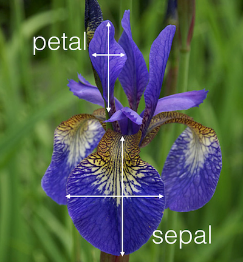

---
jupyter:
  jupytext:
    formats: ipynb,Rmd
    text_representation:
      extension: .Rmd
      format_name: rmarkdown
      format_version: '1.2'
      jupytext_version: 1.3.0
  kernelspec:
    display_name: R
    language: R
    name: ir
---

<div class="alert alert-block alert-info" style="margin-top: 20px">
    <a href="https://github.com/dd-consulting">
         
    </a>
    <h1>
        One-Stop Analytics: R
    </h1>
</div>


# Case Study of Autism Spectrum Disorder (ASD) with R

---


## <span style="color:blue">[ United States ]</span> 

## Centers for Disease Control and Prevention (CDC) - Autism Spectrum Disorder (ASD)

Autism spectrum disorder (ASD) is a developmental disability that can cause significant social, communication and behavioral challenges. CDC is committed to continuing to provide essential data on ASD, search for factors that put children at risk for ASD and possible causes, and develop resources that help identify children with ASD as early as possible.

https://www.cdc.gov/ncbddd/autism/data/index.html


## <span style="color:blue">[ Singapore ]</span> 

## TODAY Online - More preschoolers diagnosed with developmental issues

Doctors cited better awareness among parents and preschool teachers, leading to early referrals for diagnosis.

https://www.todayonline.com/singapore/more-preschoolers-diagnosed-developmental-issues


 

https://www.pathlight.org.sg/


<div class="alert alert-block alert-info" style="margin-top: 20px">
    <a href="">
    </a>
</div>


# Workshop Objective: 

## Use R to analyze Autism Spectrum Disorder (ASD) data from CDC USA. 

https://www.cdc.gov/ncbddd/autism/data/index.html

* ## R Fundamentals

* ## Data Summarization 

* ## Data Visualisation (Base Graphic)

* ## Appendices


<div class="alert alert-block alert-info" style="margin-top: 20px">
    <a href="">
    </a>
</div>


## <span style="color:blue">R Fundamentals</span>


<div class="alert alert-block alert-info" style="margin-top: 20px">
    <h3>
    R Fundamentals - Get & Set working directory
    </h3>
</div>


**Obtain current R <span style="color:blue">working directory</span>**

```{r}
getwd()
```

**Set new R working directory**

```{r}
# setwd("/media/sf_vm_shared_folder/git/DDC/DDC-ASD/model_R")
# setwd('~/Desktop/admin-desktop/vm_shared_folder/git/DDC-ASD/model_R')
getwd()
```

**Read in CSV data, storing as R <span style="color:blue">dataframe</span>**

```{r}
# Dataset: US. National Level Children ASD Prevalence
ASD_National <- read.csv("../dataset/ADV_ASD_National.csv", stringsAsFactors = FALSE)
```

```{r}
# Dataset: US. State Level Children ASD Prevalence
ASD_State    <- read.csv("../dataset/ADV_ASD_State.csv", stringsAsFactors = FALSE)
```

**Look at first/last few rows of data**

```{r}
head(ASD_National)
```

```{r}
tail(ASD_State)
```

**Obtain number of rows and number of columns/features/variables**

```{r}
dim(ASD_National)
```

```{r}
dim(ASD_State)
```

**Obtain overview (data structure/types)**

```{r}
str(ASD_National)
```

```{r}
str(ASD_State)
```

**Obtain name of columns**

```{r}
names(ASD_National)
```

```{r}
names(ASD_State)
```

**Display column name with its index number**

```{r}
cbind(names(ASD_National), c(1:length(names(ASD_National))))
```

**Look at data structure/schema (Selected columns)**

```{r}
str(ASD_National[, c(1:8, 24, 25, 26)])
```

<div class="alert alert-danger alertdanger" style="margin-top: 20px">
    <h3>
        Quiz:
    </h3>
    <p>
        Obtain feature/column names and column index of dataframe: ASD_State
    </p>
</div>

```{r}
# Write your code below and press Shift+Enter to execute 

```

Double-click <b>here</b> for the solution.

<!-- The answer is below:

# Write your code below and press Shift+Enter to execute 
cbind(names(ASD_State), c(1:length(names(ASD_State))))

-->


<div class="alert alert-block alert-info" style="margin-top: 20px">
    <h3>
    R Fundamentals - Work with dataframe
    </h3>
</div>


**Access column 1 as a <span style="color:blue">named list</span>:**

```{r}
# use column index:
ASD_National[1]
```

```{r}
typeof(ASD_National[1])
```

```{r}
ASD_National[1]$Source
```

```{r}
typeof(ASD_National[1]$Source)
```

```{r}
# use column name:
ASD_National["Source"]
```

```{r}
ASD_National['Source']$Source
```

**Access column 1 as a set of string/chr:**

```{r}
ASD_National[, 1]
```

```{r}
# or
ASD_National[, "Source"]
```

```{r}
# or
ASD_National$Source
```

```{r}
typeof(ASD_National$Source)
```

**Count number of elements in a object:**

```{r}
length(ASD_National) # number of features/columns
```

```{r}
length(ASD_National[1, ]) # number of elements(columns) in row 1
```

```{r}
length(ASD_National[, 1]) # number of elements(rows) in column 1
```

```{r}
length(ASD_National[, "Source"]) # same as above
```

```{r}
length(ASD_National$Source) # number of elements in chr list
```

**Access elements from dataframe**

```{r}
# using column index
ASD_National[1][1, ]
```

```{r}
ASD_National[1][11, ]
```

```{r}
ASD_National[1][11:20, ]
```

```{r}
# using column name
ASD_National["Source"][1, ]
```

```{r}
ASD_National["Source"][11, ]
```

```{r}
ASD_National["Source"][11:20, ]
```

**Access elements from dataframe**

```{r}
# using column index
ASD_National[, 1][1]
```

```{r}
ASD_National[, 1][11]
```

```{r}
ASD_National[, 1][11:20]
```

```{r}
# using column name
ASD_National[, "Source"][1]
```

```{r}
# using column name
ASD_National[, "Source"][11]
```

```{r}
# using column name
ASD_National[, "Source"][11:20]
```

```{r}
# using $ operator
ASD_National$Source[1]
```

```{r}
ASD_National$Source[11]
```

```{r}
ASD_National$Source[11:20]
```

**Access elements of different column:**

```{r}
cbind(names(ASD_National), c(1:length(names(ASD_National))))
```

```{r}
ASD_National[1, 1] # row 1, column 1: "Source" 
```

```{r}
ASD_National[10, 1] # row 10, column 1: "Source"
```

```{r}
ASD_National[1, 3] # row 1, column 3: "Prevalence"
```

```{r}
ASD_National[10, 3] # row 10, column 3: "Prevalence"
```

```{r}
ASD_National[1:10, 1:3] # row 1 to 10 from column 1 to 3
```

```{r}
# or using columns names
ASD_National[1:10, c('Source', 'Year', 'Prevalence')]
```

```{r}
ASD_National[c(1:10, 20, 30:35), c(1:3, 9, 12)] # row 1 to 10, 20, and 20 to 25 from column 1 to 3, 9, and 12
```

**<span style="color:blue">[ Tips ]</span> We notice missing data from above.**


<div class="alert alert-block alert-info" style="margin-top: 20px">
    <h3>
    R Fundamentals - Process missing data
    </h3>
</div>


**Count missing values in dataframe:**

```{r}
sum(is.na(ASD_National)) # No missing data recognised by R (NA)
```

```{r}
sum(is.na(ASD_State)) # Some missing data recognised by R (NA)
```

**Empty string, "No data" are not considered as missing value by R, thus we need to handle them manually.**

```{r}
# Define several offending strings
na_strings <- c("", "No data", "NA", "N A", "N / A", "N/A", "N/ A", "Not Available", "NOt available")
```

```{r}
# Load required function from packages:
if(!require(naniar)){install.packages("naniar")}
library(naniar)
if(!require(dplyr)){install.packages("dplyr")}
library(dplyr)
```

```{r}
# Uncomment below to show help
# ?replace_with_na_all # Documentation
```

**Replace these defined missing/offending values to R's internal NA**

```{r}
# "~.x" is a reserved keyword of this function:
ASD_National = replace_with_na_all(ASD_National, condition = ~.x %in% na_strings) 
```

```{r}
# Count missing values (R's internal NA) in dataframe:
sum(is.na(ASD_National))
```

<div class="alert alert-block alert-info" style="margin-top: 20px">
    <h3>
    R Fundamentals - Process invalid characters
    </h3>
</div>


**Remove invalid unicode char/string: \x92**

```{r}
ASD_National$Source_Full1[ASD_National$Source_Full1 == "National Survey of Children\x92s Health"] <- 
"National Survey of Children's Health"
```

```{r}
ASD_National$Source_Full2[ASD_National$Source_Full2 == "nsch-National Survey of Children\x92s Health"] <- 
"nsch-National Survey of Children's Health"
```

<div class="alert alert-block alert-info" style="margin-top: 20px">
    <h3>
    R Fundamentals - Delete/Drop dataframe variable
    </h3>
</div>


**Delete/Drop duplicate variable: Prevalence_dup**

```{r}
drop <- c("Prevalence_dup", "Dummy Variable Name")
```

```{r}
ASD_National = ASD_National[, !(names(ASD_National) %in% drop)] # Recall Dataframe[rows,columns]
```

<div class="alert alert-block alert-info" style="margin-top: 20px">
    <h3>
    R Fundamentals - Create/Add dataframe variable
    </h3>
</div>


**Create one new variable: Source_UC by converting to uppercase letters**

```{r}
ASD_National$Source_UC <- paste(toupper(ASD_National$Source))
```

**Create one new variable: Source_Full3 by combining Source and Source_Full1**

```{r}
ASD_National$Source_Full3 <- paste(toupper(ASD_National$Source), ASD_National$Source_Full1)
```

**Create one new ordinal categorical variable: Prevalence_Rank2 ("Low", "High") by binning Prevalence**

```{r}
# Recode Risk into category from Prevalence

# Low [0, 5)
# High [5, +oo) 

ASD_National$Prevalence_Risk2[ASD_National$Prevalence < 5] = "Low"
ASD_National$Prevalence_Risk2[ASD_National$Prevalence >= 5 ] = "High"
#
head(ASD_National)
```

**Create one new ordinal categorical variable: Prevalence_Rank4 ("Low", "Medium", "High", "Very High") by binning Prevalence**

```{r}
# Recode Risk into category from Prevalence

# Low [0, 5)
# Medium [5, 10)
# High [10, 20)
# Very High [20, +oo) 

ASD_National$Prevalence_Risk4 = "Very High"
ASD_National$Prevalence_Risk4[ASD_National$Prevalence < 20 ] = "High"
ASD_National$Prevalence_Risk4[ASD_National$Prevalence < 10 ] = "Medium"
ASD_National$Prevalence_Risk4[ASD_National$Prevalence < 5] = "Low"
#
head(ASD_National)
```

<div class="alert alert-block alert-info" style="margin-top: 20px">
    <h3>
    R Fundamentals - Convert to correct data types
    </h3>
</div>


**Review data structure and variable names:**

```{r}
str(ASD_National)
cbind(names(ASD_National), c(1:length(names(ASD_National))))
```

**Convert Prevalence and CIs from categorical/chr to numeric, column 8 to 25**

```{r}
ix <- 8:25 # define an index
# apply()
ASD_National[ix] <- apply(ASD_National[ix], 2, as.numeric) # "2" meand column-wise; "1" means row-wise.
```

```{r}
# Uncomment below to show help
# ?apply # Documentation
```

```{r}
# or lapply()
ASD_National[ix] <- lapply(ASD_National[ix], as.numeric) # column-wise
```

```{r}
# Uncomment below to show help
# ?lapply # Documentation
```

**Convert Source from categorical/chr to categorical/factor**

```{r}
ix <- c(1, 6, 7, 26, 27) # define an index
ASD_National[ix] <- lapply(ASD_National[ix], as.factor)
```

**Create new ordered factor Year_Factor from Year**

```{r}
ASD_National$Year_Factor <- factor(ASD_National$Year, ordered = TRUE)
```

```{r}
# Observe the difference of 'Levels' in below two factors
ASD_National$Year_Factor # Ordinal categorical variable
str(ASD_National$Year_Factor)

ASD_National$Source # Nominal categorical variable
str(ASD_National$Source)
```

**Convert Prevalence_Rank2 & Prevalence_Rank4 to ordered factor**

```{r}
# Convert to factor
ASD_National$Prevalence_Risk2 = factor(ASD_National$Prevalence_Risk2, ordered=TRUE,
                                           levels=c("Low", "High"))
# Convert to factor
ASD_National$Prevalence_Risk4 = factor(ASD_National$Prevalence_Risk4, ordered=TRUE,
                                           levels=c("Low", "Medium", "High", "Very High"))
```

```{r}
# Optionally, below is manual conversion examples:
# ASD_National$Male.Prevalence = as.numeric(ASD_National$Male.Prevalence)
# ASD_National$Source = as.factor(ASD_National$Source)
# ASD_National$Prevalence_Risk2 = factor(ASD_National$Prevalence_Risk2, ordered=TRUE, levels=c("Low", "High"))
# ASD_National$Prevalence_Risk4 = factor(ASD_National$Prevalence_Risk4, ordered=TRUE, levels=c("Low", "Medium", "High", "Very High"))

```

**Optionally, export the processed dataframe data to CSV file.**

```{r}
write.csv(ASD_National, file = "../dataset/ADV_ASD_National_R.csv", row.names = FALSE)
```

```{r}
# Read back in above saved file:
# ASD_National <- read.csv("../dataset/ADV_ASD_National_R.csv")
# ASD_National$Year_Factor <- factor(ASD_National$Year_Factor, ordered = TRUE) # Convert Year_Factor to ordered.factor
```

<div class="alert alert-block alert-info" style="margin-top: 20px">
</div>


## <span style="color:blue">Data Summarization </span>


<div class="alert alert-block alert-info" style="margin-top: 20px">
    <h3>
    Data Summarization - High Level Data Summary
    </h3>
</div>


```{r}
summary(ASD_National)
```

<div class="alert alert-block alert-info" style="margin-top: 20px">
    <h3>
    Data Summarization - Summary of <span style="color:blue">numeric</span> variables
    </h3>
</div>


```{r}
# Filter only numeric variables/columns
select_if(ASD_National, is.numeric) # library(dplyr)
```

```{r}
# Data summarization
summary(select_if(ASD_National, is.numeric))
```

**<span style="color:blue">[ Tips ]</span> We notice missing data in a few Prevalence variables.**

```{r}
# Calculate average Prevalence, no error
mean(ASD_National$Prevalence)
mean(ASD_National$Prevalence[ASD_National$Source == 'addm'])
mean(ASD_National$Prevalence[ASD_National$Source == 'medi'])
mean(ASD_National$Prevalence[ASD_National$Source == 'nsch'])
mean(ASD_National$Prevalence[ASD_National$Source == 'sped'])
```

```{r}
# Calculate average Male.Prevalence, there is error!
mean(ASD_National$Male.Prevalence)
```

```{r}
# Because of NA, mean() cannot process, thus we use na.rm to ignore NAs
mean(ASD_National$Male.Prevalence, na.rm = TRUE)
```

```{r}
mean(ASD_National$Female.Prevalence, na.rm = TRUE)
```

```{r}
# Count occurrences of uniques values in a variable/column: number of rows (of data entry) per year
table(ASD_National$Year) # ?table
```

<div class="alert alert-block alert-info" style="margin-top: 20px">
    <h3>
    Data Summarization - Summary of <span style="color:blue">categorical</span> variables
    </h3>
</div>


```{r}
# List of categorical variables
names(select_if(ASD_National, is.factor)) # All categorical variables are factor data type
names(select_if(ASD_National, is.character)) # No categorical variable is character data type
```

```{r}
# Look at summary
summary(select_if(ASD_National, is.factor))
```

```{r}
summary(select_if(ASD_National, is.character))
```

```{r}
# Count occurrences of uniques values in a variable/column
table(ASD_National$Source)
```

```{r}
table(ASD_National$Source_Full3)
```

```{r}
table(ASD_National$Year_Factor)
```

```{r}
table(ASD_National$Prevalence) # numeric is also possible
```

```{r}
# Display unique values (levels) of a factor categorical 
lapply(select_if(ASD_National, is.factor), levels)
```

```{r}
# or using variable names
lapply(ASD_National[c('Source_UC', 'Year_Factor')], levels)
```

```{r}
# Pivot of counting occurrences
table(ASD_National$Source_Full3, ASD_National$Year) # table(ASD_National$Year, ASD_National$Source_Full3)
```

```{r}
# Pivot of counting occurrences
table(ASD_National$Prevalence_Risk2, ASD_National$Source)

# Pivot of counting occurrences
table(ASD_National$Prevalence_Risk4, ASD_National$Source)
```

<div class="alert alert-block alert-info" style="margin-top: 20px">
</div>


## <span style="color:blue">Data Visualisation (Base Graphic)</span>


```{r}
# library(repr)
# Adjust in-line plot size to M x N
options(repr.plot.width=8, repr.plot.height=4)
```

<div class="alert alert-block alert-info" style="margin-top: 20px">
    <h3>
    Data Visualisation (Base Graphic) - Histogram (distribution of binned continuous variable)
    </h3>
</div>


https://www.statmethods.net/graphs/density.html

```{r}
hist(ASD_National$Prevalence)
```

```{r}
par(mfrow=c(1, 2)) # multiple plots on one page: row split to: 1,column split to: 2
hist(ASD_National$Male.Prevalence)
hist(ASD_National$Female.Prevalence)
par(mfrow=c(1, 1)) # Reset to one plot on one page
```

```{r}
# Histogram with annotations
hist(ASD_National$Prevalence,
     main = "Frequency of National ASD Prevalence", # Chart title
     xlab = "Prevalence per 1,000 Children", # x axis label
     ylab = "Frequency or Occurrences",# y axis label
     sub  = "Year 2000 - 2016", # Chart subtitle at bottom
     col.main="blue", col.lab="black", col.sub="darkgrey") # Colours
```

<div class="alert alert-block alert-info" style="margin-top: 20px">
    <h3>
    Density plot (distribution for continuous variable normalized to 100% area under curve)
    </h3>
</div>


https://www.statmethods.net/graphs/density.html

```{r}
par(mfrow=c(1, 2)) # multiple plots on one page: row split to: 1,column split to: 2

plot(density(ASD_National$Prevalence))

# Density plot with annotations
plot(density(ASD_National$Prevalence),
     main = "Density of National ASD Prevalence",
     xlab = "Prevalence per 1,000 Children",
     ylab = "Frequency or Occurrences",
     sub  = "Year 2000 - 2016",
     col.main="blue", col.lab="black", col.sub="darkgrey")

par(mfrow=c(1, 1))
```

<div class="alert alert-block alert-info" style="margin-top: 20px">
    <h3>
    Boxplot plot (median, 25% quantile,75% quantile)
    </h3>
</div>


https://www.statmethods.net/graphs/boxplot.html


https://stats.stackexchange.com/questions/156778/percentile-vs-quantile-vs-quartile

0 quartile = 0 quantile = 0 percentile

1 quartile = 0.25 quantile = 25 percentile

2 quartile = .5 quantile = 50 percentile (median)

3 quartile = .75 quantile = 75 percentile

4 quartile = 1 quantile = 100 percentile

```{r}
par(mfrow=c(1, 2)) # multiple plots on one page: row split to: 1,column split to: 2

# All children prevalence with and without 95% confidence side by side:
boxplot(ASD_National$Prevalence, notch = TRUE) # 95% confidence interval - a notch is drawn in each side of the boxes. If the notches of two plots do not overlap this is ‘strong evidence’ that the two medians differ
boxplot(ASD_National$Prevalence) # All children

par(mfrow=c(1, 1))
```

```{r}
par(mfrow=c(1, 2)) # multiple plots on one page: row split to: 1,column split to: 2

# Male prevalence and Female prevalence side by side:
boxplot(ASD_National$Male.Prevalence, ylim = c(0, 35), notch = TRUE) # Male children
boxplot(ASD_National$Female.Prevalence, ylim = c(0, 35), notch = TRUE) # Female children

par(mfrow=c(1, 1))
```

```{r}
# Display value ranges
# numeric:
range(ASD_National$Prevalence)
```

```{r}
range(ASD_National$Year)
```

```{r}
# categorical:
min(ASD_National$Year_Factor)
```

```{r}
max(ASD_National$Year_Factor)
```

```{r}
# Create 'Prevalence' box plots break by 'Source'
boxplot(ASD_National$Prevalence ~ ASD_National$Source,
        main = "National ASD Prevalence by Data Source",
        xlab = "Data Source",
        ylab = "Prevalence per 1,000 Children",
        sub  = "Year 2000 - 2016",
        col.main="blue", col.lab="black", col.sub="darkgrey")
```

<div class="alert alert-danger alertdanger" style="margin-top: 20px">
    <h3>
        Quiz:
    </h3>
    <p>
        Set notch=TRUE to above boxplot. Are there overlapping among four data sources?
    </p>
</div>

```{r}
# Write your code below and press Shift+Enter to execute 

```

Double-click <b>here</b> for the solution.

<!-- The answer is below:

# Write your code below and press Shift+Enter to execute 
# Create 'Prevalence' box plots break by 'Source'
boxplot(ASD_National$Prevalence ~ ASD_National$Source,
        main = "National ASD Prevalence by Data Source", notch=TRUE,
        xlab = "Data Source",
        ylab = "Prevalence per 1,000 Children",
        sub  = "Year 2000 - 2016",
        col.main="blue", col.lab="black", col.sub="darkgrey")

-->


<div class="alert alert-block alert-info" style="margin-top: 20px">
    <h3>
    Data Visualisation (Base Graphic) - Bar plot
    </h3>
</div>


```{r}
# Adjust in-line plot size to M x N
options(repr.plot.width=8, repr.plot.height=4)
```

```{r}
# ----------------------------------
# [National] Risk by Data Source
# ----------------------------------
# Create bar chart using R graphics
counts = table(ASD_National$Prevalence_Risk2, ASD_National$Source)
#counts = table(ASD_National$Source, ASD_National$Prevalence_Risk4)
barplot(counts,
        main="Prevalence by Data Sources and Risk Levels",
        xlab="Data Sources", col=c("white", "lightgrey"),
        ylab="Occurrences",
        legend = rownames(counts), 
        args.legend = list(x="topleft", bty = "n", cex = 0.85, y.intersp=2))
```

```{r}
# ----------------------------------
# [National] Risk by Data Source
# ----------------------------------
# Create bar chart using R graphics
counts = table(ASD_National$Prevalence_Risk2, ASD_National$Source) # Count of Risk records, split by Source
barplot(counts,
        main="Prevalence by Data Sources and Risk Levels",
        xlab="Data Sources",
        ylab="Occurrences",
        col=c("white", "lightgrey"),
        legend = rownames(counts), 
        args.legend = list(x = "topleft", bty = "n", cex = 0.85, y.intersp = 2))
```

```{r}
# ----------------------------------
# [National] Risk by Data Source
# ----------------------------------
# Create bar chart using R graphics
counts = table(ASD_National$Prevalence_Risk4, ASD_National$Source) # Count of Risk records, split by Source
barplot(counts,
        main="Prevalence Occurrence by Source and Risk",
        xlab="Data Sources",
        ylab="Occurrences",
        col=c("lightyellow", "orange", "red","darkred"),
        legend = rownames(counts), 
        args.legend = list(x = "topleft", bty = "n", cex = 0.85, y.intersp = 2))
```

<div class="alert alert-block alert-info" style="margin-top: 20px">
    <h3>
    Data Visualisation (Base Graphic) - Line chart
    </h3>
</div>


```{r}
# Adjust in-line plot size to M x N
options(repr.plot.width=8, repr.plot.height=5)
```

```{r}
# ----------------------------------
# [National] < Prevalence has changed over Time >
# ----------------------------------
# Prevalence over Year
# Use Year        as x-axis: y value Prevalence is NOT aggregated for different data sources
plot(ASD_National$Year, ASD_National$Prevalence) 
```

```{r}
# Use Year_factor as x-axis: y value Prevalence is     aggregated for different data sources
plot(ASD_National$Year_Factor, ASD_National$Prevalence) 
```

```{r}
# table(ASD_National$Source_Full3)
```

```{r}
# Adjust in-line plot size to M x N
options(repr.plot.width=8, repr.plot.height=6)

par(mfrow=c(2, 2))

# Prevalence over Year, from data source: 
# addm-Autism & Developmental Disabilities Monitoring Network
plot(ASD_National$Year[ASD_National$Source == 'addm'], 
     ASD_National$Prevalence[ASD_National$Source == 'addm'])

# Prevalence over Year, from data source: 
# medi-Medicaid
plot(ASD_National$Year[ASD_National$Source == 'medi'], 
     ASD_National$Prevalence[ASD_National$Source == 'medi'])

# Prevalence over Year, from data source: 
# nsch-National Survey of Children Health
plot(ASD_National$Year[ASD_National$Source == 'nsch'], 
     ASD_National$Prevalence[ASD_National$Source == 'nsch'])

# Prevalence over Year, from data source: 
# sped-Special Education Child Count
plot(ASD_National$Year[ASD_National$Source == 'sped'], 
     ASD_National$Prevalence[ASD_National$Source == 'sped'])

par(mfrow=c(1, 1)) # Reset to one plot on one page
```

```{r}
# ----------------------------------
# Add more annotations to above plots
# ----------------------------------
# Color list
# addm : darkblue
# medi : orange
# nsch : darkred
# sped : skyblue

par(mfrow=c(2, 2))

# Prevalence over Year, from data source: 
# addm-Autism & Developmental Disabilities Monitoring Network
plot(ASD_National$Year[ASD_National$Source == 'addm'], 
     ASD_National$Prevalence[ASD_National$Source == 'addm'],
     type="l", # dot/point type
     lty=1, # line type
     lwd=3, # line width
     col="darkblue", # line color
     xlab="Year", 
     ylab="Prevalence per 1,000 Children", 
     ylim = c(0, 30), # Set value range of y axis
     main="[addm] Prevalence Estimates Over Time",
     sub  = "zhan.gu@nus.edu.sg",
     col.main="blue", col.lab="black", col.sub="darkgrey")

# Prevalence over Year, from data source: 
# medi-Medicaid
plot(ASD_National$Year[ASD_National$Source == 'medi'], 
     ASD_National$Prevalence[ASD_National$Source == 'medi'],
     type="b", lty=1, lwd=3,  col="orange",
     xlab="Year", 
     ylab="Prevalence per 1,000 Children", 
     ylim = c(0, 30), # Set value range of y axis
     main="[medi] Prevalence Estimates Over Time",
     sub  = "zhan.gu@nus.edu.sg",
     col.main="blue", col.lab="black", col.sub="darkgrey")

# Prevalence over Year, from data source: 
# nsch-National Survey of Children Health
plot(ASD_National$Year[ASD_National$Source == 'nsch'], 
     ASD_National$Prevalence[ASD_National$Source == 'nsch'],
     type="l", lty=2, lwd=3,  col="darkred",
     xlab="Year", 
     ylab="Prevalence per 1,000 Children", 
     ylim = c(0, 30), # Set value range of y axis
     main="[nsch] Prevalence Estimates Over Time",
     sub  = "zhan.gu@nus.edu.sg",
     col.main="blue", col.lab="black", col.sub="darkgrey")

# Prevalence over Year, from data source: 
# sped-Special Education Child Count
plot(ASD_National$Year[ASD_National$Source == 'sped'], 
     ASD_National$Prevalence[ASD_National$Source == 'sped'],
     type="l", lty=3, lwd=3,  col="skyblue",
     xlab="Year", 
     ylab="Prevalence per 1,000 Children", 
     ylim = c(0, 30), # Set value range of y axis
     main="[sped] Prevalence Estimates Over Time",
     sub  = "zhan.gu@nus.edu.sg",
     col.main="blue", col.lab="black", col.sub="darkgrey")

par(mfrow=c(1, 1)) # Reset to one plot on one page
```

<div class="alert alert-block alert-info" style="margin-top: 20px">
    <h3>
    Data Visualisation (Base Graphic) - <span style="color:blue">[ R ] REPORTED PREVALENCE HAS CHANGED OVER TIME</span> by [ Data Source ]
    </h3>
</div>


**Create multiple lines within a single chart**

```{r}
# ----------------------------------
# [National] < Prevalence Varies over Time/Year by Data Source >
# ----------------------------------
# Create a first line
plot(ASD_National$Year[ASD_National$Source == 'addm'], 
     ASD_National$Prevalence[ASD_National$Source == 'addm'], 
     col = "darkblue", lty = 1, lwd = 2,
     type = "b", # use dot/point
     pch = 0, # dot/point type: http://www.endmemo.com/program/R/pchsymbols.php
     xlab="Year", 
     xlim=c(2000, 2016), # Set x axis value range
     ylab="Prevalence per 1,000 Children", 
     ylim=c(0, 30), # Set y axis value range
     main="Prevalence Estimates Over Time by Data Source",
     col.main="black", col.lab="black", col.sub="grey",
     frame = FALSE, # Remove frame
     axes=FALSE # Remove x and y axis
)
axis(1, at=seq(2000, 2016, 1)) # Customize x axis
axis(2, at=seq(0, 30, 5)) # Customize y axis

# Add another line
lines(ASD_National$Year[ASD_National$Source == 'medi'], 
      ASD_National$Prevalence[ASD_National$Source == 'medi'], 
      pch = 1, col = "orange", type = "b", lty = 1, lwd = 2
)
# Add another line
lines(ASD_National$Year[ASD_National$Source == 'nsch'], 
      ASD_National$Prevalence[ASD_National$Source == 'nsch'], 
      pch = 2, col = "darkred", type = "b", lty = 1, lwd = 2
)
# Add another line
lines(ASD_National$Year[ASD_National$Source == 'sped'], 
      ASD_National$Prevalence[ASD_National$Source == 'sped'], 
      pch = 5, col = "skyblue", type = "b", lty = 1, lwd = 2
)
# Add a legend to the plot
legend("topleft", legend=levels(ASD_National$Source),
       col=c("darkblue", "orange", "darkred", "skyblue"), 
       pch = 20, # dot in a line
       lty = 1, # line type
       lwd = 2, # line width
       cex=0.8, # size of text
       bty = 'n' # Without frame
)

```

R pch: dot/point type: http://www.endmemo.com/program/R/pchsymbols.php

R plot colour list: https://www.r-graph-gallery.com/42-colors-names.html


<div class="alert alert-block alert-info" style="margin-top: 20px">
    <h3>
    Data Visualisation (Base Graphic) - <span style="color:blue">[ R ] REPORTED PREVALENCE VARIES BY SEX</span> [ Source: ADDM ] over [ Year ]
    </h3>
</div>


```{r}
# ----------------------------------
# [addm] < Prevalence Varies by Sex >
# ----------------------------------
# Create a first line
plot(ASD_National$Year[ASD_National$Source == 'addm'], 
     ASD_National$Prevalence[ASD_National$Source == 'addm'], 
     col = "grey", lty = 1, lwd = 2,
     type = "l", # use dot/point
     pch = 0, # dot/point type: http://www.endmemo.com/program/R/pchsymbols.php
     xlab="Year", 
     xlim=c(2000, 2016), # Set x axis value range
     ylab="Prevalence per 1,000 Children", 
     ylim=c(0, 30), # Set y axis value range
     main="Prevalence Estimates by Sex [ADDM]",
     col.main="black", col.lab="black", col.sub="grey",
     frame = FALSE, # Remove frame
     axes=FALSE # Remove x and y axis
)
axis(1, at=seq(2000, 2016, 1)) # Customize x axis
axis(2, at=seq(0, 30, 5)) # Customize y axis

# Add Female prevalence
lines(ASD_National$Year[ASD_National$Source == 'addm'], 
      ASD_National$Female.Prevalence[ASD_National$Source == 'addm'], 
      pch = 1, col = "orange", type = "l", lty = 1, lwd = 2)
# Add Female prevalence lower CI
lines(ASD_National$Year[ASD_National$Source == 'addm'], 
      ASD_National$Female.Lower.CI[ASD_National$Source == 'addm'], 
      pch = 1, col = "orange", type = "l", lty = 3, lwd = 1)
# Add Female prevalence upper CI
lines(ASD_National$Year[ASD_National$Source == 'addm'], 
      ASD_National$Female.Upper.CI[ASD_National$Source == 'addm'], 
      pch = 1, col = "orange", type = "l", lty = 3, lwd = 1)

# Add Male prevalence
lines(ASD_National$Year[ASD_National$Source == 'addm'], 
      ASD_National$Male.Prevalence[ASD_National$Source == 'addm'], 
      pch = 1, col = "blue", type = "l", lty = 1, lwd = 2)
# Add Male prevalence lower CI
lines(ASD_National$Year[ASD_National$Source == 'addm'], 
      ASD_National$Male.Lower.CI[ASD_National$Source == 'addm'], 
      pch = 1, col = "blue", type = "l", lty = 3, lwd = 1)
# Add Male prevalence upper CI
lines(ASD_National$Year[ASD_National$Source == 'addm'], 
      ASD_National$Male.Upper.CI[ASD_National$Source == 'addm'], 
      pch = 1, col = "blue", type = "l", lty = 3, lwd = 1)
# Add a legend to the plot
legend("topleft", legend=c('ADDM Average', 'Female with 95% CI', 'Male with 95% CI'),
       col=c("grey", "orange", "blue"), 
       #       pch = 20, # dot in a line
       lty = 1, # line type
       lwd = 2, # line width
       cex=0.8, # size of text
       bty = 'n' # Without frame
)

```

<div class="alert alert-block alert-info" style="margin-top: 20px">
    <h3>
    Data Visualisation (Base Graphic) - <span style="color:blue">[ R ] REPORTED PREVALENCE VARIES BY RACE AND ETHNICITY</span> [ Source: ADDM ]
    </h3>
</div>


```{r}
# ----------------------------------
# [addm] < Prevalence Varies by Race and Ethnicity >
# ----------------------------------
# Create a first line
plot(ASD_National$Year[ASD_National$Source == 'addm'], 
     ASD_National$Prevalence[ASD_National$Source == 'addm'], 
     col = "grey", lty = 1, lwd = 2,
     type = "l", # use dot/point
     pch = 0, # dot/point type: http://www.endmemo.com/program/R/pchsymbols.php
     xlab="Year", 
     xlim=c(2000, 2016), # Set x axis value range
     ylab="Prevalence per 1,000 Children", 
     ylim=c(0, 30), # Set y axis value range
     main="Prevalence Estimates by Race/Ethnicity [ADDM]",
     col.main="black", col.lab="black", col.sub="grey",
     frame = FALSE, # Remove frame
     axes=FALSE # Remove x and y axis
)
axis(1, at=seq(2000, 2016, 1)) # Customize x axis
axis(2, at=seq(0, 30, 5)) # Customize y axis

# R plot colour list: https://www.r-graph-gallery.com/42-colors-names.html

# Add Asian.or.Pacific.Islander.Prevalence
lines(ASD_National$Year[ASD_National$Source == 'addm'], 
      ASD_National$Asian.or.Pacific.Islander.Prevalence[ASD_National$Source == 'addm'], 
      pch = 20, col = "darkred", type = "b", lty = 1, lwd = 2)
# Add Hispanic.Prevalence
lines(ASD_National$Year[ASD_National$Source == 'addm'], 
      ASD_National$Hispanic.Prevalence[ASD_National$Source == 'addm'], 
      pch = 20, col = "darkorchid3", type = "b", lty = 1, lwd = 2)
# Add Non.hispanic.black.Prevalence
lines(ASD_National$Year[ASD_National$Source == 'addm'], 
      ASD_National$Non.hispanic.black.Prevalence[ASD_National$Source == 'addm'], 
      pch = 20, col = "deepskyblue3", type = "b", lty = 1, lwd = 2)
# Add Non.hispanic.white.Prevalence
lines(ASD_National$Year[ASD_National$Source == 'addm'], 
      ASD_National$Non.hispanic.white.Prevalence[ASD_National$Source == 'addm'], 
      pch = 20, col = "chartreuse3", type = "b", lty = 1, lwd = 2)

# Add a legend to the plot
legend("topleft", legend=c('ADDM Average', 
                           'Non-Hispanic White',
                           'Non-Hispanic Black',
                           'Hispanic', 
                           'Asian/Pacific Islander'),
       col=c("grey", "chartreuse3", "deepskyblue3", "darkorchid3", "darkred"), 
       pch = 20, # dot in a line
       lty = 1, # line type
       lwd = 2, # line width
       cex=0.8, # size of text
       bty = 'n' # Without frame
)

```

```{r}
# Adjust in-line plot size to M x N
options(repr.plot.width=8, repr.plot.height=4)
```

<div class="alert alert-danger alertdanger" style="margin-top: 20px">
    <h3>
        Quiz:
    </h3>
    <p>
        Add 95% Confidence Interval to above plot
    </p>
</div>

```{r}
# Write your code below and press Shift+Enter to execute 

```

Double-click <b>here</b> for the solution.

<!-- The answer is below:

# Write your code below and press Shift+Enter to execute 
# TBD

-->


<div class="alert alert-danger alertdanger" style="margin-top: 20px">
    <h3>
        Quiz:
    </h3>
    <p>
        Use talbe() to count No. prevalence records for each Data Source. Then use barplot() to visualize.
    </p>
</div>

```{r}
# Write your code below and press Shift+Enter to execute 

```

Double-click <b>here</b> for the solution.

<!-- The answer is below:

# Write your code below and press Shift+Enter to execute 
table(ASD_National$Source)
barplot(table(ASD_National$Source))

-->


<div class="alert alert-danger alertdanger" style="margin-top: 20px">
    <h3>
        Quiz:
    </h3>
    <p>
        Which Data Sources are available in which years?
    </p>
</div>

```{r}
# Write your code below and press Shift+Enter to execute 

```

Double-click <b>here</b> for the solution.

<!-- The answer is below:

# Write your code below and press Shift+Enter to execute 
table(ASD_National$Year, ASD_National$Source)
plot(table(ASD_National$Year, ASD_National$Source))

-->


<div class="alert alert-danger alertdanger" style="margin-top: 20px">
    <h3>
        Quiz:
    </h3>
    <p>
        Which Data Source has breakdown Prevalvence data by sex/gender?
    </p>
</div>

```{r}
# Write your code below and press Shift+Enter to execute 

```

Double-click <b>here</b> for the solution.

<!-- The answer is below:

# Write your code below and press Shift+Enter to execute 
table(ASD_National$Source_Full2, ASD_National$Male.Prevalence)
plot(table(ASD_National$Source_Full2, ASD_National$Male.Prevalence))

-->


<div class="alert alert-danger alertdanger" style="margin-top: 20px">
    <h3>
        Quiz:
    </h3>
    <p>
        Which Data Source has breakdown Prevalvence data by race and ethnicity?
    </p>
</div>

```{r}
# Write your code below and press Shift+Enter to execute 

```

Double-click <b>here</b> for the solution.

<!-- The answer is below:

# Write your code below and press Shift+Enter to execute 
table(ASD_National$Source, ASD_National$Asian.or.Pacific.Islander.Prevalence)
plot(table(ASD_National$Source, ASD_National$Asian.or.Pacific.Islander.Prevalence))

-->


<div class="alert alert-block alert-info" style="margin-top: 20px">
</div>


### Excellent! You have completed the workshop notebook!


**Connect with the author:**

This notebook was written by [GU Zhan (Sam)](https://sg.linkedin.com/in/zhan-gu-27a82823 "GU Zhan (Sam)").

[Sam](https://www.iss.nus.edu.sg/about-us/staff/detail/201/GU_Zhan "GU Zhan (Sam)") is currently a lecturer in [Institute of Systems Science](https://www.iss.nus.edu.sg/ "NUS-ISS") in [National University of Singapore](http://www.nus.edu.sg/ "NUS"). He devotes himself into pedagogy & andragogy, and is very passionate in inspiring next generation of artificial intelligence lovers and leaders.


Copyright &copy; 2020 GU Zhan

This notebook and its source code are released under the terms of the [MIT License](https://en.wikipedia.org/wiki/MIT_License "Copyright (c) 2020 GU ZHAN").

Permission is hereby granted, free of charge, to any person obtaining a copy
of this software and associated documentation files (the "Software"), to deal
in the Software without restriction, including without limitation the rights
to use, copy, modify, merge, publish, distribute, sublicense, and/or sell
copies of the Software, and to permit persons to whom the Software is
furnished to do so, subject to the following conditions:

The above copyright notice and this permission notice shall be included in all
copies or substantial portions of the Software.

THE SOFTWARE IS PROVIDED "AS IS", WITHOUT WARRANTY OF ANY KIND, EXPRESS OR
IMPLIED, INCLUDING BUT NOT LIMITED TO THE WARRANTIES OF MERCHANTABILITY,
FITNESS FOR A PARTICULAR PURPOSE AND NONINFRINGEMENT. IN NO EVENT SHALL THE
AUTHORS OR COPYRIGHT HOLDERS BE LIABLE FOR ANY CLAIM, DAMAGES OR OTHER
LIABILITY, WHETHER IN AN ACTION OF CONTRACT, TORT OR OTHERWISE, ARISING FROM,
OUT OF OR IN CONNECTION WITH THE SOFTWARE OR THE USE OR OTHER DEALINGS IN THE
SOFTWARE.


<div class="alert alert-block alert-info" style="margin-top: 20px">
    <a href="">
    </a>
</div>


## <span style="color:blue">Appendices</span>


<div class="alert alert-block alert-info" style="margin-top: 20px">
    <h3>
    Interactive workshops: < Learning R inside R > using swirl() (in R/RStudio)
    </h3>
</div>


https://github.com/telescopeuser/S-SB-Workshop


<div class="alert alert-block alert-info" style="margin-top: 20px">
    <h3>
    Neural Network 101 using nnet()
    </h3>
</div>


**Use nerual net to classify three different species of iris flowers, based on four features/measurements of:**
* length of the petals
* width of the petals
* length of the sepals
* width of the sepals





```{r}
# ----------------------------------
# Neural Network 101 using nnet()
# ----------------------------------
if(!require(nnet)){install.packages("nnet")}
library("nnet")
# ?nnet
 
# < Case: predict three different iris flower types >

# https://en.wikipedia.org/wiki/Iris_flower_data_set
# https://archive.ics.uci.edu/ml/datasets/iris

# Data preparation: split iris data in two halves, for training & testing respectively.
ir <- rbind(iris3[,,1],iris3[,,2],iris3[,,3])
targets <- class.ind( c(rep("setosa", 50), rep("versicolor", 50), rep("virginica", 50)) )
samp <- c(sample(1:50,25), sample(51:100,25), sample(101:150,25))
# Model training (machine learning / data fitting)
ir1 <- nnet(ir[samp,], targets[samp,], size = 2, rang = 0.1,
            decay = 5e-4, maxit = 200)
# Model evaluation function
test.cl <- function(true, pred) {
  true <- max.col(true)
  cres <- max.col(pred)
  table(true, cres)
}
# Model evaluation
test.cl(targets[-samp,], predict(ir1, ir[-samp,]))

```

<div class="alert alert-block alert-info" style="margin-top: 20px">
    <a href="https://github.com/dd-consulting">
         
    </a>
</div>


---
