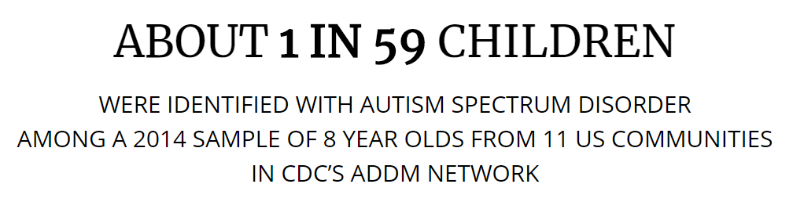
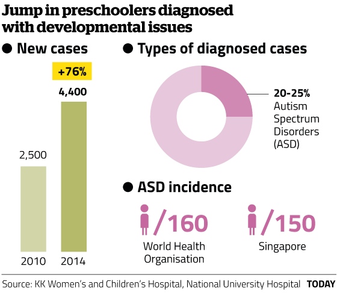

---
jupyter:
  jupytext:
    formats: ipynb,Rmd
    text_representation:
      extension: .Rmd
      format_name: rmarkdown
      format_version: '1.2'
      jupytext_version: 1.3.0
  kernelspec:
    display_name: R
    language: R
    name: ir
---

<div class="alert alert-block alert-info" style="margin-top: 20px">
    <a href="">
         
    </a>
    <h1>
        One-Stop Analytics: Predictive Modeling
    </h1>
</div>


# Case Study of Autism Spectrum Disorder (ASD) with R

---





## <span style="color:blue">[ United States ]</span> 

## Centers for Disease Control and Prevention (CDC) - Autism Spectrum Disorder (ASD)

Autism spectrum disorder (ASD) is a developmental disability that can cause significant social, communication and behavioral challenges. CDC is committed to continuing to provide essential data on ASD, search for factors that put children at risk for ASD and possible causes, and develop resources that help identify children with ASD as early as possible.

https://www.cdc.gov/ncbddd/autism/data/index.html


## <span style="color:blue">[ Singapore ]</span> 

## TODAY Online - More preschoolers diagnosed with developmental issues

Doctors cited better awareness among parents and preschool teachers, leading to early referrals for diagnosis.

https://www.gov.sg/news/content/today-online-more-preschoolers-diagnosed-with-developmental-issues




 

https://www.pathlight.org.sg/


<div class="alert alert-block alert-info" style="margin-top: 20px">
    <a href="">
         
    </a>
</div>


# Workshop Objective: 

## Use R to predict Autism Spectrum Disorder (ASD) prevalence. 

https://www.cdc.gov/ncbddd/autism/data/index.html

* ## Linear Model: Simple Linear Regression (SLR)

* ## Linear Model: Multiple Linear Regression (MLR)

* ## Linear Model: Polynomial Regression (PLR)

* ## Linear Model: Logistic Regression (LR)

* ## Non-Linear Model: Decision Tree (DT)

* ## Non-Linear Model: Neural Network (NN)

* ## Non-Linear Model: Random Forest (RF)

* ## Non-Linear Model: Support Vector Machines (SVM)

* ## Non-Linear Model: Adaptive Boosting (AdaBoost)

* ## Workshop Submission

* ## Appendices


<div class="alert alert-block alert-info" style="margin-top: 20px">
    <a href="">
         
    </a>
</div>


```{r}
library("repr") # Show graphs in-line notebook
```

**Obtain current R <span style="color:blue">working directory</span>**

```{r}
getwd()
```

**Set new R working directory**

```{r}
# setwd("/media/sf_vm_shared_folder/git/DDC/DDC-ASD/model_R")
# setwd('~/Desktop/admin-desktop/vm_shared_folder/git/DDC-ASD/model_R')
getwd()
```

<div class="alert alert-block alert-info" style="margin-top: 20px">
    <a href="">
         
    </a>
</div>


## <span style="color:blue">Linear Model: Simple Linear Regression (SLR)</span>


<div class="alert alert-block alert-info" style="margin-top: 20px">
    <h3>
    Linear Model: Simple Linear Regression (SLR) - Workshop Task
    </h3>
</div>


**Workshop Task:**

1. a.	Graph the data in a scatterplot to determine if there is a possible linear relationship.

2. b.	Compute and interpret the linear correlation coefficient, r.

3. c.	Determine the regression equation for the data.

4. d.	Graph the regression equation and the data points.

5. e.	Identify potential influential observations (outliers).

6. f.	At the 5% significance level, do the data provide sufficient evidence to conclude that the slope of the population regression line is not 0 and, hence, that [ Year ] is useful as a predictor of ASD [ Prevalence ]?

7. g.	Obtain the residuals and create a residual plot. Decide whether it is reasonable to consider that the assumptions for regression analysis are met by the variables in questions.

8. h.	Compute and interpret the coefficient of determination, $R^2$.

9. i.	Find the predicted ASD Prevalence of Year 2030.

10. j.	Determine a 95% prediction interval for the ASD Prevalence of Year 2030.


**Use Case Data: <span style="color:blue">"../dataset/ADV_ASD_State_R.csv"</span>**


**Read in CSV data, storing as R <span style="color:blue">dataframe</span>**

```{r}
# Read back in above saved file:
ASD_State <- read.csv("../dataset/ADV_ASD_State_R.csv")
ASD_State$Year_Factor <- factor(ASD_State$Year_Factor, ordered = TRUE) # Convert Year_Factor to ordered.factor
```

```{r}
head(ASD_State)
```

```{r}
# Filter [ Source: ADDM ], including only two clomuns for SLR:
# Dependent variable: Prevalence
# independent variable: Year
ASD_State_4_SLR = subset(ASD_State, Source_UC == 'ADDM', select = c(Prevalence, Year))
#
dim(ASD_State_4_SLR)
ASD_State_4_SLR
```

---


**SLR Workshop Task: <span style="color:blue">1. a. Graph the data in a scatterplot to determine if there is a possible linear relationship.</span>**

```{r}
# Adjust in-line plot size to M x N
options(repr.plot.width=8, repr.plot.height=4)
```

```{r}
plot(ASD_State_4_SLR$Year, ASD_State_4_SLR$Prevalence)
```

---


**SLR Workshop Task: <span style="color:blue">2. b. Compute and interpret the linear correlation coefficient, r.</span>**


Compute correlaion coefficient

```{r}
cor(ASD_State_4_SLR$Year, ASD_State_4_SLR$Prevalence)
```

Apply correlation test (two tail: != 0)

```{r}
cor.test(ASD_State_4_SLR$Year, ASD_State_4_SLR$Prevalence)
```

Apply correlation test (one tail: > 0)

```{r}
cor.test(ASD_State_4_SLR$Year, ASD_State_4_SLR$Prevalence, alternative = "greater")
```

---


**SLR Workshop Task: <span style="color:blue">3. c. Determine the regression equation for the data.</span>**

```{r}
fit_model = lm(formula = Prevalence ~ Year, data = ASD_State_4_SLR)
print(fit_model)
```

---


**SLR Workshop Task: <span style="color:blue">4. d. Graph the regression equation and the data points.</span>**

```{r}
plot(ASD_State_4_SLR$Year, ASD_State_4_SLR$Prevalence)
abline(fit_model, col="blue", lwd=2)
```

---


**SLR Workshop Task: <span style="color:blue">5. e. Identify potential influential observations (outliers).</span>**

```{r}
# library(repr)
# Adjust in-line plot size to M x N
options(repr.plot.width=8, repr.plot.height=6)
par(mfrow=c(2, 2)) 
plot(fit_model)
par(mfrow=c(1, 1))
```

**<span style="color:blue">[ Tips ]</span> We notice:**

* Based on **Residual vs Leverage** chart, there seems no potential influential observations (outliers)


---


**SLR Workshop Task: <span style="color:blue">6. f. At the 5% significance level, do the data provide sufficient evidence to conclude that the slope of the population regression line is not 0 and, hence, that [ Year ] is useful as a predictor of ASD [ Prevalence ]?</span>**

```{r}
summary(fit_model)
```

**<span style="color:blue">[ Tips ]</span> We notice:**

2. F-test's p-value is 4.13e-15, which is smaller than 0.05, thus above 95% confidence.


---


**SLR Workshop Task: <span style="color:blue">7. g.	Obtain the residuals and create a residual plot. Decide whether it is reasonable to consider that the assumptions for regression analysis are met by the variables in questions.</span>**

```{r}
# library(repr)
# Adjust in-line plot size to M x N
options(repr.plot.width=8, repr.plot.height=6)
par(mfrow=c(2, 2)) 
plot(fit_model)
par(mfrow=c(1, 1))
```

**<span style="color:blue">[ Tips ]</span> We notice:**

* Based on **Residual vs Fitted, Sacle-Location, and Normal Q-Q** charts, the residuals (vs fitted) are following linear assumption, with slightly "fan-shape" at larger Year values (Heteroscedasticity). https://statisticsbyjim.com/regression/heteroscedasticity-regression/

* We are to explore polynomial regression method for this issue later.


---


**SLR Workshop Task: <span style="color:blue">8. h.	Compute and interpret the coefficient of determination, $R^2$.</span>**

```{r}
summary(fit_model)
```

**<span style="color:blue">[ Tips ]</span> We notice:**

* $R^2$ is  0.5219

* Adjusted $R^2$ is  0.5162


---


**SLR Workshop Task: <span style="color:blue">9. i.	Find the predicted ASD Prevalence of Year 2030.</span>**

```{r}
newdata = data.frame(Year = 2030) 
predict(fit_model,newdata)
#
cat("Predicted ASD Prevalence of Year 2030 is", round(predict(fit_model,newdata), 1), "per 1,000 Children")
```

---


**SLR Workshop Task: <span style="color:blue">10. j.	Determine a 95% prediction interval for the ASD Prevalence of Year 2030.</span>**

```{r}
predict(fit_model, newdata, interval = "predict")
```

```{r}
cat("\nPredicted ASD Prevalence of Year 2030 (95% Upper CI) is", 
    round(predict(fit_model,newdata, interval = "predict")[3], 1), "per 1,000 Children")

cat("\nPredicted ASD Prevalence of Year 2030 (95% Lower CI) is", 
    round(predict(fit_model,newdata, interval = "predict")[2], 1), "per 1,000 Children")

```

---


<div class="alert alert-danger alertdanger" style="margin-top: 20px">
    <h3>
        Quiz:
    </h3>
    <p>
        Create Prevalence ~ Year SLR model for Data Source: SPED
    </p>
</div>

```{r}
# Write your code below and press Shift+Enter to execute 

```

Double-click <b>here</b> for the solution.

<!-- The answer is below:

# Write your code below and press Shift+Enter to execute 
ASD_State_4_SLR = subset(ASD_State, Source_UC == 'SPED', select = c(Prevalence, Year))
ASD_State_4_SLR = subset(ASD_State, Source_UC == 'NSCH', select = c(Prevalence, Year))
ASD_State_4_SLR = subset(ASD_State, Source_UC == 'MEDI', select = c(Prevalence, Year))
ASD_State_4_SLR = subset(ASD_State, select = c(Prevalence, Year))

-->


<div class="alert alert-block alert-info" style="margin-top: 20px">
    <a href="">
         
    </a>
</div>


## <span style="color:blue">Linear Model: Multiple Linear Regression (MLR)</span>


<div class="alert alert-block alert-info" style="margin-top: 20px">
    <h3>
    Linear Model: Multiple Linear Regression (MLR) - Workshop Task
    </h3>
</div>


**Workshop Task:**

1. a.	Get the data.

2. b.	Discover and visualize the data to gain insights (Is there missing Value in the dataframe, then how to deal with the missing value)

3. c.	Visualize Data and trends

4. d.	Compute correlation between variables and apply multiple regression.

5. e.	Check multicollinearity, then how to remove multicollinearity.

6. f.	How is your final model looks like?


**MLR Workshop Task: <span style="color:blue">1. a. Get the data.</span>**


**Use Case Data: <span style="color:blue">"../dataset/ADV_ASD_State_R.csv"</span>**


**Read in CSV data, storing as R <span style="color:blue">dataframe</span>**

```{r}
# Read back in above saved file:
ASD_State <- read.csv("../dataset/ADV_ASD_State_R.csv")
ASD_State$Year_Factor <- factor(ASD_State$Year_Factor, ordered = TRUE) # Convert Year_Factor to ordered.factor
```

```{r}
head(ASD_State)
```

```{r}
names(ASD_State)
```

```{r}
# Filter to include relevant clomuns for MLR:
# Dependent variable: Prevalence
# independent variable: Let's include all at the moment
ASD_State_4_MLR = ASD_State
#
dim(ASD_State_4_MLR)
ASD_State_4_MLR
```

---


**MLR Workshop Task: <span style="color:blue">2. b.	Discover and visualize the data to gain insights (Is there missing Value in the dataframe, then how to deal with the missing value).</span>**

```{r}
summary(ASD_State_4_MLR)
```

```{r}
# Check whether each columns got missing value:
lapply(ASD_State_4_MLR, function(col_x)sum(is.na(col_x)))
       
# Adjust in-line plot size to M x N
options(repr.plot.width=8, repr.plot.height=3)
barplot(apply(ASD_State_4_MLR, 2, function(col_x)sum(is.na(col_x))))
```

```{r}
dim(ASD_State_4_MLR)
```

```{r}
#Get all the column variables which contains missing value 
NA_Column_Names <- names(ASD_State_4_MLR[0, colSums(is.na(ASD_State_4_MLR)) > 0])
#
NA_Column_Names
```

```{r}
# Remove these columns from dataframe
ASD_State_4_MLR <- ASD_State_4_MLR[ , !(names(ASD_State_4_MLR) %in% NA_Column_Names)]
#
ASD_State_4_MLR
```

**No missing values, as they have been handled earlier. <span style="color:blue">Hurrah!</span>**

**But some varialbe contains <span style="color:blue">"leaky"</span> information, which can be used to directly calculate the dependent variable: Prevalence. This won't happen in real world scenario, thus they need to be removed.**

```{r}
cbind(names(ASD_State_4_MLR), c(1:length(names(ASD_State_4_MLR))))
```

```{r}
Leaky_Column_Names = c('Lower.CI', 'Upper.CI', 'Numerator_ASD', 'Numerator_NonASD', 'Proportion', 
                    'Chi_Wilson_Corrected_Lower.CI', 'Chi_Wilson_Corrected_Upper.CI')
```

```{r}
# Remove these columns from dataframe
ASD_State_4_MLR <- ASD_State_4_MLR[ , !(names(ASD_State_4_MLR) %in% Leaky_Column_Names)]
#
ASD_State_4_MLR
```

**Remove redundant/duplicate variables (aliased coefficients), retaining one for each type of information is enough:**

https://en.wikipedia.org/wiki/Multicollinearity

https://stats.stackexchange.com/questions/112442/what-are-aliased-coefficients

```{r}
Redundant_Column_Names = c('State', 'Source_Full1', 'State_Full1', 'Source_UC', 'Source_Full3', 'Year_Factor')
```

```{r}
# Remove these columns from dataframe
ASD_State_4_MLR <- ASD_State_4_MLR[ , !(names(ASD_State_4_MLR) %in% Redundant_Column_Names)]
#
ASD_State_4_MLR
```

```{r}
# $AM
# ASD_State_4_MLR <- subset(ASD_State_4_MLR, Source == "addm")
# Redundant_Column_Names = c('Source')
# ASD_State_4_MLR <- ASD_State_4_MLR[ , !(names(ASD_State_4_MLR) %in% Redundant_Column_Names)]
# ASD_State_4_MLR
```

---


**MLR Workshop Task: <span style="color:blue">3. c.	Visualize the data to gain insights</span>**

```{r}
# Adjust in-line plot size to M x N
options(repr.plot.width=8, repr.plot.height=4)
```

```{r}
plot(ASD_State_4_MLR$Year, ASD_State_4_MLR$Prevalence)
```

```{r}
plot(as.factor(ASD_State_4_MLR$Year), ASD_State_4_MLR$Prevalence)
```

```{r}
plot(ASD_State_4_MLR$Denominator, ASD_State_4_MLR$Prevalence)
```

```{r}
# To use bin() function
# https://www.rdocumentation.org/packages/OneR/versions/2.2/topics/bin
if(!require(OneR)){install.packages("OneR")}
library('OneR')

# Bin 'Denominator'
plot(bin(ASD_State_4_MLR$Denominator, nbins = 10), ASD_State_4_MLR$Prevalence)
```

```{r}
plot(ASD_State_4_MLR$Source, ASD_State_4_MLR$Prevalence)
```

```{r}
plot(ASD_State_4_MLR$State_Full2, ASD_State_4_MLR$Prevalence)
```

---


**MLR Workshop Task: <span style="color:blue">4. d.	Compute correlation between variables and apply multiple regression.</span>**


Recode categorical variable to dummy (numeric) variable using one-hot encoding:

```{r}
# To use select_if() function
if(!require(dplyr)){install.packages("dplyr")}
library("dplyr")

summary(select_if(ASD_State_4_MLR, is.numeric))
```

```{r}
correlation = cor(select_if(ASD_State_4_MLR, is.numeric))
correlation
```

```{r}
# Variable's correlation against target dependent variable:
correlation[, 2]
```

```{r}
str(ASD_State_4_MLR)
```

```{r}
# To build (National level) ASD Prevalence predictive model for all state's:
# In situations that we won't know the US. State name, we can also fit a model without State name/code:
fit_model = lm(Prevalence ~ . - State_Full2, data = ASD_State_4_MLR) # Exclude a variable using: "- variable"
#
summary(fit_model)
```

<div class="alert alert-block alert-info" style="margin-top: 20px">
    <p>
        Adjusted $R^2$ = 0.6575
    </p>
</div>


```{r}
# To build (US. State level) ASD Prevalence predictive model for specific state's prevalence:
# In situations that we shall know the US. State name. (A state name is required during prediciton.)
fit_model = lm(Prevalence ~ . , data = ASD_State_4_MLR) # "~." means all other variables, including factors
#
summary(fit_model)
```

<div class="alert alert-block alert-info" style="margin-top: 20px">
    <p>
        Adjusted $R^2$ = 0.7697
    </p>
</div>


---


**MLR Workshop Task: <span style="color:blue">5. e.	Check multicollinearity, then how to remove multicollinearity.</span>**


< Detection of multicollinearity >

Some authors have suggested a formal detection-tolerance or the variance inflation factor (VIF) for multicollinearity. <span style="color:blue">A VIF of 5 or 10 and above</span> indicates a multicollinearity problem.

```{r}
# To use select_if() function
if(!require(car)){install.packages("car")}
library("car")
```

```{r}
vif(fit_model)
```

**<span style="color:blue">[ Tips ]</span> We notice VIF of Denominator and State_Full2 are high.** Let's exclude them one at a time.


**Retain: State; Remove: Denominator then re-build model:**

```{r}
# To build (National level) ASD Prevalence predictive model for all state's:
# In situations that we won't know the US. State name, we can also fit a model without State name/code:
fit_model_with_State = lm(Prevalence ~ . - Denominator, data = ASD_State_4_MLR) # Exclude a variable using: "- variable"
#
summary(fit_model_with_State)
```

```{r}
vif(fit_model_with_State)
```

<div class="alert alert-block alert-info" style="margin-top: 20px">
    <p>
        Adjusted $R^2$ = 0.7662
    </p>
</div>


---


**Retain: Denominator; Remove: State; then re-build model:**

```{r}
# To build (National level) ASD Prevalence predictive model for all state's:
# In situations that we won't know the US. State name, we can also fit a model without State name/code:
fit_model_with_Denominator = lm(Prevalence ~ . - State_Full2, data = ASD_State_4_MLR) # Exclude a variable using: "- variable"
#
summary(fit_model_with_Denominator)
```

```{r}
vif(fit_model_with_Denominator)
```

<div class="alert alert-block alert-info" style="margin-top: 20px">
    <p>
        Adjusted $R^2$ = 0.6575
    </p>
</div>


---


**MLR Workshop Task: <span style="color:blue">6. f.	How is your final model looks like?</span>**

<!-- #region -->
* During prediction, if US. State name will be known, then the **fit_model_with_State** can be better because it has higher $R^2$ value.


* During prediction, if US. State name will NOT be known,  then the **fit_model_with_Denominator** can be adopted because it doesn't require state name as input for prediciton.

<!-- #endregion -->

**MLR Prediciton 1**

Let's use **fit_model_with_State** to predict CA-California ASD Prevalence of Year 2016 if ADDM would have conducted a survey

```{r}
newdata = ASD_State_4_MLR[1,] # Copy datastructure
newdata$Prevalence = NA
newdata$Denominator = 50000
newdata$Year = 2016
newdata$Source = "addm"
#newdata$State_Full2 = "CA-California"
newdata$State_Full2 = "AZ-Arizona"

newdata
```

```{r}
predict(fit_model_with_State, newdata, interval = "predict")
#
cat("Predicted ASD Prevalence is", round(predict(fit_model_with_State, newdata), 1), "per 1,000 Children")
```

**MLR Prediciton 2**

Let's use **fit_model_with_Denominator** to predict National level ASD Prevalence of Year 2016 if ADDM would have conducted a survey

```{r}
predict(fit_model_with_Denominator, newdata, interval = "predict")
#
cat("Predicted ASD Prevalence is", round(predict(fit_model_with_Denominator, newdata), 1), "per 1,000 Children")
```

```{r}

```

```{r}

```

```{r}

```

```{r}

```

```{r}

```

```{r}

```

```{r}

```

```{r}

```

```{r}

```

```{r}

```

```{r}

```

<div class="alert alert-danger alertdanger" style="margin-top: 20px">
    <h3>
        Quiz:
    </h3>
    <p>
        Which Data Source has breakdown Prevalvence data by race and ethnicity?
    </p>
</div>

```{r}
# Write your code below and press Shift+Enter to execute 

```

Double-click <b>here</b> for the solution.

<!-- The answer is below:

# Write your code below and press Shift+Enter to execute 
table(ASD_National$Source, ASD_National$Asian.or.Pacific.Islander.Prevalence)
plot(table(ASD_National$Source, ASD_National$Asian.or.Pacific.Islander.Prevalence))

-->


<div class="alert alert-block alert-info" style="margin-top: 20px">
</div>


## <span style="color:blue">Data Visualisation (Enhanced)</span>


```{r}
if(!require(ggplot2)){install.packages("ggplot2")}
library(ggplot2)
```

```{r}
# Adjust in-line plot size to M x N
options(repr.plot.width=8, repr.plot.height=4)
```

<div class="alert alert-block alert-info" style="margin-top: 20px">
    <h3>
    Data Visualisation (Enhanced) - <span style="color:blue">[ CDC ] Explore the Data</span>
    </h3>
</div>


<div class="alert alert-block alert-info" style="margin-top: 20px">
    <h3>
    Data Visualisation (Enhanced) - <span style="color:blue">[ R ] Explore the Data</span>
    </h3>
</div>


# dummy


<div class="alert alert-danger alertdanger" style="margin-top: 20px">
    <h3>
        Quiz:
    </h3>
    <p>
        Obtain CI of Female.Prevalence propotion [ Source: ADDM] [ Year: 2014 ] at 99% confidence.
    </p>
    <p>
        Then Compare CI range with Male children's CI range. Which gender has statistically higer ASD prevalence/proportion?
    </p>
</div>

```{r}
# Write your code below and press Shift+Enter to execute 

```

Double-click <b>here</b> for the solution.

<!-- The answer is below:

# Write your code below and press Shift+Enter to execute 
#
ASD_Female_numb
Children_Female_numb
ASD_Female_numb / Children_Female_numb
#
# ------------------------------------
# proportion test (with continuity correction) to obtain CI for Female.Prevalence propotion at 99% confidence:
# ------------------------------------
# Yates' chi-squared test = Wilson score interval with continuity correction - prop.test
prop.test(ASD_Female_numb, Children_Female_numb, conf.level = 0.99) 

# ------------------------------------
# Two group proportion test (with continuity correction)
# ------------------------------------
# Yates' chi-squared test = Wilson score interval with continuity correction - prop.test
prop.test(c(ASD_Male_numb, ASD_Female_numb), c(Children_Male_numb, Children_Female_numb), conf.level = 0.99) 

-->


<div class="alert alert-block alert-info" style="margin-top: 20px">
    <a href="">
         
    </a>
</div>


## <span style="color:blue">Workshop Submission</span>


<div class="alert alert-danger alertdanger" style="margin-top: 20px">
    <h3>
        What to submit?
    </h3>
    <p>
        Choose one of below visualisations/charts, use R to construct the chart nicely.
    </p>
    <p>
        Optionally, enhance it with additional data dimensions to be better than original chart.
    </p>
</div>


https://www.cdc.gov/ncbddd/autism/data/index.html


```{r}
# Write your code below and press Shift+Enter to execute 

```

<div class="alert alert-block alert-info" style="margin-top: 20px">
</div>


### Excellent! You have completed the workshop notebook!


**Connect with the author:**

This notebook was written by [GU Zhan (Sam)](https://sg.linkedin.com/in/zhan-gu-27a82823 "GU Zhan (Sam)").

[Sam](https://www.iss.nus.edu.sg/about-us/staff/detail/201/GU%20Zhan "GU Zhan (Sam)") is currently a lecturer in [Institute of Systems Science](https://www.iss.nus.edu.sg/ "NUS-ISS") in [National University of Singapore](http://www.nus.edu.sg/ "NUS"). He devotes himself into pedagogy & andragogy, and is very passionate in inspiring next generation of artificial intelligence lovers and leaders.


Copyright &copy; 2020 GU Zhan

This notebook and its source code are released under the terms of the [MIT License](https://en.wikipedia.org/wiki/MIT_License "Copyright (c) 2020 GU ZHAN").

Permission is hereby granted, free of charge, to any person obtaining a copy
of this software and associated documentation files (the "Software"), to deal
in the Software without restriction, including without limitation the rights
to use, copy, modify, merge, publish, distribute, sublicense, and/or sell
copies of the Software, and to permit persons to whom the Software is
furnished to do so, subject to the following conditions:

The above copyright notice and this permission notice shall be included in all
copies or substantial portions of the Software.

THE SOFTWARE IS PROVIDED "AS IS", WITHOUT WARRANTY OF ANY KIND, EXPRESS OR
IMPLIED, INCLUDING BUT NOT LIMITED TO THE WARRANTIES OF MERCHANTABILITY,
FITNESS FOR A PARTICULAR PURPOSE AND NONINFRINGEMENT. IN NO EVENT SHALL THE
AUTHORS OR COPYRIGHT HOLDERS BE LIABLE FOR ANY CLAIM, DAMAGES OR OTHER
LIABILITY, WHETHER IN AN ACTION OF CONTRACT, TORT OR OTHERWISE, ARISING FROM,
OUT OF OR IN CONNECTION WITH THE SOFTWARE OR THE USE OR OTHER DEALINGS IN THE
SOFTWARE.


<div class="alert alert-block alert-info" style="margin-top: 20px">
    <a href="">
         
    </a>
</div>


## <span style="color:blue">Appendices</span>


<div class="alert alert-block alert-info" style="margin-top: 20px">
    <h3>
    Interactive workshops: < Learning R inside R > using swirl() (in R/RStudio)
    </h3>
</div>


```{r}
# ----------------------------------
# Interactive workshops: < Learning R inside R > using swirl() (in R/RStudio)
# ----------------------------------

# https://github.com/telescopeuser/S-SB-Workshop

# Restart R to install to install "swirl" package:

# if(!require(swirl)){install.packages("swirl")}
# library("swirl")
# install_course("R Programming")
# install_course("Exploratory Data Analysis")
# install_course("Regression Models")
# install_course("Statistical Inference")
# swirl()
```

<div class="alert alert-block alert-info" style="margin-top: 20px">
    <a href="">
         
    </a>
</div>

